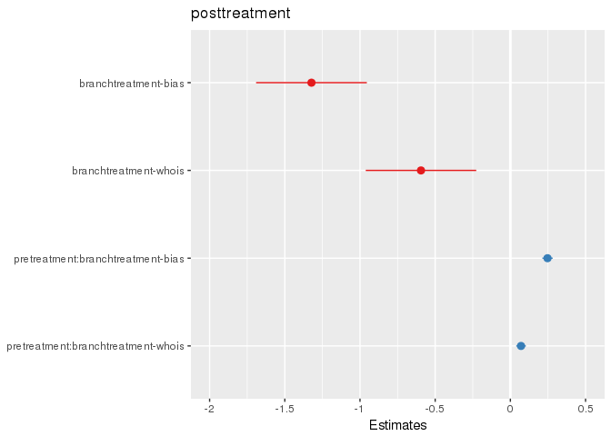
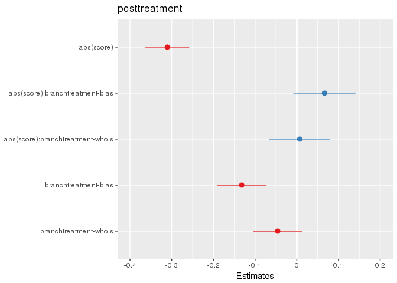

# Data prep

- Data constructed from raw dwell event log data
- Each row is an individual user initiating a dwell event on a specific URL (truncated to tld+1)
- Schema:
--
--
--
--


```r
head(dwell_tbl)
```

```
## # Source:   lazy query [?? x 8]
## # Database: spark_connection
##   pioneer_id         branch   visit_start_date domain     visit_start_time
##   <chr>              <chr>    <date>           <chr>                 <dbl>
## 1 4ea77acd-36af-4db… treatme… 2018-04-08       kalmbachh…       1523230449
## 2 a029610c-6c5f-496… control  2018-04-24       startpage…       1524576638
## 3 8f8a9601-78f4-4f8… treatme… 2018-04-17       twitter.c…       1523980364
## 4 8c8ae141-1391-e04… control  2018-04-18       nevnov.ru        1524093952
## 5 ef08a51b-36d1-416… control  2018-04-14       vidup.tv         1523741381
## 6 ddcf1de0-b07e-400… treatme… 2018-04-30       pogo.com         1525098561
## # ... with 3 more variables: total_dwell_time <dbl>,
## #   total_idle_time <dbl>, days_since_appearance <int>
```

- Remove google.com, youtube.com, facebook.com, youtube.com, amazon.com
- Remove invalid timestamps
- Remove days outside of study periods
- Construct variable for indicating stage
- Compute "active" time as dwell time less idle time on each dwell event


```r
head(activity_tbl)
```

```
## # Source:   lazy query [?? x 11]
## # Database: spark_connection
##   pioneer_id         branch    visit_start_date domain    visit_start_time
##   <chr>              <chr>     <date>           <chr>                <dbl>
## 1 f67c9a40-218f-4f7… control   2018-04-23       stewmac.…       1524523563
## 2 058c4672-b959-4c4… treatmen… 2018-04-25       pathofex…       1524652815
## 3 539ebd6f-78af-304… treatmen… 2018-04-07       soundclo…       1523131960
## 4 91e6968e-3485-814… treatmen… 2018-04-13       american…       1523624942
## 5 4f40aebc-3a90-4d7… treatmen… 2018-04-23       united.c…       1524460095
## 6 9bd4407b-4f72-4bc… treatmen… 2018-04-24       nytimes.…       1524589324
## # ... with 6 more variables: total_dwell_time <dbl>,
## #   total_idle_time <dbl>, days_since_appearance <int>, id <dbl>,
## #   stage <chr>, total_active_time <dbl>
```

- Remove all browsing not matched to the alignment scores
- Compute mean active time per domain on a day in the study
- Compute total active time per domain on a day in the study

```r
head(scored_browsing_tbl)
```

```
## # Source:   lazy query [?? x 8]
## # Database: spark_connection
## # Groups:   id, stage, days_since_appearance, branch, domain
##      id stage   days_since_appea… branch  domain    score mean_active_tim…
##   <dbl> <chr>               <int> <chr>   <chr>     <dbl>            <dbl>
## 1    60 posttr…                19 control thegua… -0.572             24.5 
## 2   374 treatm…                 8 treatm… wjla.c… -0.320              0   
## 3  1066 pretre…                 1 treatm… aol.com  0.0133             9.76
## 4  4378 posttr…                14 treatm… dailyk… -0.897             52   
## 5  6863 posttr…                20 control breitb…  0.914             33.5 
## 6  2822 treatm…                10 treatm… cnn.com -0.270              6   
## # ... with 1 more variable: total_active_time_s <dbl>
```

# Specification 1


```r
# scored_browsing_tbl %>% 
#   filter(stage != 'treatment') %>%
#   group_by(id, domain, score, mean_active_time_s, days_since_appearance) %>%
#   mutate(
#     scored_perday_active_time_s = mean_active_time_s * abs(score) # gets site * score of site
#   ) %>%
#   ungroup %>% group_by(id, days_since_appearance, total_active_time_s) %>%
#   mutate(
#     total_perday_active_time_s = sum(total_active_time_s, na.rm=T) # computes total active time on scored domains for the day
#   ) %>%
#   sdf_pivot(id + days_since_appearance + domain + branch + scored_perday_active_time_s + total_perday_active_time_s ~ stage) %>%
#   mutate(
#     scaled_scored_active_time_s = scored_perday_active_time_s/total_perday_active_time_s
#   ) %>% select(-scored_perday_active_time_s, -total_perday_active_time_s) %>%
#   filter(id==1098 & domain=='aol.com')
```

```r
# options(scipen=10000)
# scored_browsing_tbl %>%
#   filter(stage != 'treatment') %>%
#   group_by(id, domain, score, mean_active_time_s, days_since_appearance) %>%
#   mutate(
#     scored_perday_active_time_s = mean_active_time_s * abs(score) # gets site * score of site
#   ) %>%
#   ungroup %>% group_by(id, days_since_appearance, total_active_time_s) %>%
#   mutate(
#     total_perday_active_time_s = sum(total_active_time_s, na.rm=T) # computes total active time on scored domains for the day
#   ) %>%
#   sdf_pivot(id + days_since_appearance + domain + branch + scored_perday_active_time_s + total_perday_active_time_s ~ stage) %>%
#   mutate(
#     scaled_scored_active_time_s = scored_perday_active_time_s/total_perday_active_time_s
#   ) %>% select(-scored_perday_active_time_s, -total_perday_active_time_s) %>%
#   sdf_quantile(column='scaled_scored_active_time_s', probabilities=c(0,.25,.5,.75,.9,.99,.999,1))
```


```r
tmp = scored_browsing_tbl %>% 
  filter(stage != 'treatment') %>%
  group_by(id, domain, score, mean_active_time_s, days_since_appearance) %>%
  mutate(
    scored_active_time_s = mean_active_time_s * abs(score) # gets site * score of site
  ) %>%
  ungroup %>% group_by(id, days_since_appearance, total_active_time_s) %>%
  mutate(
    total_perday_active_time_s = sum(total_active_time_s, na.rm=T) # computes total active time on scored domains for the day
  ) 

tmp
```

```
## # Source:   lazy query [?? x 10]
## # Database: spark_connection
## # Groups:   id, days_since_appearance, total_active_time_s
##       id stage   days_since_appea… branch  domain   score mean_active_tim…
##    <dbl> <chr>               <int> <chr>   <chr>    <dbl>            <dbl>
##  1     1 pretre…                 4 treatm… vimeo.… -0.292             7   
##  2     8 posttr…                17 treatm… newrep… -0.670             0   
##  3    15 posttr…                20 control breitb…  0.914             1.27
##  4    26 pretre…                 2 treatm… nbcnew… -0.274             4.87
##  5    41 pretre…                 5 control twitte… -0.218            44.4 
##  6    49 pretre…                 5 treatm… nypost…  0.250             8.5 
##  7    54 pretre…                 5 control thehil…  0.166            17.3 
##  8    54 posttr…                20 control latime… -0.400             0   
##  9    54 posttr…                20 control fiveth… -0.522             0   
## 10    57 pretre…                 3 treatm… washin… -0.257            24.5 
## # ... with more rows, and 3 more variables: total_active_time_s <dbl>,
## #   scored_active_time_s <dbl>, total_perday_active_time_s <dbl>
```

```r
sdf_quantile(tmp, column='scored_active_time_s', probabilities=c(0,.25,.5,.75,.9,.99,.999,1))
```

```
##         0%        25%        50%        75%        90%        99% 
##    0.00000    0.57230    2.71390    7.30350   16.58478   75.21380 
##      99.9%       100% 
##  306.28300 4124.50000
```

```r
sdf_quantile(tmp, column='total_perday_active_time_s', probabilities=c(0,.25,.5,.75,.9,.99,.999,1))
```

```
##    0%   25%   50%   75%   90%   99% 99.9%  100% 
##     0     6    22    69   206  1366  4992 29895
```

```r
spec1a_tbl = scored_browsing_tbl %>% 
  filter(stage != 'treatment') %>%
  group_by(id, domain, score, mean_active_time_s, days_since_appearance) %>%
  mutate(
    scored_active_time_s = mean_active_time_s * abs(score) # gets site * score of site
  ) %>%
  ungroup %>%
  select(-mean_active_time_s, -score) %>%
  group_by(id, stage, branch) %>%
  mutate(
    avg_scored_active_time_s = mean(scored_active_time_s, na.rm=T)
  ) %>% 
  ungroup %>% select(-scored_active_time_s, -total_active_time_s, -domain) %>%
  sdf_pivot(id + branch + avg_scored_active_time_s ~ stage) %>%
  mutate(
     posttreatment = (posttreatment/posttreatment)*avg_scored_active_time_s, # fill treatment dummy with mean value
     pretreatment = (pretreatment/pretreatment)*avg_scored_active_time_s # fill treatment dummy with mean value
   ) %>% 
  ungroup %>% group_by(id, branch) %>%
  mutate(
   posttreatment = sum(posttreatment, na.rm=T),
   pretreatment = sum(pretreatment, na.rm=T)
  ) %>%
  collect %>%
  distinct(id, .keep_all=T)
```

Posttreatment - mean( post-treatment average time on site x bias of site )
Pretreatment - mean( pre-treatment average time on site x bias of site )
Branch - bias, whois, control

Unit of analysis is single user

```r
paste('Number of missing posttreatments =', sum(is.na(spec1a_tbl$posttreatment)))
```

```
## [1] "Number of missing posttreatments = 3554"
```

```r
paste('Number of missing pretreatments =', sum(is.na(spec1a_tbl$pretreatment)))
```

```
## [1] "Number of missing pretreatments = 2411"
```

```r
paste('Number of rows =', dim(spec1a_tbl)[1])
```

```
## [1] "Number of rows = 15505"
```

```r
fit1a = glm(posttreatment ~ pretreatment*branch + branch, data=spec1a_tbl)
sjt.glm(fit1a)
```

<table style="border-collapse:collapse; border:none;border-bottom:double;"><tr>
<td style="padding:0.2cm; border-top:double;">&nbsp;</td>
<td style="border-bottom:1px solid; padding-left:0.5em; padding-right:0.5em; border-top:double;">&nbsp;</td>
<td style="padding:0.2cm; text-align:center; border-bottom:1px solid; border-top:double;" colspan="3">posttreatment</td>
</tr>
<tr>
<td style="padding:0.2cm; font-style:italic;">&nbsp;</td><td style="padding-left:0.5em; padding-right:0.5em; font-style:italic;">&nbsp;</td>
<td style="padding:0.2cm; text-align:center; font-style:italic; ">Estimate</td><td style="padding:0.2cm; text-align:center; font-style:italic; ">CI</td><td style="padding:0.2cm; text-align:center; font-style:italic; ">p</td> 
</tr>
<tr>
<td style="padding:0.2cm; border-top:1px solid; text-align:left;">(Intercept)</td><td style="padding-left:0.5em; padding-right:0.5em; border-top:1px solid; ">&nbsp;</td>
<td style="padding:0.2cm; text-align:center; border-top:1px solid; ">269.46</td><td style="padding:0.2cm; text-align:center; border-top:1px solid; ">169.96&nbsp;&ndash;&nbsp;427.21</td><td style="padding:0.2cm; text-align:center; border-top:1px solid; ">&lt;.001</td>
</tr>
<tr>
<td style="padding:0.2cm; text-align:left;">pretreatment</td><td style="padding-left:0.5em; padding-right:0.5em;">&nbsp;</td>
<td style="padding:0.2cm; text-align:center; ">1.17</td><td style="padding:0.2cm; text-align:center; ">1.15&nbsp;&ndash;&nbsp;1.19</td><td style="padding:0.2cm; text-align:center; ">&lt;.001</td>
</tr>
<tr>
<td style="padding:0.2cm; text-align:left;">branchtreatment-bias</td><td style="padding-left:0.5em; padding-right:0.5em;">&nbsp;</td>
<td style="padding:0.2cm; text-align:center; ">0.03</td><td style="padding:0.2cm; text-align:center; ">0.01&nbsp;&ndash;&nbsp;0.05</td><td style="padding:0.2cm; text-align:center; ">&lt;.001</td>
</tr>
<tr>
<td style="padding:0.2cm; text-align:left;">branchtreatment-whois</td><td style="padding-left:0.5em; padding-right:0.5em;">&nbsp;</td>
<td style="padding:0.2cm; text-align:center; ">0.08</td><td style="padding:0.2cm; text-align:center; ">0.04&nbsp;&ndash;&nbsp;0.15</td><td style="padding:0.2cm; text-align:center; ">&lt;.001</td>
</tr>
<tr>
<td style="padding:0.2cm; text-align:left;">pretreatment:branchtreatment-bias</td><td style="padding-left:0.5em; padding-right:0.5em;">&nbsp;</td>
<td style="padding:0.2cm; text-align:center; ">1.68</td><td style="padding:0.2cm; text-align:center; ">1.62&nbsp;&ndash;&nbsp;1.75</td><td style="padding:0.2cm; text-align:center; ">&lt;.001</td>
</tr>
<tr>
<td style="padding:0.2cm; text-align:left;">pretreatment:branchtreatment-whois</td><td style="padding-left:0.5em; padding-right:0.5em;">&nbsp;</td>
<td style="padding:0.2cm; text-align:center; ">1.48</td><td style="padding:0.2cm; text-align:center; ">1.43&nbsp;&ndash;&nbsp;1.54</td><td style="padding:0.2cm; text-align:center; ">&lt;.001</td>
</tr>
<tr>
<td style="padding:0.2cm; padding-top:0.1cm; padding-bottom:0.1cm; text-align:left; border-top:1px solid;">Observations</td><td style="padding-left:0.5em; padding-right:0.5em; border-top:1px solid;">&nbsp;</td> <td style="padding:0.2cm; padding-top:0.1cm; padding-bottom:0.1cm; text-align:center; border-top:1px solid;" colspan="3">9540</td>
</tr>
</table>

```r
plot_model(fit1a, rm.terms = 'pretreatment')
```

<!-- -->


# Specification 2

Average time on site (post) ~ Average time on site (pre) + alignment (bias) * branch + (1|site)


```r
spec2a_tbl = scored_browsing_tbl %>% 
  filter(stage != 'treatment') %>%
  sdf_pivot(id + days_since_appearance + domain + score + branch + mean_active_time_s ~ stage) %>%
  mutate(
    posttreatment = posttreatment*mean_active_time_s, # fill treatment dummy with mean value
    pretreatment = pretreatment*mean_active_time_s # fill treatment dummy with mean value
  ) %>%
  group_by(id, domain) %>%
  select(-mean_active_time_s) %>%
  mutate(
   posttreatment = log(sum(posttreatment, na.rm=T)),
   pretreatment = log(sum(pretreatment, na.rm=T))
  ) %>%
  na.replace(0) %>%
  #filter(row_number(id) == 1) %>% ungroup %>%
  collect

spec2b_tbl = scored_browsing_tbl %>% 
  filter(stage != 'treatment') %>%
  sdf_pivot(id + domain + score + branch + mean_active_time_s ~ stage) %>% # creates columns for stage dummy
  mutate(
    posttreatment = posttreatment*mean_active_time_s,
    pretreatment = pretreatment*mean_active_time_s
  ) %>%
  group_by(id, domain) %>%
  select(-mean_active_time_s) %>%
  mutate(
   posttreatment = log(sum(posttreatment, na.rm=T)),
   pretreatment = log(sum(pretreatment, na.rm=T))
  ) %>%
  filter(row_number(id) == 1) %>% ungroup() %>%
  na.replace(0) %>%
  collect

spec2c_tbl = scored_browsing_tbl %>%
  filter(stage != 'treatment') %>%
  group_by(id, domain, score, mean_active_time_s, days_since_appearance) %>%
  mutate(
    scored_avg_perday_active_time_s = mean_active_time_s * abs(score) # gets site * score of site
  ) %>%
  ungroup %>%
  sdf_pivot(id + days_since_appearance + domain + branch + score + scored_avg_perday_active_time_s ~ stage) %>%
  mutate(
    posttreatment = log(posttreatment*scored_avg_perday_active_time_s), # fill treatment dummy with mean value
    pretreatment = log(pretreatment*scored_avg_perday_active_time_s) # fill treatment dummy with mean value
  ) %>%
  ungroup %>% select(-scored_avg_perday_active_time_s) %>%
  group_by(id, domain, score, days_since_appearance) %>%
  arrange(id, days_since_appearance) %>%
  na.replace(0) %>%
  collect
```

```r
spec2a_tbl %>% filter(id==1098)
```

```
## # A tibble: 0 x 7
## # ... with 7 variables: id <dbl>, days_since_appearance <int>,
## #   domain <chr>, score <dbl>, branch <chr>, posttreatment <dbl>,
## #   pretreatment <dbl>
```

```r
spec2b_tbl %>% filter(id==1098)
```

```
## # A tibble: 0 x 6
## # ... with 6 variables: id <dbl>, domain <chr>, score <dbl>, branch <chr>,
## #   posttreatment <dbl>, pretreatment <dbl>
```

```r
spec2c_tbl %>% filter(id==1098)
```

```
## # A tibble: 0 x 7
## # ... with 7 variables: id <dbl>, days_since_appearance <int>,
## #   domain <chr>, branch <chr>, score <dbl>, posttreatment <dbl>,
## #   pretreatment <dbl>
```


```r
spec2a_tbl$branch = factor(spec2a_tbl$branch)
fit2a = lmer(posttreatment ~ pretreatment + abs(score) * branch + (1|id), data=spec2a_tbl)
sjt.lmer(fit2a)
```

```
## Computing p-values via Wald-statistics approximation (treating t as Wald z).
```

<table style="border-collapse:collapse; border:none;border-bottom:double;">
<td style="padding:0.2cm; border-top:double;">&nbsp;</td>
<td style="border-bottom:1px solid; padding-left:0.5em; padding-right:0.5em; border-top:double;">&nbsp;</td>
<td style="padding:0.2cm; text-align:center; border-bottom:1px solid; border-top:double;" colspan="3">posttreatment</td>
</tr>
<tr>
<td style="padding:0.2cm; font-style:italic;">&nbsp;</td>
<td style="padding-left:0.5em; padding-right:0.5em; font-style:italic;">&nbsp;</td>
<td style="padding:0.2cm; text-align:center; font-style:italic; ">B</td>
<td style="padding:0.2cm; text-align:center; font-style:italic; ">CI</td>
<td style="padding:0.2cm; text-align:center; font-style:italic; ">p</td> 
</tr>
<tr>
<td colspan="5" style="padding:0.2cm; text-align:left; border-top:1px solid; font-weight:bold; text-align:left;">Fixed Parts</td>
</tr>
<tr>
<td style="padding:0.2cm; text-align:left;">(Intercept)</td>
<td style="padding-left:0.5em; padding-right:0.5em; ">&nbsp;</td>
<td style="padding:0.2cm; text-align:center; ">1.28</td>
<td style="padding:0.2cm; text-align:center; ">1.24&nbsp;&ndash;&nbsp;1.32</td>
<td style="padding:0.2cm; text-align:center; ">&lt;.001</td>
</tr>
<tr>
<td style="padding:0.2cm; text-align:left;">pretreatment</td>
<td style="padding-left:0.5em; padding-right:0.5em;">&nbsp;</td>
<td style="padding:0.2cm; text-align:center; ">0.38</td>
<td style="padding:0.2cm; text-align:center; ">0.38&nbsp;&ndash;&nbsp;0.39</td>
<td style="padding:0.2cm; text-align:center; ">&lt;.001</td>
</tr>
<tr>
<td style="padding:0.2cm; text-align:left;">abs(score)</td>
<td style="padding-left:0.5em; padding-right:0.5em;">&nbsp;</td>
<td style="padding:0.2cm; text-align:center; ">&#45;0.31</td>
<td style="padding:0.2cm; text-align:center; ">&#45;0.36&nbsp;&ndash;&nbsp;&#45;0.26</td>
<td style="padding:0.2cm; text-align:center; ">&lt;.001</td>
</tr>
<tr>
<td style="padding:0.2cm; text-align:left;">branchtreatment&#45;bias</td>
<td style="padding-left:0.5em; padding-right:0.5em;">&nbsp;</td>
<td style="padding:0.2cm; text-align:center; ">&#45;0.13</td>
<td style="padding:0.2cm; text-align:center; ">&#45;0.19&nbsp;&ndash;&nbsp;&#45;0.07</td>
<td style="padding:0.2cm; text-align:center; ">&lt;.001</td>
</tr>
<tr>
<td style="padding:0.2cm; text-align:left;">branchtreatment&#45;whois</td>
<td style="padding-left:0.5em; padding-right:0.5em;">&nbsp;</td>
<td style="padding:0.2cm; text-align:center; ">&#45;0.05</td>
<td style="padding:0.2cm; text-align:center; ">&#45;0.11&nbsp;&ndash;&nbsp;0.01</td>
<td style="padding:0.2cm; text-align:center; ">.131</td>
</tr>
<tr>
<td style="padding:0.2cm; text-align:left;">abs(score):branchtreatment&#45;bias</td>
<td style="padding-left:0.5em; padding-right:0.5em;">&nbsp;</td>
<td style="padding:0.2cm; text-align:center; ">0.07</td>
<td style="padding:0.2cm; text-align:center; ">&#45;0.01&nbsp;&ndash;&nbsp;0.14</td>
<td style="padding:0.2cm; text-align:center; ">.081</td>
</tr>
<tr>
<td style="padding:0.2cm; text-align:left;">abs(score):branchtreatment&#45;whois</td>
<td style="padding-left:0.5em; padding-right:0.5em;">&nbsp;</td>
<td style="padding:0.2cm; text-align:center; ">0.01</td>
<td style="padding:0.2cm; text-align:center; ">&#45;0.07&nbsp;&ndash;&nbsp;0.08</td>
<td style="padding:0.2cm; text-align:center; ">.849</td>
</tr><tr>
<td colspan="5" style="padding:0.2cm; padding-top:0.1cm; padding-bottom:0.1cm; text-align:left; font-weight:bold; text-align:left; padding-top:0.5em;">Random Parts</td>
</tr>

<tr>
<td style="padding:0.2cm; padding-top:0.1cm; padding-bottom:0.1cm; text-align:left;">&sigma;<sup>2</sup></td>
<td style="padding-left:0.5em; padding-right:0.5em;">&nbsp;</td><td style="padding:0.2cm; text-align:center; padding-top:0.1cm; padding-bottom:0.1cm;" colspan="3">2.083</td>
</tr>

<tr>
<td style="padding:0.2cm; padding-top:0.1cm; padding-bottom:0.1cm; text-align:left;">&tau;<sub>00, id</sub></td>
<td style="padding-left:0.5em; padding-right:0.5em;">&nbsp;</td><td style="padding:0.2cm; text-align:center; padding-top:0.1cm; padding-bottom:0.1cm;" colspan="3">1.435</td>
</tr>

<tr>
<td style="padding:0.2cm; padding-top:0.1cm; padding-bottom:0.1cm; text-align:left;">N<sub>id</sub></td>
<td style="padding-left:0.5em; padding-right:0.5em;">&nbsp;</td><td style="padding:0.2cm; text-align:center; padding-top:0.1cm; padding-bottom:0.1cm;" colspan="3">15442</td>
</tr>
<tr>
<td style="padding:0.2cm; text-align:left; padding-top:0.1cm; padding-bottom:0.1cm;">ICC<sub>id</sub></td>
<td style="padding-left:0.5em; padding-right:0.5em;">&nbsp;</td><td style="padding:0.2cm; text-align:center; padding-top:0.1cm; padding-bottom:0.1cm;" colspan="3">0.408</td>
 </tr>

<tr>
<td style="padding:0.2cm; padding-top:0.1cm; padding-bottom:0.1cm; text-align:left; border-top:1px solid;">Observations</td>
<td style="padding-left:0.5em; padding-right:0.5em; border-top:1px solid;">&nbsp;</td><td style="padding:0.2cm; padding-top:0.1cm; padding-bottom:0.1cm; text-align:center; border-top:1px solid;" colspan="3">183311</td>
</tr>
<tr>
<td style="padding:0.2cm; text-align:left; padding-top:0.1cm; padding-bottom:0.1cm;">R<sup>2</sup> / &Omega;<sub>0</sub><sup>2</sup></td>

<td style="padding-left:0.5em; padding-right:0.5em;">&nbsp;</td><td style="padding:0.2cm; text-align:center; padding-top:0.1cm; padding-bottom:0.1cm;" colspan="3">.514 / .512</td>
 </tr>
</table>

```r
plot_model(fit2a, rm.terms = 'pretreatment')
```

```
## Computing p-values via Wald-statistics approximation (treating t as Wald z).
```

<!-- -->

```r
spec2b_tbl$branch = factor(spec2b_tbl$branch)
fit2b = lmer(posttreatment ~ pretreatment + abs(score) * branch + (1|id), data=spec2b_tbl)
sjt.lmer(fit2b)
```

```
## Computing p-values via Wald-statistics approximation (treating t as Wald z).
```

<table style="border-collapse:collapse; border:none;border-bottom:double;">
<td style="padding:0.2cm; border-top:double;">&nbsp;</td>
<td style="border-bottom:1px solid; padding-left:0.5em; padding-right:0.5em; border-top:double;">&nbsp;</td>
<td style="padding:0.2cm; text-align:center; border-bottom:1px solid; border-top:double;" colspan="3">posttreatment</td>
</tr>
<tr>
<td style="padding:0.2cm; font-style:italic;">&nbsp;</td>
<td style="padding-left:0.5em; padding-right:0.5em; font-style:italic;">&nbsp;</td>
<td style="padding:0.2cm; text-align:center; font-style:italic; ">B</td>
<td style="padding:0.2cm; text-align:center; font-style:italic; ">CI</td>
<td style="padding:0.2cm; text-align:center; font-style:italic; ">p</td> 
</tr>
<tr>
<td colspan="5" style="padding:0.2cm; text-align:left; border-top:1px solid; font-weight:bold; text-align:left;">Fixed Parts</td>
</tr>
<tr>
<td style="padding:0.2cm; text-align:left;">(Intercept)</td>
<td style="padding-left:0.5em; padding-right:0.5em; ">&nbsp;</td>
<td style="padding:0.2cm; text-align:center; ">1.42</td>
<td style="padding:0.2cm; text-align:center; ">1.38&nbsp;&ndash;&nbsp;1.46</td>
<td style="padding:0.2cm; text-align:center; ">&lt;.001</td>
</tr>
<tr>
<td style="padding:0.2cm; text-align:left;">pretreatment</td>
<td style="padding-left:0.5em; padding-right:0.5em;">&nbsp;</td>
<td style="padding:0.2cm; text-align:center; ">0.06</td>
<td style="padding:0.2cm; text-align:center; ">0.06&nbsp;&ndash;&nbsp;0.07</td>
<td style="padding:0.2cm; text-align:center; ">&lt;.001</td>
</tr>
<tr>
<td style="padding:0.2cm; text-align:left;">abs(score)</td>
<td style="padding-left:0.5em; padding-right:0.5em;">&nbsp;</td>
<td style="padding:0.2cm; text-align:center; ">&#45;0.22</td>
<td style="padding:0.2cm; text-align:center; ">&#45;0.30&nbsp;&ndash;&nbsp;&#45;0.15</td>
<td style="padding:0.2cm; text-align:center; ">&lt;.001</td>
</tr>
<tr>
<td style="padding:0.2cm; text-align:left;">branchtreatment&#45;bias</td>
<td style="padding-left:0.5em; padding-right:0.5em;">&nbsp;</td>
<td style="padding:0.2cm; text-align:center; ">&#45;0.10</td>
<td style="padding:0.2cm; text-align:center; ">&#45;0.15&nbsp;&ndash;&nbsp;&#45;0.04</td>
<td style="padding:0.2cm; text-align:center; ">&lt;.001</td>
</tr>
<tr>
<td style="padding:0.2cm; text-align:left;">branchtreatment&#45;whois</td>
<td style="padding-left:0.5em; padding-right:0.5em;">&nbsp;</td>
<td style="padding:0.2cm; text-align:center; ">&#45;0.04</td>
<td style="padding:0.2cm; text-align:center; ">&#45;0.09&nbsp;&ndash;&nbsp;0.02</td>
<td style="padding:0.2cm; text-align:center; ">.169</td>
</tr>
<tr>
<td style="padding:0.2cm; text-align:left;">abs(score):branchtreatment&#45;bias</td>
<td style="padding-left:0.5em; padding-right:0.5em;">&nbsp;</td>
<td style="padding:0.2cm; text-align:center; ">0.05</td>
<td style="padding:0.2cm; text-align:center; ">&#45;0.05&nbsp;&ndash;&nbsp;0.15</td>
<td style="padding:0.2cm; text-align:center; ">.341</td>
</tr>
<tr>
<td style="padding:0.2cm; text-align:left;">abs(score):branchtreatment&#45;whois</td>
<td style="padding-left:0.5em; padding-right:0.5em;">&nbsp;</td>
<td style="padding:0.2cm; text-align:center; ">0.03</td>
<td style="padding:0.2cm; text-align:center; ">&#45;0.07&nbsp;&ndash;&nbsp;0.14</td>
<td style="padding:0.2cm; text-align:center; ">.519</td>
</tr><tr>
<td colspan="5" style="padding:0.2cm; padding-top:0.1cm; padding-bottom:0.1cm; text-align:left; font-weight:bold; text-align:left; padding-top:0.5em;">Random Parts</td>
</tr>

<tr>
<td style="padding:0.2cm; padding-top:0.1cm; padding-bottom:0.1cm; text-align:left;">&sigma;<sup>2</sup></td>
<td style="padding-left:0.5em; padding-right:0.5em;">&nbsp;</td><td style="padding:0.2cm; text-align:center; padding-top:0.1cm; padding-bottom:0.1cm;" colspan="3">2.377</td>
</tr>

<tr>
<td style="padding:0.2cm; padding-top:0.1cm; padding-bottom:0.1cm; text-align:left;">&tau;<sub>00, id</sub></td>
<td style="padding-left:0.5em; padding-right:0.5em;">&nbsp;</td><td style="padding:0.2cm; text-align:center; padding-top:0.1cm; padding-bottom:0.1cm;" colspan="3">0.426</td>
</tr>

<tr>
<td style="padding:0.2cm; padding-top:0.1cm; padding-bottom:0.1cm; text-align:left;">N<sub>id</sub></td>
<td style="padding-left:0.5em; padding-right:0.5em;">&nbsp;</td><td style="padding:0.2cm; text-align:center; padding-top:0.1cm; padding-bottom:0.1cm;" colspan="3">15442</td>
</tr>
<tr>
<td style="padding:0.2cm; text-align:left; padding-top:0.1cm; padding-bottom:0.1cm;">ICC<sub>id</sub></td>
<td style="padding-left:0.5em; padding-right:0.5em;">&nbsp;</td><td style="padding:0.2cm; text-align:center; padding-top:0.1cm; padding-bottom:0.1cm;" colspan="3">0.152</td>
 </tr>

<tr>
<td style="padding:0.2cm; padding-top:0.1cm; padding-bottom:0.1cm; text-align:left; border-top:1px solid;">Observations</td>
<td style="padding-left:0.5em; padding-right:0.5em; border-top:1px solid;">&nbsp;</td><td style="padding:0.2cm; padding-top:0.1cm; padding-bottom:0.1cm; text-align:center; border-top:1px solid;" colspan="3">89597</td>
</tr>
<tr>
<td style="padding:0.2cm; text-align:left; padding-top:0.1cm; padding-bottom:0.1cm;">R<sup>2</sup> / &Omega;<sub>0</sub><sup>2</sup></td>

<td style="padding-left:0.5em; padding-right:0.5em;">&nbsp;</td><td style="padding:0.2cm; text-align:center; padding-top:0.1cm; padding-bottom:0.1cm;" colspan="3">.245 / .207</td>
 </tr>
</table>

```r
plot_model(fit2b, rm.terms = 'pretreatment')
```

```
## Computing p-values via Wald-statistics approximation (treating t as Wald z).
```

<!-- -->

```r
spec2c_tbl$branch = factor(spec2c_tbl$branch)
fit2c = lmer(posttreatment ~ pretreatment + abs(score) * branch + (1|id), data=spec2c_tbl)
sjt.lmer(fit2c)
```

```
## Computing p-values via Wald-statistics approximation (treating t as Wald z).
```

<table style="border-collapse:collapse; border:none;border-bottom:double;">
<td style="padding:0.2cm; border-top:double;">&nbsp;</td>
<td style="border-bottom:1px solid; padding-left:0.5em; padding-right:0.5em; border-top:double;">&nbsp;</td>
<td style="padding:0.2cm; text-align:center; border-bottom:1px solid; border-top:double;" colspan="3">posttreatment</td>
</tr>
<tr>
<td style="padding:0.2cm; font-style:italic;">&nbsp;</td>
<td style="padding-left:0.5em; padding-right:0.5em; font-style:italic;">&nbsp;</td>
<td style="padding:0.2cm; text-align:center; font-style:italic; ">B</td>
<td style="padding:0.2cm; text-align:center; font-style:italic; ">CI</td>
<td style="padding:0.2cm; text-align:center; font-style:italic; ">p</td> 
</tr>
<tr>
<td colspan="5" style="padding:0.2cm; text-align:left; border-top:1px solid; font-weight:bold; text-align:left;">Fixed Parts</td>
</tr>
<tr>
<td style="padding:0.2cm; text-align:left;">(Intercept)</td>
<td style="padding-left:0.5em; padding-right:0.5em; ">&nbsp;</td>
<td style="padding:0.2cm; text-align:center; ">&#45;0.03</td>
<td style="padding:0.2cm; text-align:center; ">&#45;0.05&nbsp;&ndash;&nbsp;&#45;0.01</td>
<td style="padding:0.2cm; text-align:center; ">.002</td>
</tr>
<tr>
<td style="padding:0.2cm; text-align:left;">pretreatment</td>
<td style="padding-left:0.5em; padding-right:0.5em;">&nbsp;</td>
<td style="padding:0.2cm; text-align:center; ">&#45;0.37</td>
<td style="padding:0.2cm; text-align:center; ">&#45;0.38&nbsp;&ndash;&nbsp;&#45;0.37</td>
<td style="padding:0.2cm; text-align:center; ">&lt;.001</td>
</tr>
<tr>
<td style="padding:0.2cm; text-align:left;">abs(score)</td>
<td style="padding-left:0.5em; padding-right:0.5em;">&nbsp;</td>
<td style="padding:0.2cm; text-align:center; ">1.81</td>
<td style="padding:0.2cm; text-align:center; ">1.77&nbsp;&ndash;&nbsp;1.84</td>
<td style="padding:0.2cm; text-align:center; ">&lt;.001</td>
</tr>
<tr>
<td style="padding:0.2cm; text-align:left;">branchtreatment&#45;bias</td>
<td style="padding-left:0.5em; padding-right:0.5em;">&nbsp;</td>
<td style="padding:0.2cm; text-align:center; ">&#45;0.03</td>
<td style="padding:0.2cm; text-align:center; ">&#45;0.06&nbsp;&ndash;&nbsp;&#45;0.00</td>
<td style="padding:0.2cm; text-align:center; ">.024</td>
</tr>
<tr>
<td style="padding:0.2cm; text-align:left;">branchtreatment&#45;whois</td>
<td style="padding-left:0.5em; padding-right:0.5em;">&nbsp;</td>
<td style="padding:0.2cm; text-align:center; ">&#45;0.01</td>
<td style="padding:0.2cm; text-align:center; ">&#45;0.03&nbsp;&ndash;&nbsp;0.02</td>
<td style="padding:0.2cm; text-align:center; ">.634</td>
</tr>
<tr>
<td style="padding:0.2cm; text-align:left;">abs(score):branchtreatment&#45;bias</td>
<td style="padding-left:0.5em; padding-right:0.5em;">&nbsp;</td>
<td style="padding:0.2cm; text-align:center; ">0.04</td>
<td style="padding:0.2cm; text-align:center; ">&#45;0.01&nbsp;&ndash;&nbsp;0.09</td>
<td style="padding:0.2cm; text-align:center; ">.088</td>
</tr>
<tr>
<td style="padding:0.2cm; text-align:left;">abs(score):branchtreatment&#45;whois</td>
<td style="padding-left:0.5em; padding-right:0.5em;">&nbsp;</td>
<td style="padding:0.2cm; text-align:center; ">&#45;0.02</td>
<td style="padding:0.2cm; text-align:center; ">&#45;0.06&nbsp;&ndash;&nbsp;0.03</td>
<td style="padding:0.2cm; text-align:center; ">.469</td>
</tr><tr>
<td colspan="5" style="padding:0.2cm; padding-top:0.1cm; padding-bottom:0.1cm; text-align:left; font-weight:bold; text-align:left; padding-top:0.5em;">Random Parts</td>
</tr>

<tr>
<td style="padding:0.2cm; padding-top:0.1cm; padding-bottom:0.1cm; text-align:left;">&sigma;<sup>2</sup></td>
<td style="padding-left:0.5em; padding-right:0.5em;">&nbsp;</td><td style="padding:0.2cm; text-align:center; padding-top:0.1cm; padding-bottom:0.1cm;" colspan="3">0.891</td>
</tr>

<tr>
<td style="padding:0.2cm; padding-top:0.1cm; padding-bottom:0.1cm; text-align:left;">&tau;<sub>00, id</sub></td>
<td style="padding-left:0.5em; padding-right:0.5em;">&nbsp;</td><td style="padding:0.2cm; text-align:center; padding-top:0.1cm; padding-bottom:0.1cm;" colspan="3">0.144</td>
</tr>

<tr>
<td style="padding:0.2cm; padding-top:0.1cm; padding-bottom:0.1cm; text-align:left;">N<sub>id</sub></td>
<td style="padding-left:0.5em; padding-right:0.5em;">&nbsp;</td><td style="padding:0.2cm; text-align:center; padding-top:0.1cm; padding-bottom:0.1cm;" colspan="3">15442</td>
</tr>
<tr>
<td style="padding:0.2cm; text-align:left; padding-top:0.1cm; padding-bottom:0.1cm;">ICC<sub>id</sub></td>
<td style="padding-left:0.5em; padding-right:0.5em;">&nbsp;</td><td style="padding:0.2cm; text-align:center; padding-top:0.1cm; padding-bottom:0.1cm;" colspan="3">0.139</td>
 </tr>

<tr>
<td style="padding:0.2cm; padding-top:0.1cm; padding-bottom:0.1cm; text-align:left; border-top:1px solid;">Observations</td>
<td style="padding-left:0.5em; padding-right:0.5em; border-top:1px solid;">&nbsp;</td><td style="padding:0.2cm; padding-top:0.1cm; padding-bottom:0.1cm; text-align:center; border-top:1px solid;" colspan="3">183311</td>
</tr>
<tr>
<td style="padding:0.2cm; text-align:left; padding-top:0.1cm; padding-bottom:0.1cm;">R<sup>2</sup> / &Omega;<sub>0</sub><sup>2</sup></td>

<td style="padding-left:0.5em; padding-right:0.5em;">&nbsp;</td><td style="padding:0.2cm; text-align:center; padding-top:0.1cm; padding-bottom:0.1cm;" colspan="3">.333 / .330</td>
 </tr>
</table>

```r
plot_model(fit2c, rm.terms = c('pretreatment', 'abs(score)'))
```

```
## Computing p-values via Wald-statistics approximation (treating t as Wald z).
```

<!-- -->

# Specification 3 

Has average score changed over time?


