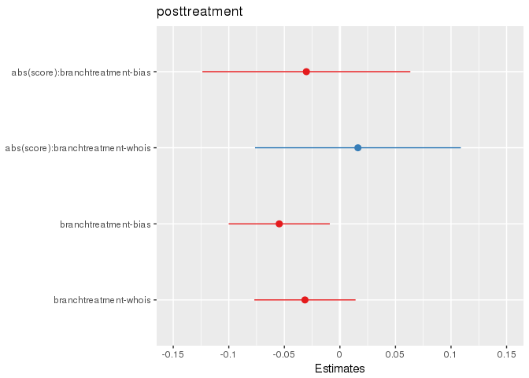
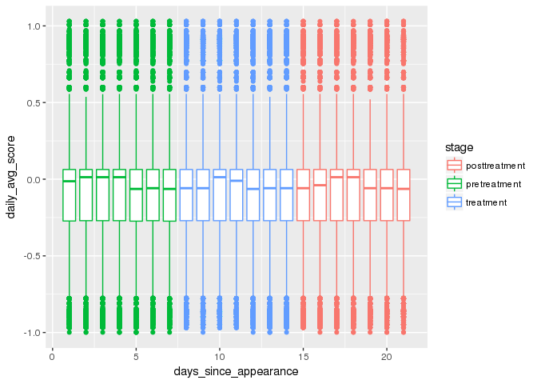

# Data prep

* Data constructed from raw dwell event log data
* Each row is an individual user initiating a dwell event on a specific URL (truncated to tld+1)

## Schema
--
--
--
--


```r
head(dwell_tbl)
```

```
## # Source:   lazy query [?? x 9]
## # Database: spark_connection
##   pioneer_id         branch    visit_start_date domain    visit_start_time
##   <chr>              <chr>     <date>           <chr>                <dbl>
## 1 52bea5a6-74c6-412… treatmen… 2018-04-17       facebook…       1524006345
## 2 13106a0a-185d-4e1… control   2018-04-18       reddit.c…       1524079667
## 3 24555038-3420-445… control   2018-04-19       facebook…       1524178416
## 4 59dc8928-2b01-460… control   2018-04-15       connexus…       1523832781
## 5 17f41e3f-6271-464… treatmen… 2018-04-20       salesfor…       1524249801
## 6 a03b6154-ec20-4c7… treatmen… 2018-04-17       time-to-…       1523976928
## # ... with 4 more variables: total_dwell_time <dbl>,
## #   total_idle_time <dbl>, nav_event_count <int>,
## #   days_since_appearance <int>
```

* Remove google.com, youtube.com, facebook.com, youtube.com, amazon.com
* Remove invalid timestamps
* Remove days outside of study periods
* Construct variable for indicating stage
* Compute "active" time as dwell time less idle time on each dwell event


```r
head(activity_tbl)
```

```
## # Source:   lazy query [?? x 12]
## # Database: spark_connection
##   pioneer_id         branch    visit_start_date domain    visit_start_time
##   <chr>              <chr>     <date>           <chr>                <dbl>
## 1 abd6d7f3-1453-47c… control   2018-04-12       google.c…       1523556809
## 2 ceca8ce5-d650-4cf… treatmen… 2018-04-06       github.c…       1523048362
## 3 2a932e75-1cc9-42f… treatmen… 2018-04-24       official…       1524587243
## 4 4d0694f5-63f6-403… treatmen… 2018-04-11       space.com       1523485848
## 5 6cd8d1d5-68de-4a5… treatmen… 2018-04-06       0.1             1522987113
## 6 ae46eea2-0fb1-47c… treatmen… 2018-04-16       yahoo.com       1523883568
## # ... with 7 more variables: total_dwell_time <dbl>,
## #   total_idle_time <dbl>, nav_event_count <int>,
## #   days_since_appearance <int>, id <dbl>, stage <chr>,
## #   total_active_time <dbl>
```

* Remove all browsing not matched to the alignment scores
* Compute mean active time per domain on a day in the study
* Compute total active time per domain on a day in the study

```r
#head(scored_browsing_tbl)
head(scored_activity_tbl)
```

```
## # Source:   lazy query [?? x 11]
## # Database: spark_connection
##   pioneer_id         branch    visit_start_date domain    visit_start_time
##   <chr>              <chr>     <date>           <chr>                <dbl>
## 1 d766ac5e-0dfa-44c… treatmen… 2018-04-09       cbsnews.…       1523277043
## 2 d97bcde5-3dd6-490… treatmen… 2018-04-12       thefeder…       1523539447
## 3 3ee6d195-6cbd-43d… treatmen… 2018-04-25       breitbar…       1524681174
## 4 edd1a79b-3504-4a0… treatmen… 2018-04-14       twitter.…       1523675500
## 5 86a1e23d-188f-41f… control   2018-04-05       amazon.c…       1522933123
## 6 6c0c0941-7bcd-134… control   2018-04-08       nytimes.…       1523208085
## # ... with 6 more variables: days_since_appearance <int>, id <dbl>,
## #   stage <chr>, total_active_time <dbl>, score <dbl>,
## #   scored_active_time <dbl>
```

# Specification 1


```r
# scored_browsing_tbl %>% 
#   filter(stage != 'treatment') %>%
#   group_by(id, domain, score, mean_active_time_s, days_since_appearance) %>%
#   mutate(
#     scored_perday_active_time_s = mean_active_time_s * abs(score) # gets site * score of site
#   ) %>%
#   ungroup %>% group_by(id, days_since_appearance, total_active_time_s) %>%
#   mutate(
#     total_perday_active_time_s = sum(total_active_time_s, na.rm=T) # computes total active time on scored domains for the day
#   ) %>%
#   sdf_pivot(id + days_since_appearance + domain + branch + scored_perday_active_time_s + total_perday_active_time_s ~ stage) %>%
#   mutate(
#     scaled_scored_active_time_s = scored_perday_active_time_s/total_perday_active_time_s
#   ) %>% select(-scored_perday_active_time_s, -total_perday_active_time_s) %>%
#   filter(id==1098 & domain=='aol.com')
```

```r
# options(scipen=10000)
# scored_browsing_tbl %>%
#   filter(stage != 'treatment') %>%
#   group_by(id, domain, score, mean_active_time_s, days_since_appearance) %>%
#   mutate(
#     scored_perday_active_time_s = mean_active_time_s * abs(score) # gets site * score of site
#   ) %>%
#   ungroup %>% group_by(id, days_since_appearance, total_active_time_s) %>%
#   mutate(
#     total_perday_active_time_s = sum(total_active_time_s, na.rm=T) # computes total active time on scored domains for the day
#   ) %>%
#   sdf_pivot(id + days_since_appearance + domain + branch + scored_perday_active_time_s + total_perday_active_time_s ~ stage) %>%
#   mutate(
#     scaled_scored_active_time_s = scored_perday_active_time_s/total_perday_active_time_s
#   ) %>% select(-scored_perday_active_time_s, -total_perday_active_time_s) %>%
#   sdf_quantile(column='scaled_scored_active_time_s', probabilities=c(0,.25,.5,.75,.9,.99,.999,1))
```


```r
scored_browsing_tbl = activity_tbl %>%
  inner_join(scored_domains_tbl) %>%
  group_by(id, stage, days_since_appearance, branch, domain, score) %>%
  summarise(
    mean_active_time_s = mean(total_active_time, na.rm=T),
    total_active_time_s = sum(total_active_time, na.rm=T)) 
```

```
## Joining, by = "domain"
```

```r
tmp = scored_browsing_tbl%>% 
  filter(stage != 'treatment') %>%
  group_by(id, domain, score, mean_active_time_s, days_since_appearance) %>%
  mutate(
    scored_active_time_s = mean_active_time_s * abs(score) # gets site * score of site
  ) %>%
  ungroup %>% group_by(id, days_since_appearance, total_active_time_s) %>%
  mutate(
    total_perday_active_time_s = sum(total_active_time_s, na.rm=T) # computes total active time on scored domains for the day
  ) 

head(tmp)
```

```
## # Source:   lazy query [?? x 10]
## # Database: spark_connection
## # Groups:   id, days_since_appearance, total_active_time_s
##      id stage   days_since_appea… branch  domain    score mean_active_tim…
##   <dbl> <chr>               <int> <chr>   <chr>     <dbl>            <dbl>
## 1     3 posttr…                19 control fiveth… -0.522              0.25
## 2     3 posttr…                19 control washin… -0.257              1   
## 3     4 posttr…                16 treatm… youtub…  0.0634            11.1 
## 4     4 posttr…                21 treatm… amazon…  0.0362             2.35
## 5     6 pretre…                 5 treatm… youtub…  0.0634             4.37
## 6     7 posttr…                16 treatm… twitte… -0.218             18.8 
## # ... with 3 more variables: total_active_time_s <dbl>,
## #   scored_active_time_s <dbl>, total_perday_active_time_s <dbl>
```

```r
sdf_quantile(tmp, column='scored_active_time_s', probabilities=c(0,.25,.5,.75,.9,.99,.999,1))
```

```
##           0%          25%          50%          75%          90% 
##    0.0000000    0.4261889    1.4949000    4.7723636   12.0318000 
##          99%        99.9%         100% 
##   59.3560500  230.9230500 4124.5000000
```

```r
sdf_quantile(tmp, column='total_perday_active_time_s', probabilities=c(0,.25,.5,.75,.9,.99,.999,1))
```

```
##    0%   25%   50%   75%   90%   99% 99.9%  100% 
##     0    10    36   141   452  2507  8091 43569
```

```r
spec1a_tbl = scored_browsing_tbl %>% 
  filter(stage != 'treatment') %>%
  group_by(id, domain, score, mean_active_time_s, days_since_appearance) %>%
  mutate(
    scored_active_time_s = mean_active_time_s * abs(score) # gets site * score of site
  ) %>%
  ungroup %>%
  select(-mean_active_time_s, -score) %>%
  group_by(id, stage, branch) %>%
  mutate(
    avg_scored_active_time_s = mean(scored_active_time_s, na.rm=T)
  ) %>% 
  ungroup %>% select(-scored_active_time_s, -total_active_time_s, -domain) %>%
  sdf_pivot(id + branch + avg_scored_active_time_s ~ stage) %>%
  mutate(
     posttreatment = (posttreatment/posttreatment)*avg_scored_active_time_s, # fill treatment dummy with mean value
     pretreatment = (pretreatment/pretreatment)*avg_scored_active_time_s # fill treatment dummy with mean value
   ) %>% 
  ungroup %>% group_by(id, branch) %>%
  mutate(
   posttreatment = sum(posttreatment, na.rm=T),
   pretreatment = sum(pretreatment, na.rm=T)
  ) %>%
  collect %>%
  distinct(id, .keep_all=T)
```

Posttreatment - mean( post-treatment average time on site x bias of site )
Pretreatment - mean( pre-treatment average time on site x bias of site )
Branch - bias, whois, control

Unit of analysis is single user

```r
paste('Number of missing posttreatments =', sum(is.na(spec1a_tbl$posttreatment)))
```

```
## [1] "Number of missing posttreatments = 4139"
```

```r
paste('Number of missing pretreatments =', sum(is.na(spec1a_tbl$pretreatment)))
```

```
## [1] "Number of missing pretreatments = 1443"
```

```r
paste('Number of rows =', dim(spec1a_tbl)[1])
```

```
## [1] "Number of rows = 19841"
```

```r
fit1a = glm(posttreatment ~ pretreatment*branch + branch, data=spec1a_tbl)
sjt.glm(fit1a)
```

<table style="border-collapse:collapse; border:none;border-bottom:double;"><tr>
<td style="padding:0.2cm; border-top:double;">&nbsp;</td>
<td style="border-bottom:1px solid; padding-left:0.5em; padding-right:0.5em; border-top:double;">&nbsp;</td>
<td style="padding:0.2cm; text-align:center; border-bottom:1px solid; border-top:double;" colspan="3">posttreatment</td>
</tr>
<tr>
<td style="padding:0.2cm; font-style:italic;">&nbsp;</td><td style="padding-left:0.5em; padding-right:0.5em; font-style:italic;">&nbsp;</td>
<td style="padding:0.2cm; text-align:center; font-style:italic; ">Estimate</td><td style="padding:0.2cm; text-align:center; font-style:italic; ">CI</td><td style="padding:0.2cm; text-align:center; font-style:italic; ">p</td> 
</tr>
<tr>
<td style="padding:0.2cm; border-top:1px solid; text-align:left;">(Intercept)</td><td style="padding-left:0.5em; padding-right:0.5em; border-top:1px solid; ">&nbsp;</td>
<td style="padding:0.2cm; text-align:center; border-top:1px solid; ">15.06</td><td style="padding:0.2cm; text-align:center; border-top:1px solid; ">11.63&nbsp;&ndash;&nbsp;19.50</td><td style="padding:0.2cm; text-align:center; border-top:1px solid; ">&lt;.001</td>
</tr>
<tr>
<td style="padding:0.2cm; text-align:left;">pretreatment</td><td style="padding-left:0.5em; padding-right:0.5em;">&nbsp;</td>
<td style="padding:0.2cm; text-align:center; ">1.54</td><td style="padding:0.2cm; text-align:center; ">1.51&nbsp;&ndash;&nbsp;1.57</td><td style="padding:0.2cm; text-align:center; ">&lt;.001</td>
</tr>
<tr>
<td style="padding:0.2cm; text-align:left;">branchtreatment-bias</td><td style="padding-left:0.5em; padding-right:0.5em;">&nbsp;</td>
<td style="padding:0.2cm; text-align:center; ">0.27</td><td style="padding:0.2cm; text-align:center; ">0.18&nbsp;&ndash;&nbsp;0.39</td><td style="padding:0.2cm; text-align:center; ">&lt;.001</td>
</tr>
<tr>
<td style="padding:0.2cm; text-align:left;">branchtreatment-whois</td><td style="padding-left:0.5em; padding-right:0.5em;">&nbsp;</td>
<td style="padding:0.2cm; text-align:center; ">0.55</td><td style="padding:0.2cm; text-align:center; ">0.38&nbsp;&ndash;&nbsp;0.80</td><td style="padding:0.2cm; text-align:center; ">.002</td>
</tr>
<tr>
<td style="padding:0.2cm; text-align:left;">pretreatment:branchtreatment-bias</td><td style="padding-left:0.5em; padding-right:0.5em;">&nbsp;</td>
<td style="padding:0.2cm; text-align:center; ">1.28</td><td style="padding:0.2cm; text-align:center; ">1.24&nbsp;&ndash;&nbsp;1.32</td><td style="padding:0.2cm; text-align:center; ">&lt;.001</td>
</tr>
<tr>
<td style="padding:0.2cm; text-align:left;">pretreatment:branchtreatment-whois</td><td style="padding-left:0.5em; padding-right:0.5em;">&nbsp;</td>
<td style="padding:0.2cm; text-align:center; ">1.07</td><td style="padding:0.2cm; text-align:center; ">1.04&nbsp;&ndash;&nbsp;1.11</td><td style="padding:0.2cm; text-align:center; ">&lt;.001</td>
</tr>
<tr>
<td style="padding:0.2cm; padding-top:0.1cm; padding-bottom:0.1cm; text-align:left; border-top:1px solid;">Observations</td><td style="padding-left:0.5em; padding-right:0.5em; border-top:1px solid;">&nbsp;</td> <td style="padding:0.2cm; padding-top:0.1cm; padding-bottom:0.1cm; text-align:center; border-top:1px solid;" colspan="3">14259</td>
</tr>
</table>

```r
plot_model(fit1a, rm.terms = 'pretreatment')
```

<!-- -->

```r
mod_stargazer <- function(output.file, ...) {
  output <- capture.output(stargazer(...,omit.stat=c("LL","ser","f"), no.space=TRUE))
  cat(paste(output, collapse = "\n"), "\n", file=output.file, append=TRUE)
}

mod_stargazer('tables.tex',fit1a, header=F)
```


# Specification 2

Average time on site (post) ~ Average time on site (pre) + alignment (bias) * branch + (1|site)


```r
spec2a_tbl = scored_browsing_tbl %>% 
  filter(stage != 'treatment') %>%
  sdf_pivot(id + days_since_appearance + domain + score + branch + mean_active_time_s ~ stage) %>%
  mutate(
    posttreatment = posttreatment*mean_active_time_s, # fill treatment dummy with mean value
    pretreatment = pretreatment*mean_active_time_s # fill treatment dummy with mean value
  ) %>%
  group_by(id, domain) %>%
  select(-mean_active_time_s) %>%
  mutate(
   posttreatment = log(sum(posttreatment, na.rm=T)),
   pretreatment = log(sum(pretreatment, na.rm=T))
  ) %>%
  na.replace(0) %>%
  #filter(row_number(id) == 1) %>% ungroup %>%
  collect

spec2b_tbl = scored_browsing_tbl %>% 
  filter(stage != 'treatment') %>%
  sdf_pivot(id + domain + score + branch + mean_active_time_s ~ stage) %>% # creates columns for stage dummy
  mutate(
    posttreatment = posttreatment*mean_active_time_s,
    pretreatment = pretreatment*mean_active_time_s
  ) %>%
  group_by(id, domain) %>%
  select(-mean_active_time_s) %>%
  mutate(
   posttreatment = log(sum(posttreatment, na.rm=T)),
   pretreatment = log(sum(pretreatment, na.rm=T))
  ) %>%
  filter(row_number(id) == 1) %>% ungroup() %>%
  na.replace(0) %>%
  collect

spec2c_tbl = scored_browsing_tbl %>%
  filter(stage != 'treatment') %>%
  group_by(id, domain, score, mean_active_time_s, days_since_appearance) %>%
  mutate(
    scored_avg_perday_active_time_s = mean_active_time_s * abs(score) # gets site * score of site
  ) %>%
  ungroup %>%
  sdf_pivot(id + days_since_appearance + domain + branch + score + scored_avg_perday_active_time_s ~ stage) %>%
  mutate(
    posttreatment = log(posttreatment*scored_avg_perday_active_time_s), # fill treatment dummy with mean value
    pretreatment = log(pretreatment*scored_avg_perday_active_time_s) # fill treatment dummy with mean value
  ) %>%
  ungroup %>% select(-scored_avg_perday_active_time_s) %>%
  group_by(id, domain, score, days_since_appearance) %>%
  arrange(id, days_since_appearance) %>%
  na.replace(0) %>%
  collect
```


```r
spec2a_tbl %>% filter(id==1098)
```

```
## # A tibble: 31 x 7
##       id days_since_appe… domain   score branch posttreatment pretreatment
##    <dbl>            <int> <chr>    <dbl> <chr>          <dbl>        <dbl>
##  1  1098                2 think… -0.862  treat…          0           0.916
##  2  1098                5 bloom… -0.156  treat…          0           0    
##  3  1098                5 boing… -0.778  treat…          0           0    
##  4  1098               21 thehi…  0.166  treat…          0           0    
##  5  1098               15 youtu…  0.0634 treat…          3.53        4.22 
##  6  1098                5 youtu…  0.0634 treat…          3.53        4.22 
##  7  1098                2 youtu…  0.0634 treat…          3.53        4.22 
##  8  1098               18 youtu…  0.0634 treat…          3.53        4.22 
##  9  1098               21 youtu…  0.0634 treat…          3.53        4.22 
## 10  1098                1 youtu…  0.0634 treat…          3.53        4.22 
## # ... with 21 more rows
```

```r
spec2b_tbl %>% filter(id==1098)
```

```
## # A tibble: 15 x 6
##       id domain              score branch       posttreatment pretreatment
##    <dbl> <chr>               <dbl> <chr>                <dbl>        <dbl>
##  1  1098 thinkprogress.org -0.862  treatment-b…          0           0.916
##  2  1098 bloomberg.com     -0.156  treatment-b…          0           0    
##  3  1098 boingboing.net    -0.778  treatment-b…          0           0    
##  4  1098 thehill.com        0.166  treatment-b…          0           0    
##  5  1098 youtube.com        0.0634 treatment-b…          3.53        4.22 
##  6  1098 nydailynews.com   -0.214  treatment-b…          0           0    
##  7  1098 amazon.com         0.0362 treatment-b…          0           4.79 
##  8  1098 thedailybeast.com -0.456  treatment-b…          0           0    
##  9  1098 theguardian.com   -0.572  treatment-b…          0           0    
## 10  1098 newsweek.com      -0.273  treatment-b…          0           0    
## 11  1098 twitter.com       -0.218  treatment-b…          1.95        3.58 
## 12  1098 theverge.com      -0.261  treatment-b…          0           0    
## 13  1098 bbc.com           -0.261  treatment-b…          0           1.39 
## 14  1098 cnbc.com           0.0503 treatment-b…          0           0    
## 15  1098 nytimes.com       -0.547  treatment-b…          2.71        0
```

```r
spec2c_tbl %>% filter(id==1098)
```

```
## # A tibble: 31 x 7
##       id days_since_appe… domain branch   score posttreatment pretreatment
##    <dbl>            <int> <chr>  <chr>    <dbl>         <dbl>        <dbl>
##  1  1098                1 youtu… treat…  0.0634             0      -0.638 
##  2  1098                2 think… treat… -0.862              0       0.767 
##  3  1098                2 youtu… treat…  0.0634             0       0.0551
##  4  1098                2 amazo… treat…  0.0362             0      -1.81  
##  5  1098                4 theda… treat… -0.456              0       0     
##  6  1098                4 amazo… treat…  0.0362             0      -0.489 
##  7  1098                4 youtu… treat…  0.0634             0      -1.00  
##  8  1098                4 bbc.c… treat… -0.261              0       0.0427
##  9  1098                5 twitt… treat… -0.218              0      -1.52  
## 10  1098                5 bloom… treat… -0.156              0       0     
## # ... with 21 more rows
```


```r
head(spec2a_tbl)
```

```
## # A tibble: 6 x 7
##      id days_since_appea… domain   score branch posttreatment pretreatment
##   <dbl>             <int> <chr>    <dbl> <chr>          <dbl>        <dbl>
## 1    36                16 politi… -0.480 treat…          3.88         2.40
## 2    36                 3 politi… -0.480 treat…          3.88         2.40
## 3    36                 1 politi… -0.480 treat…          3.88         2.40
## 4    36                21 politi… -0.480 treat…          3.88         2.40
## 5    67                19 dailyd… -0.596 contr…          0            0   
## 6    76                 3 bbc.com -0.261 contr…          0           -1.10
```

```r
head(spec2b_tbl)
```

```
## # A tibble: 6 x 6
##      id domain             score branch         posttreatment pretreatment
##   <dbl> <chr>              <dbl> <chr>                  <dbl>        <dbl>
## 1    36 politifact.com    -0.480 treatment-who…          3.88         2.40
## 2    67 dailydot.com      -0.596 control                 0            0   
## 3    76 bbc.com           -0.261 control                 0           -1.10
## 4    80 theverge.com      -0.261 treatment-bias          0            2.34
## 5    85 politifact.com    -0.480 treatment-bias          1.25         0   
## 6    88 thedailybeast.com -0.456 treatment-who…          2.48         0
```

```r
head(spec2c_tbl)
```

```
## # A tibble: 6 x 7
##      id days_since_appea… domain branch   score posttreatment pretreatment
##   <dbl>             <int> <chr>  <chr>    <dbl>         <dbl>        <dbl>
## 1     0                19 twitt… contr… -0.218              0        0    
## 2     1                 1 youtu… contr…  0.0634             0       -1.18 
## 3     1                 1 ktla.… contr… -0.229              0        1.57 
## 4     1                 1 amazo… contr…  0.0362             0       -0.680
## 5     1                 2 youtu… contr…  0.0634             0       -0.853
## 6     1                 2 amazo… contr…  0.0362             0        0
```


```r
library(lme4)
```

```
## Loading required package: Matrix
```

```
## 
## Attaching package: 'Matrix'
```

```
## The following object is masked from 'package:tidyr':
## 
##     expand
```

```r
spec2a_tbl$branch = factor(spec2a_tbl$branch)
fit2a = lmer(posttreatment ~ pretreatment + abs(score) * branch + (1|id), data=spec2a_tbl)
sjt.lmer(fit2a)
```

```
## Computing p-values via Wald-statistics approximation (treating t as Wald z).
```

<table style="border-collapse:collapse; border:none;border-bottom:double;">
<td style="padding:0.2cm; border-top:double;">&nbsp;</td>
<td style="border-bottom:1px solid; padding-left:0.5em; padding-right:0.5em; border-top:double;">&nbsp;</td>
<td style="padding:0.2cm; text-align:center; border-bottom:1px solid; border-top:double;" colspan="3">posttreatment</td>
</tr>
<tr>
<td style="padding:0.2cm; font-style:italic;">&nbsp;</td>
<td style="padding-left:0.5em; padding-right:0.5em; font-style:italic;">&nbsp;</td>
<td style="padding:0.2cm; text-align:center; font-style:italic; ">B</td>
<td style="padding:0.2cm; text-align:center; font-style:italic; ">CI</td>
<td style="padding:0.2cm; text-align:center; font-style:italic; ">p</td> 
</tr>
<tr>
<td colspan="5" style="padding:0.2cm; text-align:left; border-top:1px solid; font-weight:bold; text-align:left;">Fixed Parts</td>
</tr>
<tr>
<td style="padding:0.2cm; text-align:left;">(Intercept)</td>
<td style="padding-left:0.5em; padding-right:0.5em; ">&nbsp;</td>
<td style="padding:0.2cm; text-align:center; ">1.37</td>
<td style="padding:0.2cm; text-align:center; ">1.33&nbsp;&ndash;&nbsp;1.41</td>
<td style="padding:0.2cm; text-align:center; ">&lt;.001</td>
</tr>
<tr>
<td style="padding:0.2cm; text-align:left;">pretreatment</td>
<td style="padding-left:0.5em; padding-right:0.5em;">&nbsp;</td>
<td style="padding:0.2cm; text-align:center; ">0.45</td>
<td style="padding:0.2cm; text-align:center; ">0.45&nbsp;&ndash;&nbsp;0.46</td>
<td style="padding:0.2cm; text-align:center; ">&lt;.001</td>
</tr>
<tr>
<td style="padding:0.2cm; text-align:left;">abs(score)</td>
<td style="padding-left:0.5em; padding-right:0.5em;">&nbsp;</td>
<td style="padding:0.2cm; text-align:center; ">&#45;1.00</td>
<td style="padding:0.2cm; text-align:center; ">&#45;1.04&nbsp;&ndash;&nbsp;&#45;0.96</td>
<td style="padding:0.2cm; text-align:center; ">&lt;.001</td>
</tr>
<tr>
<td style="padding:0.2cm; text-align:left;">branchtreatment&#45;bias</td>
<td style="padding-left:0.5em; padding-right:0.5em;">&nbsp;</td>
<td style="padding:0.2cm; text-align:center; ">&#45;0.06</td>
<td style="padding:0.2cm; text-align:center; ">&#45;0.11&nbsp;&ndash;&nbsp;&#45;0.01</td>
<td style="padding:0.2cm; text-align:center; ">.031</td>
</tr>
<tr>
<td style="padding:0.2cm; text-align:left;">branchtreatment&#45;whois</td>
<td style="padding-left:0.5em; padding-right:0.5em;">&nbsp;</td>
<td style="padding:0.2cm; text-align:center; ">&#45;0.04</td>
<td style="padding:0.2cm; text-align:center; ">&#45;0.09&nbsp;&ndash;&nbsp;0.02</td>
<td style="padding:0.2cm; text-align:center; ">.190</td>
</tr>
<tr>
<td style="padding:0.2cm; text-align:left;">abs(score):branchtreatment&#45;bias</td>
<td style="padding-left:0.5em; padding-right:0.5em;">&nbsp;</td>
<td style="padding:0.2cm; text-align:center; ">&#45;0.03</td>
<td style="padding:0.2cm; text-align:center; ">&#45;0.09&nbsp;&ndash;&nbsp;0.02</td>
<td style="padding:0.2cm; text-align:center; ">.233</td>
</tr>
<tr>
<td style="padding:0.2cm; text-align:left;">abs(score):branchtreatment&#45;whois</td>
<td style="padding-left:0.5em; padding-right:0.5em;">&nbsp;</td>
<td style="padding:0.2cm; text-align:center; ">0.01</td>
<td style="padding:0.2cm; text-align:center; ">&#45;0.05&nbsp;&ndash;&nbsp;0.06</td>
<td style="padding:0.2cm; text-align:center; ">.775</td>
</tr><tr>
<td colspan="5" style="padding:0.2cm; padding-top:0.1cm; padding-bottom:0.1cm; text-align:left; font-weight:bold; text-align:left; padding-top:0.5em;">Random Parts</td>
</tr>

<tr>
<td style="padding:0.2cm; padding-top:0.1cm; padding-bottom:0.1cm; text-align:left;">&sigma;<sup>2</sup></td>
<td style="padding-left:0.5em; padding-right:0.5em;">&nbsp;</td><td style="padding:0.2cm; text-align:center; padding-top:0.1cm; padding-bottom:0.1cm;" colspan="3">2.040</td>
</tr>

<tr>
<td style="padding:0.2cm; padding-top:0.1cm; padding-bottom:0.1cm; text-align:left;">&tau;<sub>00, id</sub></td>
<td style="padding-left:0.5em; padding-right:0.5em;">&nbsp;</td><td style="padding:0.2cm; text-align:center; padding-top:0.1cm; padding-bottom:0.1cm;" colspan="3">2.014</td>
</tr>

<tr>
<td style="padding:0.2cm; padding-top:0.1cm; padding-bottom:0.1cm; text-align:left;">N<sub>id</sub></td>
<td style="padding-left:0.5em; padding-right:0.5em;">&nbsp;</td><td style="padding:0.2cm; text-align:center; padding-top:0.1cm; padding-bottom:0.1cm;" colspan="3">19710</td>
</tr>
<tr>
<td style="padding:0.2cm; text-align:left; padding-top:0.1cm; padding-bottom:0.1cm;">ICC<sub>id</sub></td>
<td style="padding-left:0.5em; padding-right:0.5em;">&nbsp;</td><td style="padding:0.2cm; text-align:center; padding-top:0.1cm; padding-bottom:0.1cm;" colspan="3">0.497</td>
 </tr>

<tr>
<td style="padding:0.2cm; padding-top:0.1cm; padding-bottom:0.1cm; text-align:left; border-top:1px solid;">Observations</td>
<td style="padding-left:0.5em; padding-right:0.5em; border-top:1px solid;">&nbsp;</td><td style="padding:0.2cm; padding-top:0.1cm; padding-bottom:0.1cm; text-align:center; border-top:1px solid;" colspan="3">321467</td>
</tr>
<tr>
<td style="padding:0.2cm; text-align:left; padding-top:0.1cm; padding-bottom:0.1cm;">R<sup>2</sup> / &Omega;<sub>0</sub><sup>2</sup></td>

<td style="padding-left:0.5em; padding-right:0.5em;">&nbsp;</td><td style="padding:0.2cm; text-align:center; padding-top:0.1cm; padding-bottom:0.1cm;" colspan="3">.557 / .556</td>
 </tr>
</table>

```r
plot_model(fit2a, rm.terms = c('pretreatment', 'abs(score)'))
```

```
## Computing p-values via Wald-statistics approximation (treating t as Wald z).
```

<!-- -->

```r
spec2b_tbl$branch = factor(spec2b_tbl$branch)
fit2b = lmer(posttreatment ~ pretreatment + abs(score) * branch + (1|id), data=spec2b_tbl)
sjt.lmer(fit2b)
```

```
## Computing p-values via Wald-statistics approximation (treating t as Wald z).
```

<table style="border-collapse:collapse; border:none;border-bottom:double;">
<td style="padding:0.2cm; border-top:double;">&nbsp;</td>
<td style="border-bottom:1px solid; padding-left:0.5em; padding-right:0.5em; border-top:double;">&nbsp;</td>
<td style="padding:0.2cm; text-align:center; border-bottom:1px solid; border-top:double;" colspan="3">posttreatment</td>
</tr>
<tr>
<td style="padding:0.2cm; font-style:italic;">&nbsp;</td>
<td style="padding-left:0.5em; padding-right:0.5em; font-style:italic;">&nbsp;</td>
<td style="padding:0.2cm; text-align:center; font-style:italic; ">B</td>
<td style="padding:0.2cm; text-align:center; font-style:italic; ">CI</td>
<td style="padding:0.2cm; text-align:center; font-style:italic; ">p</td> 
</tr>
<tr>
<td colspan="5" style="padding:0.2cm; text-align:left; border-top:1px solid; font-weight:bold; text-align:left;">Fixed Parts</td>
</tr>
<tr>
<td style="padding:0.2cm; text-align:left;">(Intercept)</td>
<td style="padding-left:0.5em; padding-right:0.5em; ">&nbsp;</td>
<td style="padding:0.2cm; text-align:center; ">1.59</td>
<td style="padding:0.2cm; text-align:center; ">1.55&nbsp;&ndash;&nbsp;1.62</td>
<td style="padding:0.2cm; text-align:center; ">&lt;.001</td>
</tr>
<tr>
<td style="padding:0.2cm; text-align:left;">pretreatment</td>
<td style="padding-left:0.5em; padding-right:0.5em;">&nbsp;</td>
<td style="padding:0.2cm; text-align:center; ">0.18</td>
<td style="padding:0.2cm; text-align:center; ">0.18&nbsp;&ndash;&nbsp;0.19</td>
<td style="padding:0.2cm; text-align:center; ">&lt;.001</td>
</tr>
<tr>
<td style="padding:0.2cm; text-align:left;">abs(score)</td>
<td style="padding-left:0.5em; padding-right:0.5em;">&nbsp;</td>
<td style="padding:0.2cm; text-align:center; ">&#45;0.99</td>
<td style="padding:0.2cm; text-align:center; ">&#45;1.05&nbsp;&ndash;&nbsp;&#45;0.92</td>
<td style="padding:0.2cm; text-align:center; ">&lt;.001</td>
</tr>
<tr>
<td style="padding:0.2cm; text-align:left;">branchtreatment&#45;bias</td>
<td style="padding-left:0.5em; padding-right:0.5em;">&nbsp;</td>
<td style="padding:0.2cm; text-align:center; ">&#45;0.05</td>
<td style="padding:0.2cm; text-align:center; ">&#45;0.10&nbsp;&ndash;&nbsp;&#45;0.01</td>
<td style="padding:0.2cm; text-align:center; ">.019</td>
</tr>
<tr>
<td style="padding:0.2cm; text-align:left;">branchtreatment&#45;whois</td>
<td style="padding-left:0.5em; padding-right:0.5em;">&nbsp;</td>
<td style="padding:0.2cm; text-align:center; ">&#45;0.03</td>
<td style="padding:0.2cm; text-align:center; ">&#45;0.08&nbsp;&ndash;&nbsp;0.01</td>
<td style="padding:0.2cm; text-align:center; ">.176</td>
</tr>
<tr>
<td style="padding:0.2cm; text-align:left;">abs(score):branchtreatment&#45;bias</td>
<td style="padding-left:0.5em; padding-right:0.5em;">&nbsp;</td>
<td style="padding:0.2cm; text-align:center; ">&#45;0.03</td>
<td style="padding:0.2cm; text-align:center; ">&#45;0.12&nbsp;&ndash;&nbsp;0.06</td>
<td style="padding:0.2cm; text-align:center; ">.527</td>
</tr>
<tr>
<td style="padding:0.2cm; text-align:left;">abs(score):branchtreatment&#45;whois</td>
<td style="padding-left:0.5em; padding-right:0.5em;">&nbsp;</td>
<td style="padding:0.2cm; text-align:center; ">0.02</td>
<td style="padding:0.2cm; text-align:center; ">&#45;0.08&nbsp;&ndash;&nbsp;0.11</td>
<td style="padding:0.2cm; text-align:center; ">.731</td>
</tr><tr>
<td colspan="5" style="padding:0.2cm; padding-top:0.1cm; padding-bottom:0.1cm; text-align:left; font-weight:bold; text-align:left; padding-top:0.5em;">Random Parts</td>
</tr>

<tr>
<td style="padding:0.2cm; padding-top:0.1cm; padding-bottom:0.1cm; text-align:left;">&sigma;<sup>2</sup></td>
<td style="padding-left:0.5em; padding-right:0.5em;">&nbsp;</td><td style="padding:0.2cm; text-align:center; padding-top:0.1cm; padding-bottom:0.1cm;" colspan="3">2.752</td>
</tr>

<tr>
<td style="padding:0.2cm; padding-top:0.1cm; padding-bottom:0.1cm; text-align:left;">&tau;<sub>00, id</sub></td>
<td style="padding-left:0.5em; padding-right:0.5em;">&nbsp;</td><td style="padding:0.2cm; text-align:center; padding-top:0.1cm; padding-bottom:0.1cm;" colspan="3">0.564</td>
</tr>

<tr>
<td style="padding:0.2cm; padding-top:0.1cm; padding-bottom:0.1cm; text-align:left;">N<sub>id</sub></td>
<td style="padding-left:0.5em; padding-right:0.5em;">&nbsp;</td><td style="padding:0.2cm; text-align:center; padding-top:0.1cm; padding-bottom:0.1cm;" colspan="3">19710</td>
</tr>
<tr>
<td style="padding:0.2cm; text-align:left; padding-top:0.1cm; padding-bottom:0.1cm;">ICC<sub>id</sub></td>
<td style="padding-left:0.5em; padding-right:0.5em;">&nbsp;</td><td style="padding:0.2cm; text-align:center; padding-top:0.1cm; padding-bottom:0.1cm;" colspan="3">0.170</td>
 </tr>

<tr>
<td style="padding:0.2cm; padding-top:0.1cm; padding-bottom:0.1cm; text-align:left; border-top:1px solid;">Observations</td>
<td style="padding-left:0.5em; padding-right:0.5em; border-top:1px solid;">&nbsp;</td><td style="padding:0.2cm; padding-top:0.1cm; padding-bottom:0.1cm; text-align:center; border-top:1px solid;" colspan="3">123148</td>
</tr>
<tr>
<td style="padding:0.2cm; text-align:left; padding-top:0.1cm; padding-bottom:0.1cm;">R<sup>2</sup> / &Omega;<sub>0</sub><sup>2</sup></td>

<td style="padding-left:0.5em; padding-right:0.5em;">&nbsp;</td><td style="padding:0.2cm; text-align:center; padding-top:0.1cm; padding-bottom:0.1cm;" colspan="3">.279 / .255</td>
 </tr>
</table>

```r
plot_model(fit2b, rm.terms = c('pretreatment', 'abs(score)'))
```

```
## Computing p-values via Wald-statistics approximation (treating t as Wald z).
```

<!-- -->

```r
spec2c_tbl$branch = factor(spec2c_tbl$branch)
fit2c = lmer(posttreatment ~ pretreatment + abs(score) * branch + (1|id), data=spec2c_tbl)
sjt.lmer(fit2c)
```

```
## Computing p-values via Wald-statistics approximation (treating t as Wald z).
```

<table style="border-collapse:collapse; border:none;border-bottom:double;">
<td style="padding:0.2cm; border-top:double;">&nbsp;</td>
<td style="border-bottom:1px solid; padding-left:0.5em; padding-right:0.5em; border-top:double;">&nbsp;</td>
<td style="padding:0.2cm; text-align:center; border-bottom:1px solid; border-top:double;" colspan="3">posttreatment</td>
</tr>
<tr>
<td style="padding:0.2cm; font-style:italic;">&nbsp;</td>
<td style="padding-left:0.5em; padding-right:0.5em; font-style:italic;">&nbsp;</td>
<td style="padding:0.2cm; text-align:center; font-style:italic; ">B</td>
<td style="padding:0.2cm; text-align:center; font-style:italic; ">CI</td>
<td style="padding:0.2cm; text-align:center; font-style:italic; ">p</td> 
</tr>
<tr>
<td colspan="5" style="padding:0.2cm; text-align:left; border-top:1px solid; font-weight:bold; text-align:left;">Fixed Parts</td>
</tr>
<tr>
<td style="padding:0.2cm; text-align:left;">(Intercept)</td>
<td style="padding-left:0.5em; padding-right:0.5em; ">&nbsp;</td>
<td style="padding:0.2cm; text-align:center; ">&#45;0.09</td>
<td style="padding:0.2cm; text-align:center; ">&#45;0.11&nbsp;&ndash;&nbsp;&#45;0.08</td>
<td style="padding:0.2cm; text-align:center; ">&lt;.001</td>
</tr>
<tr>
<td style="padding:0.2cm; text-align:left;">pretreatment</td>
<td style="padding-left:0.5em; padding-right:0.5em;">&nbsp;</td>
<td style="padding:0.2cm; text-align:center; ">&#45;0.27</td>
<td style="padding:0.2cm; text-align:center; ">&#45;0.27&nbsp;&ndash;&nbsp;&#45;0.27</td>
<td style="padding:0.2cm; text-align:center; ">&lt;.001</td>
</tr>
<tr>
<td style="padding:0.2cm; text-align:left;">abs(score)</td>
<td style="padding-left:0.5em; padding-right:0.5em;">&nbsp;</td>
<td style="padding:0.2cm; text-align:center; ">1.74</td>
<td style="padding:0.2cm; text-align:center; ">1.71&nbsp;&ndash;&nbsp;1.76</td>
<td style="padding:0.2cm; text-align:center; ">&lt;.001</td>
</tr>
<tr>
<td style="padding:0.2cm; text-align:left;">branchtreatment&#45;bias</td>
<td style="padding-left:0.5em; padding-right:0.5em;">&nbsp;</td>
<td style="padding:0.2cm; text-align:center; ">&#45;0.01</td>
<td style="padding:0.2cm; text-align:center; ">&#45;0.03&nbsp;&ndash;&nbsp;0.00</td>
<td style="padding:0.2cm; text-align:center; ">.138</td>
</tr>
<tr>
<td style="padding:0.2cm; text-align:left;">branchtreatment&#45;whois</td>
<td style="padding-left:0.5em; padding-right:0.5em;">&nbsp;</td>
<td style="padding:0.2cm; text-align:center; ">0.00</td>
<td style="padding:0.2cm; text-align:center; ">&#45;0.01&nbsp;&ndash;&nbsp;0.02</td>
<td style="padding:0.2cm; text-align:center; ">.618</td>
</tr>
<tr>
<td style="padding:0.2cm; text-align:left;">abs(score):branchtreatment&#45;bias</td>
<td style="padding-left:0.5em; padding-right:0.5em;">&nbsp;</td>
<td style="padding:0.2cm; text-align:center; ">&#45;0.01</td>
<td style="padding:0.2cm; text-align:center; ">&#45;0.04&nbsp;&ndash;&nbsp;0.03</td>
<td style="padding:0.2cm; text-align:center; ">.697</td>
</tr>
<tr>
<td style="padding:0.2cm; text-align:left;">abs(score):branchtreatment&#45;whois</td>
<td style="padding-left:0.5em; padding-right:0.5em;">&nbsp;</td>
<td style="padding:0.2cm; text-align:center; ">&#45;0.04</td>
<td style="padding:0.2cm; text-align:center; ">&#45;0.07&nbsp;&ndash;&nbsp;&#45;0.00</td>
<td style="padding:0.2cm; text-align:center; ">.032</td>
</tr><tr>
<td colspan="5" style="padding:0.2cm; padding-top:0.1cm; padding-bottom:0.1cm; text-align:left; font-weight:bold; text-align:left; padding-top:0.5em;">Random Parts</td>
</tr>

<tr>
<td style="padding:0.2cm; padding-top:0.1cm; padding-bottom:0.1cm; text-align:left;">&sigma;<sup>2</sup></td>
<td style="padding-left:0.5em; padding-right:0.5em;">&nbsp;</td><td style="padding:0.2cm; text-align:center; padding-top:0.1cm; padding-bottom:0.1cm;" colspan="3">0.771</td>
</tr>

<tr>
<td style="padding:0.2cm; padding-top:0.1cm; padding-bottom:0.1cm; text-align:left;">&tau;<sub>00, id</sub></td>
<td style="padding-left:0.5em; padding-right:0.5em;">&nbsp;</td><td style="padding:0.2cm; text-align:center; padding-top:0.1cm; padding-bottom:0.1cm;" colspan="3">0.093</td>
</tr>

<tr>
<td style="padding:0.2cm; padding-top:0.1cm; padding-bottom:0.1cm; text-align:left;">N<sub>id</sub></td>
<td style="padding-left:0.5em; padding-right:0.5em;">&nbsp;</td><td style="padding:0.2cm; text-align:center; padding-top:0.1cm; padding-bottom:0.1cm;" colspan="3">19710</td>
</tr>
<tr>
<td style="padding:0.2cm; text-align:left; padding-top:0.1cm; padding-bottom:0.1cm;">ICC<sub>id</sub></td>
<td style="padding-left:0.5em; padding-right:0.5em;">&nbsp;</td><td style="padding:0.2cm; text-align:center; padding-top:0.1cm; padding-bottom:0.1cm;" colspan="3">0.107</td>
 </tr>

<tr>
<td style="padding:0.2cm; padding-top:0.1cm; padding-bottom:0.1cm; text-align:left; border-top:1px solid;">Observations</td>
<td style="padding-left:0.5em; padding-right:0.5em; border-top:1px solid;">&nbsp;</td><td style="padding:0.2cm; padding-top:0.1cm; padding-bottom:0.1cm; text-align:center; border-top:1px solid;" colspan="3">321467</td>
</tr>
<tr>
<td style="padding:0.2cm; text-align:left; padding-top:0.1cm; padding-bottom:0.1cm;">R<sup>2</sup> / &Omega;<sub>0</sub><sup>2</sup></td>

<td style="padding-left:0.5em; padding-right:0.5em;">&nbsp;</td><td style="padding:0.2cm; text-align:center; padding-top:0.1cm; padding-bottom:0.1cm;" colspan="3">.277 / .274</td>
 </tr>
</table>

```r
plot_model(fit2c, rm.terms = c('pretreatment', 'abs(score)'))
```

```
## Computing p-values via Wald-statistics approximation (treating t as Wald z).
```

<!-- -->

```r
stargazer(fit2a, fit2b, fit2c)
```

```
## 
## % Table created by stargazer v.5.2 by Marek Hlavac, Harvard University. E-mail: hlavac at fas.harvard.edu
## % Date and time: Wed, May 16, 2018 - 12:36:12 AM
## \begin{table}[!htbp] \centering 
##   \caption{} 
##   \label{} 
## \begin{tabular}{@{\extracolsep{5pt}}lccc} 
## \\[-1.8ex]\hline 
## \hline \\[-1.8ex] 
##  & \multicolumn{3}{c}{\textit{Dependent variable:}} \\ 
## \cline{2-4} 
## \\[-1.8ex] & \multicolumn{3}{c}{posttreatment} \\ 
## \\[-1.8ex] & (1) & (2) & (3)\\ 
## \hline \\[-1.8ex] 
##  pretreatment & 0.452$^{***}$ & 0.185$^{***}$ & $-$0.269$^{***}$ \\ 
##   & (0.002) & (0.003) & (0.002) \\ 
##   & & & \\ 
##  abs(score) & $-$0.998$^{***}$ & $-$0.987$^{***}$ & 1.738$^{***}$ \\ 
##   & (0.020) & (0.034) & (0.012) \\ 
##   & & & \\ 
##  branchtreatment-bias & $-$0.058$^{**}$ & $-$0.055$^{**}$ & $-$0.012 \\ 
##   & (0.027) & (0.023) & (0.008) \\ 
##   & & & \\ 
##  branchtreatment-whois & $-$0.036 & $-$0.031 & 0.004 \\ 
##   & (0.027) & (0.023) & (0.008) \\ 
##   & & & \\ 
##  abs(score):branchtreatment-bias & $-$0.034 & $-$0.030 & $-$0.007 \\ 
##   & (0.029) & (0.048) & (0.017) \\ 
##   & & & \\ 
##  abs(score):branchtreatment-whois & 0.008 & 0.016 & $-$0.036$^{**}$ \\ 
##   & (0.028) & (0.047) & (0.017) \\ 
##   & & & \\ 
##  Constant & 1.374$^{***}$ & 1.587$^{***}$ & $-$0.094$^{***}$ \\ 
##   & (0.020) & (0.018) & (0.006) \\ 
##   & & & \\ 
## \hline \\[-1.8ex] 
## Observations & 321,467 & 123,148 & 321,467 \\ 
## Log Likelihood & $-$593,962.000 & $-$243,921.700 & $-$423,096.100 \\ 
## Akaike Inf. Crit. & 1,187,942.000 & 487,861.500 & 846,210.200 \\ 
## Bayesian Inf. Crit. & 1,188,038.000 & 487,949.000 & 846,306.300 \\ 
## \hline 
## \hline \\[-1.8ex] 
## \textit{Note:}  & \multicolumn{3}{r}{$^{*}$p$<$0.1; $^{**}$p$<$0.05; $^{***}$p$<$0.01} \\ 
## \end{tabular} 
## \end{table}
```

# Specification 3 

Has average score changed over time?


```r
spec3_tbl = scored_browsing_tbl %>% 
  filter(stage=='pretreatment' | stage=='treatment' | stage=='posttreatment') %>%
  group_by(id, stage, days_since_appearance, score) %>%
  mutate(
    daily_avg_score = mean(score, na.rm=T)
  ) %>% select(-mean_active_time_s, -total_active_time_s) %>%
  collect

ggplot(spec3_tbl, aes(
       x=days_since_appearance,
       y=daily_avg_score,
       color=stage,
       group=days_since_appearance)) +
  geom_boxplot()
```

<!-- -->

```r
#spec3_tbl = spec3_tbl %>%
#  inner_join(pid_tbl) %>%
#  filter(pid == 'D' | pid == 'R' | pid == 'SD' | pid == 'SR') %>%
#  group_by(id, stage, days_since_appearance, score) %>%
#  mutate(
#    daily_avg_score = mean(score, na.rm=T)
#  ) %>% 
#  collect

#ggplot(spec3_tbl, aes(
#       x=days_since_appearance,
#       y=daily_avg_score,
#       color=stage,
#       group=days_since_appearance)) +
#  geom_boxplot() + facet_wrap(~pid)
```

```r
#ggplot(spec3_tbl, aes(
#       x=days_since_appearance,
#       y=daily_avg_score,
#       fill=branch,
#       group=days_since_appearance)) +
#  geom_boxplot(position='dodge') + facet_wrap(~stage)
```

