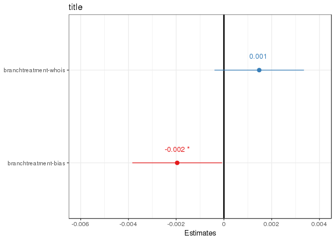

## R Markdown

within the document. You can embed an R code chunk like this:


## Effect of treatments on browsing

```r
# scored_activity_tbl = activity_tbl %>%
#  inner_join(scored_domains_tbl) %>%
#  filter(domain != 'youtube.com' & domain != 'google.com' & domain!= 'facebook.com') %>% 
#  mutate(total_active_time = total_dwell_time - total_idle_time,
#         scored_active_time = score * total_active_time) %>%
#  filter(total_active_time < 5000) #%>% # remove clients with active time greater than 99.999%

scaled_browsing = scored_activity_tbl %>%
  group_by(id, stage, branch, days_since_appearance) %>%
  summarise(
    scored_active_time_s = sum(abs(scored_active_time), na.rm=T), # XXX added abs value
    total_active_time_s = sum(total_active_time, na.rm=T)) %>%
  mutate(scaled_active_bias_s = scored_active_time_s/total_active_time_s) %>%
  compute('scaled_browsing')

treatment_spark = scaled_browsing %>%
  sdf_pivot(id + days_since_appearance + branch + scaled_active_bias_s ~ stage) %>%
  na.replace(0) %>%
  mutate(pretreatment = pretreatment * scaled_active_bias_s,
         treatment = treatment * scaled_active_bias_s,
         posttreatment = posttreatment * scaled_active_bias_s,
         condition = case_when(
           branch=='control'~'Control',
           branch=='treatment-bias'~'Treatment',
           branch=='treatment-whois'~'APlacebo')) 

fit_main_xcontrol = glm(data=treatment_spark, formula=posttreatment~pretreatment + branch)
fit_main_xplacebo = glm(data=treatment_spark, formula=posttreatment~pretreatment + condition)
fit_int_xplacebo = glm(data=treatment_spark, formula=posttreatment~pretreatment*condition + condition)
fit_int_xcontrol = glm(data=treatment_spark, formula=posttreatment~pretreatment*branch + branch)

sjt.lm(fit_main_xcontrol,fit_main_xplacebo,
        show.header = T,
        emph.p=T, 
        show.ci=T,
        digits.est = 3,
        digits.ci = 2,
        separate.ci.col = T,
        string.est = "Estimate",
        string.ci = "Conf. Int.",
        string.p = "p-value",
        string.dv = "Response",
        string.pred = "Coefficients",
        p.numeric = T)
```

```
## Warning in if (class(input_list[[1]]) == "list") input_list <-
## lapply(input_list[[1]], : the condition has length > 1 and only the first
## element will be used
```

```
## Fitted models have different coefficients. Grouping may not work properly. Set `group.pred = FALSE` if you encouter cluttered labelling.
```

<table style="border-collapse:collapse; border:none;border-bottom:double;">
<tr>
<td style="padding:0.2cm; border-top:double;" rowspan="2"><em>Coefficients</em></td>
<td colspan="8" style="padding:0.2cm; border-top:double; text-align:center; border-bottom:1px solid;"><em>Response</em></td>
</tr>

<td style=" padding-left:0.5em; padding-right:0.5em;">&nbsp;</td>
<td style="padding:0.2cm; text-align:center; " colspan="3">posttreatment</td>
<td style=" padding-left:0.5em; padding-right:0.5em;">&nbsp;</td>
<td style="padding:0.2cm; text-align:center; " colspan="3">posttreatment</td>
</tr>
<tr>
<td style="padding:0.2cm; font-style:italic;">&nbsp;</td>
<td style="padding-left:0.5em; padding-right:0.5em; font-style:italic;">&nbsp;</td>
<td style="padding:0.2cm; text-align:center; font-style:italic; ">Estimate</td>
<td style="padding:0.2cm; text-align:center; font-style:italic; ">Conf. Int.</td>
<td style="padding:0.2cm; text-align:center; font-style:italic; ">p&#45;value</td>
<td style="padding-left:0.5em; padding-right:0.5em; font-style:italic;">&nbsp;</td>
<td style="padding:0.2cm; text-align:center; font-style:italic; ">Estimate</td>
<td style="padding:0.2cm; text-align:center; font-style:italic; ">Conf. Int.</td>
<td style="padding:0.2cm; text-align:center; font-style:italic; ">p&#45;value</td> 
</tr>
<tr>
<td style="padding:0.2cm; border-top:1px solid; text-align:left;">(Intercept)</td>
<td style="padding-left:0.5em; padding-right:0.5em; border-top:1px solid; ">&nbsp;</td>
<td style="padding:0.2cm; text-align:center; border-top:1px solid; ">0.086</td>
<td style="padding:0.2cm; text-align:center; border-top:1px solid; ">0.08&nbsp;&ndash;&nbsp;0.09</td>
<td style="padding:0.2cm; text-align:center; border-top:1px solid; "><b>&lt;.001</b></td>
<td style="padding-left:0.5em; padding-right:0.5em; border-top:1px solid; ">&nbsp;</td>
<td style="padding:0.2cm; text-align:center; border-top:1px solid; ">0.087</td>
<td style="padding:0.2cm; text-align:center; border-top:1px solid; ">0.09&nbsp;&ndash;&nbsp;0.09</td>
<td style="padding:0.2cm; text-align:center; border-top:1px solid; "><b>&lt;.001</b></td>
</tr>
<tr>
<td style="padding:0.2cm; text-align:left;">pretreatment</td>
<td style="padding-left:0.5em; padding-right:0.5em;">&nbsp;</td>
<td style="padding:0.2cm; text-align:center; ">&#45;0.194</td>
<td style="padding:0.2cm; text-align:center; ">&#45;0.20&nbsp;&ndash;&nbsp;&#45;0.19</td>
<td style="padding:0.2cm; text-align:center; "><b>&lt;.001</b></td>
<td style="padding-left:0.5em; padding-right:0.5em;">&nbsp;</td>
<td style="padding:0.2cm; text-align:center; ">&#45;0.194</td>
<td style="padding:0.2cm; text-align:center; ">&#45;0.20&nbsp;&ndash;&nbsp;&#45;0.19</td>
<td style="padding:0.2cm; text-align:center; "><b>&lt;.001</b></td>
</tr>
<tr>
<td style="padding:0.2cm; text-align:left;">branchtreatment&#45;bias</td>
<td style="padding-left:0.5em; padding-right:0.5em;">&nbsp;</td>
<td style="padding:0.2cm; text-align:center; ">&#45;0.002</td>
<td style="padding:0.2cm; text-align:center; ">&#45;0.00&nbsp;&ndash;&nbsp;&#45;0.00</td>
<td style="padding:0.2cm; text-align:center; "><b>.041</b></td>
<td style="padding-left:0.5em; padding-right:0.5em;">&nbsp;</td>
<td style="padding:0.2cm; text-align:center; "></td>
<td style="padding:0.2cm; text-align:center; ">&nbsp;</td>
<td style="padding:0.2cm; text-align:center; "></td>
</tr>
<tr>
<td style="padding:0.2cm; text-align:left;">branchtreatment&#45;whois</td>
<td style="padding-left:0.5em; padding-right:0.5em;">&nbsp;</td>
<td style="padding:0.2cm; text-align:center; ">0.001</td>
<td style="padding:0.2cm; text-align:center; ">&#45;0.00&nbsp;&ndash;&nbsp;0.00</td>
<td style="padding:0.2cm; text-align:center; ">.122</td>
<td style="padding-left:0.5em; padding-right:0.5em;">&nbsp;</td>
<td style="padding:0.2cm; text-align:center; "></td>
<td style="padding:0.2cm; text-align:center; ">&nbsp;</td>
<td style="padding:0.2cm; text-align:center; "></td>
</tr>
<tr>
<td style="padding:0.2cm; text-align:left;">conditionControl</td>
<td style="padding-left:0.5em; padding-right:0.5em;">&nbsp;</td>
<td style="padding:0.2cm; text-align:center; "></td>
<td style="padding:0.2cm; text-align:center; ">&nbsp;</td>
<td style="padding:0.2cm; text-align:center; "></td>
<td style="padding-left:0.5em; padding-right:0.5em;">&nbsp;</td>
<td style="padding:0.2cm; text-align:center; ">&#45;0.001</td>
<td style="padding:0.2cm; text-align:center; ">&#45;0.00&nbsp;&ndash;&nbsp;0.00</td>
<td style="padding:0.2cm; text-align:center; ">.122</td>
</tr>
<tr>
<td style="padding:0.2cm; text-align:left;">conditionTreatment</td>
<td style="padding-left:0.5em; padding-right:0.5em;">&nbsp;</td>
<td style="padding:0.2cm; text-align:center; "></td>
<td style="padding:0.2cm; text-align:center; ">&nbsp;</td>
<td style="padding:0.2cm; text-align:center; "></td>
<td style="padding-left:0.5em; padding-right:0.5em;">&nbsp;</td>
<td style="padding:0.2cm; text-align:center; ">&#45;0.003</td>
<td style="padding:0.2cm; text-align:center; ">&#45;0.01&nbsp;&ndash;&nbsp;&#45;0.00</td>
<td style="padding:0.2cm; text-align:center; "><b>&lt;.001</b></td>
</tr>
<tr>
<td style="padding:0.2cm; padding-top:0.1cm; padding-bottom:0.1cm; text-align:left; border-top:1px solid;">Observations</td>
<td style="padding-left:0.5em; padding-right:0.5em; border-top:1px solid;">&nbsp;</td><td style="padding:0.2cm; padding-top:0.1cm; padding-bottom:0.1cm; text-align:center; border-top:1px solid;" colspan="3">160789</td>
<td style="padding-left:0.5em; padding-right:0.5em; border-top:1px solid;">&nbsp;</td><td style="padding:0.2cm; padding-top:0.1cm; padding-bottom:0.1cm; text-align:center; border-top:1px solid;" colspan="3">160789</td>
</tr>
<tr>
<td style="padding:0.2cm; text-align:left; padding-top:0.1cm; padding-bottom:0.1cm;">R<sup>2</sup> / adj. R<sup>2</sup></td>

<td style="padding-left:0.5em; padding-right:0.5em;">&nbsp;</td><td style="padding:0.2cm; text-align:center; padding-top:0.1cm; padding-bottom:0.1cm;" colspan="3">.001 / .044</td>

<td style="padding-left:0.5em; padding-right:0.5em;">&nbsp;</td><td style="padding:0.2cm; text-align:center; padding-top:0.1cm; padding-bottom:0.1cm;" colspan="3">.001 / .044</td>
 </tr>
</table>

```r
# library(stargazer)
# stargazer(fit_main_xcontrol,fit_main_xplacebo)

sjt.lm(fit_int_xplacebo, fit_int_xcontrol,
        show.header = T,
        emph.p=T, 
        show.ci=T,
        digits.est = 3,
        digits.ci = 2,
        separate.ci.col = T,
        string.est = "Estimate",
        string.ci = "Conf. Int.",
        string.p = "p-value",
        string.dv = "Response",
        string.pred = "Coefficients",
        p.numeric = T)
```

```
## Warning in if (class(input_list[[1]]) == "list") input_list <-
## lapply(input_list[[1]], : the condition has length > 1 and only the first
## element will be used
```

```
## Fitted models have different coefficients. Grouping may not work properly. Set `group.pred = FALSE` if you encouter cluttered labelling.
```

<table style="border-collapse:collapse; border:none;border-bottom:double;">
<tr>
<td style="padding:0.2cm; border-top:double;" rowspan="2"><em>Coefficients</em></td>
<td colspan="8" style="padding:0.2cm; border-top:double; text-align:center; border-bottom:1px solid;"><em>Response</em></td>
</tr>

<td style=" padding-left:0.5em; padding-right:0.5em;">&nbsp;</td>
<td style="padding:0.2cm; text-align:center; " colspan="3">posttreatment</td>
<td style=" padding-left:0.5em; padding-right:0.5em;">&nbsp;</td>
<td style="padding:0.2cm; text-align:center; " colspan="3">posttreatment</td>
</tr>
<tr>
<td style="padding:0.2cm; font-style:italic;">&nbsp;</td>
<td style="padding-left:0.5em; padding-right:0.5em; font-style:italic;">&nbsp;</td>
<td style="padding:0.2cm; text-align:center; font-style:italic; ">Estimate</td>
<td style="padding:0.2cm; text-align:center; font-style:italic; ">Conf. Int.</td>
<td style="padding:0.2cm; text-align:center; font-style:italic; ">p&#45;value</td>
<td style="padding-left:0.5em; padding-right:0.5em; font-style:italic;">&nbsp;</td>
<td style="padding:0.2cm; text-align:center; font-style:italic; ">Estimate</td>
<td style="padding:0.2cm; text-align:center; font-style:italic; ">Conf. Int.</td>
<td style="padding:0.2cm; text-align:center; font-style:italic; ">p&#45;value</td> 
</tr>
<tr>
<td style="padding:0.2cm; border-top:1px solid; text-align:left;">(Intercept)</td>
<td style="padding-left:0.5em; padding-right:0.5em; border-top:1px solid; ">&nbsp;</td>
<td style="padding:0.2cm; text-align:center; border-top:1px solid; ">0.087</td>
<td style="padding:0.2cm; text-align:center; border-top:1px solid; ">0.09&nbsp;&ndash;&nbsp;0.09</td>
<td style="padding:0.2cm; text-align:center; border-top:1px solid; "><b>&lt;.001</b></td>
<td style="padding-left:0.5em; padding-right:0.5em; border-top:1px solid; ">&nbsp;</td>
<td style="padding:0.2cm; text-align:center; border-top:1px solid; ">0.086</td>
<td style="padding:0.2cm; text-align:center; border-top:1px solid; ">0.08&nbsp;&ndash;&nbsp;0.09</td>
<td style="padding:0.2cm; text-align:center; border-top:1px solid; "><b>&lt;.001</b></td>
</tr>
<tr>
<td style="padding:0.2cm; text-align:left;">pretreatment</td>
<td style="padding-left:0.5em; padding-right:0.5em;">&nbsp;</td>
<td style="padding:0.2cm; text-align:center; ">&#45;0.196</td>
<td style="padding:0.2cm; text-align:center; ">&#45;0.20&nbsp;&ndash;&nbsp;&#45;0.19</td>
<td style="padding:0.2cm; text-align:center; "><b>&lt;.001</b></td>
<td style="padding-left:0.5em; padding-right:0.5em;">&nbsp;</td>
<td style="padding:0.2cm; text-align:center; ">&#45;0.198</td>
<td style="padding:0.2cm; text-align:center; ">&#45;0.21&nbsp;&ndash;&nbsp;&#45;0.19</td>
<td style="padding:0.2cm; text-align:center; "><b>&lt;.001</b></td>
</tr>
<tr>
<td style="padding:0.2cm; text-align:left;">conditionControl</td>
<td style="padding-left:0.5em; padding-right:0.5em;">&nbsp;</td>
<td style="padding:0.2cm; text-align:center; ">&#45;0.001</td>
<td style="padding:0.2cm; text-align:center; ">&#45;0.00&nbsp;&ndash;&nbsp;0.00</td>
<td style="padding:0.2cm; text-align:center; ">.206</td>
<td style="padding-left:0.5em; padding-right:0.5em;">&nbsp;</td>
<td style="padding:0.2cm; text-align:center; "></td>
<td style="padding:0.2cm; text-align:center; ">&nbsp;</td>
<td style="padding:0.2cm; text-align:center; "></td>
</tr>
<tr>
<td style="padding:0.2cm; text-align:left;">conditionTreatment</td>
<td style="padding-left:0.5em; padding-right:0.5em;">&nbsp;</td>
<td style="padding:0.2cm; text-align:center; ">&#45;0.004</td>
<td style="padding:0.2cm; text-align:center; ">&#45;0.01&nbsp;&ndash;&nbsp;&#45;0.00</td>
<td style="padding:0.2cm; text-align:center; "><b>&lt;.001</b></td>
<td style="padding-left:0.5em; padding-right:0.5em;">&nbsp;</td>
<td style="padding:0.2cm; text-align:center; "></td>
<td style="padding:0.2cm; text-align:center; ">&nbsp;</td>
<td style="padding:0.2cm; text-align:center; "></td>
</tr>
<tr>
<td style="padding:0.2cm; text-align:left;">pretreatment:conditionControl</td>
<td style="padding-left:0.5em; padding-right:0.5em;">&nbsp;</td>
<td style="padding:0.2cm; text-align:center; ">&#45;0.002</td>
<td style="padding:0.2cm; text-align:center; ">&#45;0.01&nbsp;&ndash;&nbsp;0.01</td>
<td style="padding:0.2cm; text-align:center; ">.750</td>
<td style="padding-left:0.5em; padding-right:0.5em;">&nbsp;</td>
<td style="padding:0.2cm; text-align:center; "></td>
<td style="padding:0.2cm; text-align:center; ">&nbsp;</td>
<td style="padding:0.2cm; text-align:center; "></td>
</tr>
<tr>
<td style="padding:0.2cm; text-align:left;">pretreatment:conditionTreatment</td>
<td style="padding-left:0.5em; padding-right:0.5em;">&nbsp;</td>
<td style="padding:0.2cm; text-align:center; ">0.007</td>
<td style="padding:0.2cm; text-align:center; ">&#45;0.00&nbsp;&ndash;&nbsp;0.02</td>
<td style="padding:0.2cm; text-align:center; ">.206</td>
<td style="padding-left:0.5em; padding-right:0.5em;">&nbsp;</td>
<td style="padding:0.2cm; text-align:center; "></td>
<td style="padding:0.2cm; text-align:center; ">&nbsp;</td>
<td style="padding:0.2cm; text-align:center; "></td>
</tr>
<tr>
<td style="padding:0.2cm; text-align:left;">branchtreatment&#45;bias</td>
<td style="padding-left:0.5em; padding-right:0.5em;">&nbsp;</td>
<td style="padding:0.2cm; text-align:center; "></td>
<td style="padding:0.2cm; text-align:center; ">&nbsp;</td>
<td style="padding:0.2cm; text-align:center; "></td>
<td style="padding-left:0.5em; padding-right:0.5em;">&nbsp;</td>
<td style="padding:0.2cm; text-align:center; ">&#45;0.003</td>
<td style="padding:0.2cm; text-align:center; ">&#45;0.00&nbsp;&ndash;&nbsp;&#45;0.00</td>
<td style="padding:0.2cm; text-align:center; "><b>.012</b></td>
</tr>
<tr>
<td style="padding:0.2cm; text-align:left;">branchtreatment&#45;whois</td>
<td style="padding-left:0.5em; padding-right:0.5em;">&nbsp;</td>
<td style="padding:0.2cm; text-align:center; "></td>
<td style="padding:0.2cm; text-align:center; ">&nbsp;</td>
<td style="padding:0.2cm; text-align:center; "></td>
<td style="padding-left:0.5em; padding-right:0.5em;">&nbsp;</td>
<td style="padding:0.2cm; text-align:center; ">0.001</td>
<td style="padding:0.2cm; text-align:center; ">&#45;0.00&nbsp;&ndash;&nbsp;0.00</td>
<td style="padding:0.2cm; text-align:center; ">.206</td>
</tr>
<tr>
<td style="padding:0.2cm; text-align:left;">pretreatment:branchtreatment&#45;bias</td>
<td style="padding-left:0.5em; padding-right:0.5em;">&nbsp;</td>
<td style="padding:0.2cm; text-align:center; "></td>
<td style="padding:0.2cm; text-align:center; ">&nbsp;</td>
<td style="padding:0.2cm; text-align:center; "></td>
<td style="padding-left:0.5em; padding-right:0.5em;">&nbsp;</td>
<td style="padding:0.2cm; text-align:center; ">0.009</td>
<td style="padding:0.2cm; text-align:center; ">&#45;0.00&nbsp;&ndash;&nbsp;0.02</td>
<td style="padding:0.2cm; text-align:center; ">.121</td>
</tr>
<tr>
<td style="padding:0.2cm; text-align:left;">pretreatment:branchtreatment&#45;whois</td>
<td style="padding-left:0.5em; padding-right:0.5em;">&nbsp;</td>
<td style="padding:0.2cm; text-align:center; "></td>
<td style="padding:0.2cm; text-align:center; ">&nbsp;</td>
<td style="padding:0.2cm; text-align:center; "></td>
<td style="padding-left:0.5em; padding-right:0.5em;">&nbsp;</td>
<td style="padding:0.2cm; text-align:center; ">0.002</td>
<td style="padding:0.2cm; text-align:center; ">&#45;0.01&nbsp;&ndash;&nbsp;0.01</td>
<td style="padding:0.2cm; text-align:center; ">.750</td>
</tr>
<tr>
<td style="padding:0.2cm; padding-top:0.1cm; padding-bottom:0.1cm; text-align:left; border-top:1px solid;">Observations</td>
<td style="padding-left:0.5em; padding-right:0.5em; border-top:1px solid;">&nbsp;</td><td style="padding:0.2cm; padding-top:0.1cm; padding-bottom:0.1cm; text-align:center; border-top:1px solid;" colspan="3">160789</td>
<td style="padding-left:0.5em; padding-right:0.5em; border-top:1px solid;">&nbsp;</td><td style="padding:0.2cm; padding-top:0.1cm; padding-bottom:0.1cm; text-align:center; border-top:1px solid;" colspan="3">160789</td>
</tr>
<tr>
<td style="padding:0.2cm; text-align:left; padding-top:0.1cm; padding-bottom:0.1cm;">R<sup>2</sup> / adj. R<sup>2</sup></td>

<td style="padding-left:0.5em; padding-right:0.5em;">&nbsp;</td><td style="padding:0.2cm; text-align:center; padding-top:0.1cm; padding-bottom:0.1cm;" colspan="3">.001 / .044</td>

<td style="padding-left:0.5em; padding-right:0.5em;">&nbsp;</td><td style="padding:0.2cm; text-align:center; padding-top:0.1cm; padding-bottom:0.1cm;" colspan="3">.001 / .044</td>
 </tr>
</table>

```r
sjPlot::plot_model(fit_main_xcontrol,
                   rm.terms=c('pretreatment'),
                   title='title',
                   vline.color='black',
                   show.values = T,
                   digits=3,
                   sort.est=T) + theme_bw()
```

<!-- -->

```r
sjPlot::plot_model(fit_main_xplacebo,
                   rm.terms=c('pretreatment'),
                   title='title',
                   vline.color='black',
                   show.values = T,
                   digits=3,
                   sort.est=T) + theme_bw()
```

<!-- -->

```r
sjPlot::plot_model(fit_int_xcontrol,
                   rm.terms=c('pretreatment'),
                   title='title',
                   vline.color='black',
                   show.values = T,
                   digits=3,
                   sort.est=T) + theme_bw()
```

<!-- -->

```r
sjPlot::plot_model(fit_int_xplacebo,
                   rm.terms=c('pretreatment'),
                   title='title',
                   vline.color='black',
                   show.values = T,
                   digits=3,
                   sort.est=T) + theme_bw()
```

<!-- -->

```r
dat = ggeffects::ggpredict(fit_int_xcontrol, terms = c('pretreatment','branch'))
```

```
## Following variables had many unique values and were prettified: pretreatment. Use `pretty = FALSE` to get smoother plots with all values, however, at the cost of increased memory usage.
```

```r
plot(dat) + theme_bw()
```

<!-- -->

```r
datb = ggeffects::ggpredict(fit_int_xplacebo, terms = c('pretreatment','condition'))
```

```
## Following variables had many unique values and were prettified: pretreatment. Use `pretty = FALSE` to get smoother plots with all values, however, at the cost of increased memory usage.
```

```r
plot(datb) + theme_bw()
```

<!-- -->


```
## Joining, by = "pioneer_id"
```

```
## Fitted models have different coefficients. Grouping may not work properly. Set `group.pred = FALSE` if you encouter cluttered labelling.
```

<table style="border-collapse:collapse; border:none;border-bottom:double;">
<tr>
<td style="padding:0.2cm; border-top:double;" rowspan="2"><em>Coefficients</em></td>
<td colspan="8" style="padding:0.2cm; border-top:double; text-align:center; border-bottom:1px solid;"><em>Response</em></td>
</tr>

<td style=" padding-left:0.5em; padding-right:0.5em;">&nbsp;</td>
<td style="padding:0.2cm; text-align:center; " colspan="3">posttreatment</td>
<td style=" padding-left:0.5em; padding-right:0.5em;">&nbsp;</td>
<td style="padding:0.2cm; text-align:center; " colspan="3">posttreatment</td>
</tr>
<tr>
<td style="padding:0.2cm; font-style:italic;">&nbsp;</td>
<td style="padding-left:0.5em; padding-right:0.5em; font-style:italic;">&nbsp;</td>
<td style="padding:0.2cm; text-align:center; font-style:italic; ">Estimate</td>
<td style="padding:0.2cm; text-align:center; font-style:italic; ">Conf. Int.</td>
<td style="padding:0.2cm; text-align:center; font-style:italic; ">p&#45;value</td>
<td style="padding-left:0.5em; padding-right:0.5em; font-style:italic;">&nbsp;</td>
<td style="padding:0.2cm; text-align:center; font-style:italic; ">Estimate</td>
<td style="padding:0.2cm; text-align:center; font-style:italic; ">Conf. Int.</td>
<td style="padding:0.2cm; text-align:center; font-style:italic; ">p&#45;value</td> 
</tr>
<tr>
<td style="padding:0.2cm; border-top:1px solid; text-align:left;">(Intercept)</td>
<td style="padding-left:0.5em; padding-right:0.5em; border-top:1px solid; ">&nbsp;</td>
<td style="padding:0.2cm; text-align:center; border-top:1px solid; ">&#45;0.070</td>
<td style="padding:0.2cm; text-align:center; border-top:1px solid; ">&#45;0.07&nbsp;&ndash;&nbsp;&#45;0.07</td>
<td style="padding:0.2cm; text-align:center; border-top:1px solid; "><b>&lt;.001</b></td>
<td style="padding-left:0.5em; padding-right:0.5em; border-top:1px solid; ">&nbsp;</td>
<td style="padding:0.2cm; text-align:center; border-top:1px solid; ">&#45;0.071</td>
<td style="padding:0.2cm; text-align:center; border-top:1px solid; ">&#45;0.07&nbsp;&ndash;&nbsp;&#45;0.07</td>
<td style="padding:0.2cm; text-align:center; border-top:1px solid; "><b>&lt;.001</b></td>
</tr>
<tr>
<td style="padding:0.2cm; text-align:left;">pretreatment</td>
<td style="padding-left:0.5em; padding-right:0.5em;">&nbsp;</td>
<td style="padding:0.2cm; text-align:center; ">&#45;0.107</td>
<td style="padding:0.2cm; text-align:center; ">&#45;0.12&nbsp;&ndash;&nbsp;&#45;0.10</td>
<td style="padding:0.2cm; text-align:center; "><b>&lt;.001</b></td>
<td style="padding-left:0.5em; padding-right:0.5em;">&nbsp;</td>
<td style="padding:0.2cm; text-align:center; ">&#45;0.107</td>
<td style="padding:0.2cm; text-align:center; ">&#45;0.12&nbsp;&ndash;&nbsp;&#45;0.10</td>
<td style="padding:0.2cm; text-align:center; "><b>&lt;.001</b></td>
</tr>
<tr>
<td style="padding:0.2cm; text-align:left;">branchtreatment&#45;bias</td>
<td style="padding-left:0.5em; padding-right:0.5em;">&nbsp;</td>
<td style="padding:0.2cm; text-align:center; ">0.005</td>
<td style="padding:0.2cm; text-align:center; ">0.00&nbsp;&ndash;&nbsp;0.01</td>
<td style="padding:0.2cm; text-align:center; "><b>.018</b></td>
<td style="padding-left:0.5em; padding-right:0.5em;">&nbsp;</td>
<td style="padding:0.2cm; text-align:center; "></td>
<td style="padding:0.2cm; text-align:center; ">&nbsp;</td>
<td style="padding:0.2cm; text-align:center; "></td>
</tr>
<tr>
<td style="padding:0.2cm; text-align:left;">branchtreatment&#45;whois</td>
<td style="padding-left:0.5em; padding-right:0.5em;">&nbsp;</td>
<td style="padding:0.2cm; text-align:center; ">&#45;0.001</td>
<td style="padding:0.2cm; text-align:center; ">&#45;0.00&nbsp;&ndash;&nbsp;0.00</td>
<td style="padding:0.2cm; text-align:center; ">.583</td>
<td style="padding-left:0.5em; padding-right:0.5em;">&nbsp;</td>
<td style="padding:0.2cm; text-align:center; "></td>
<td style="padding:0.2cm; text-align:center; ">&nbsp;</td>
<td style="padding:0.2cm; text-align:center; "></td>
</tr>
<tr>
<td style="padding:0.2cm; text-align:left;">pidR</td>
<td style="padding-left:0.5em; padding-right:0.5em;">&nbsp;</td>
<td style="padding:0.2cm; text-align:center; ">0.064</td>
<td style="padding:0.2cm; text-align:center; ">0.06&nbsp;&ndash;&nbsp;0.07</td>
<td style="padding:0.2cm; text-align:center; "><b>&lt;.001</b></td>
<td style="padding-left:0.5em; padding-right:0.5em;">&nbsp;</td>
<td style="padding:0.2cm; text-align:center; ">0.064</td>
<td style="padding:0.2cm; text-align:center; ">0.06&nbsp;&ndash;&nbsp;0.07</td>
<td style="padding:0.2cm; text-align:center; "><b>&lt;.001</b></td>
</tr>
<tr>
<td style="padding:0.2cm; text-align:left;">pidSD</td>
<td style="padding-left:0.5em; padding-right:0.5em;">&nbsp;</td>
<td style="padding:0.2cm; text-align:center; ">&#45;0.008</td>
<td style="padding:0.2cm; text-align:center; ">&#45;0.01&nbsp;&ndash;&nbsp;&#45;0.00</td>
<td style="padding:0.2cm; text-align:center; "><b>&lt;.001</b></td>
<td style="padding-left:0.5em; padding-right:0.5em;">&nbsp;</td>
<td style="padding:0.2cm; text-align:center; ">&#45;0.008</td>
<td style="padding:0.2cm; text-align:center; ">&#45;0.01&nbsp;&ndash;&nbsp;&#45;0.00</td>
<td style="padding:0.2cm; text-align:center; "><b>&lt;.001</b></td>
</tr>
<tr>
<td style="padding:0.2cm; text-align:left;">pidSR</td>
<td style="padding-left:0.5em; padding-right:0.5em;">&nbsp;</td>
<td style="padding:0.2cm; text-align:center; ">0.110</td>
<td style="padding:0.2cm; text-align:center; ">0.10&nbsp;&ndash;&nbsp;0.12</td>
<td style="padding:0.2cm; text-align:center; "><b>&lt;.001</b></td>
<td style="padding-left:0.5em; padding-right:0.5em;">&nbsp;</td>
<td style="padding:0.2cm; text-align:center; ">0.110</td>
<td style="padding:0.2cm; text-align:center; ">0.10&nbsp;&ndash;&nbsp;0.12</td>
<td style="padding:0.2cm; text-align:center; "><b>&lt;.001</b></td>
</tr>
<tr>
<td style="padding:0.2cm; text-align:left;">conditionControl</td>
<td style="padding-left:0.5em; padding-right:0.5em;">&nbsp;</td>
<td style="padding:0.2cm; text-align:center; "></td>
<td style="padding:0.2cm; text-align:center; ">&nbsp;</td>
<td style="padding:0.2cm; text-align:center; "></td>
<td style="padding-left:0.5em; padding-right:0.5em;">&nbsp;</td>
<td style="padding:0.2cm; text-align:center; ">0.001</td>
<td style="padding:0.2cm; text-align:center; ">&#45;0.00&nbsp;&ndash;&nbsp;0.00</td>
<td style="padding:0.2cm; text-align:center; ">.583</td>
</tr>
<tr>
<td style="padding:0.2cm; text-align:left;">conditionTreatment</td>
<td style="padding-left:0.5em; padding-right:0.5em;">&nbsp;</td>
<td style="padding:0.2cm; text-align:center; "></td>
<td style="padding:0.2cm; text-align:center; ">&nbsp;</td>
<td style="padding:0.2cm; text-align:center; "></td>
<td style="padding-left:0.5em; padding-right:0.5em;">&nbsp;</td>
<td style="padding:0.2cm; text-align:center; ">0.006</td>
<td style="padding:0.2cm; text-align:center; ">0.00&nbsp;&ndash;&nbsp;0.01</td>
<td style="padding:0.2cm; text-align:center; "><b>.003</b></td>
</tr>
<tr>
<td style="padding:0.2cm; padding-top:0.1cm; padding-bottom:0.1cm; text-align:left; border-top:1px solid;">Observations</td>
<td style="padding-left:0.5em; padding-right:0.5em; border-top:1px solid;">&nbsp;</td><td style="padding:0.2cm; padding-top:0.1cm; padding-bottom:0.1cm; text-align:center; border-top:1px solid;" colspan="3">44181</td>
<td style="padding-left:0.5em; padding-right:0.5em; border-top:1px solid;">&nbsp;</td><td style="padding:0.2cm; padding-top:0.1cm; padding-bottom:0.1cm; text-align:center; border-top:1px solid;" colspan="3">44181</td>
</tr>
<tr>
<td style="padding:0.2cm; text-align:left; padding-top:0.1cm; padding-bottom:0.1cm;">R<sup>2</sup> / adj. R<sup>2</sup></td>

<td style="padding-left:0.5em; padding-right:0.5em;">&nbsp;</td><td style="padding:0.2cm; text-align:center; padding-top:0.1cm; padding-bottom:0.1cm;" colspan="3">.002 / .054</td>

<td style="padding-left:0.5em; padding-right:0.5em;">&nbsp;</td><td style="padding:0.2cm; text-align:center; padding-top:0.1cm; padding-bottom:0.1cm;" colspan="3">.002 / .054</td>
 </tr>
</table>

```
## Fitted models have different coefficients. Grouping may not work properly. Set `group.pred = FALSE` if you encouter cluttered labelling.
```

<table style="border-collapse:collapse; border:none;border-bottom:double;">
<tr>
<td style="padding:0.2cm; border-top:double;" rowspan="2"><em>Coefficients</em></td>
<td colspan="8" style="padding:0.2cm; border-top:double; text-align:center; border-bottom:1px solid;"><em>Response</em></td>
</tr>

<td style=" padding-left:0.5em; padding-right:0.5em;">&nbsp;</td>
<td style="padding:0.2cm; text-align:center; " colspan="3">posttreatment</td>
<td style=" padding-left:0.5em; padding-right:0.5em;">&nbsp;</td>
<td style="padding:0.2cm; text-align:center; " colspan="3">posttreatment</td>
</tr>
<tr>
<td style="padding:0.2cm; font-style:italic;">&nbsp;</td>
<td style="padding-left:0.5em; padding-right:0.5em; font-style:italic;">&nbsp;</td>
<td style="padding:0.2cm; text-align:center; font-style:italic; ">Estimate</td>
<td style="padding:0.2cm; text-align:center; font-style:italic; ">Conf. Int.</td>
<td style="padding:0.2cm; text-align:center; font-style:italic; ">p&#45;value</td>
<td style="padding-left:0.5em; padding-right:0.5em; font-style:italic;">&nbsp;</td>
<td style="padding:0.2cm; text-align:center; font-style:italic; ">Estimate</td>
<td style="padding:0.2cm; text-align:center; font-style:italic; ">Conf. Int.</td>
<td style="padding:0.2cm; text-align:center; font-style:italic; ">p&#45;value</td> 
</tr>
<tr>
<td style="padding:0.2cm; border-top:1px solid; text-align:left;">(Intercept)</td>
<td style="padding-left:0.5em; padding-right:0.5em; border-top:1px solid; ">&nbsp;</td>
<td style="padding:0.2cm; text-align:center; border-top:1px solid; ">&#45;0.067</td>
<td style="padding:0.2cm; text-align:center; border-top:1px solid; ">&#45;0.07&nbsp;&ndash;&nbsp;&#45;0.06</td>
<td style="padding:0.2cm; text-align:center; border-top:1px solid; "><b>&lt;.001</b></td>
<td style="padding-left:0.5em; padding-right:0.5em; border-top:1px solid; ">&nbsp;</td>
<td style="padding:0.2cm; text-align:center; border-top:1px solid; ">&#45;0.072</td>
<td style="padding:0.2cm; text-align:center; border-top:1px solid; ">&#45;0.08&nbsp;&ndash;&nbsp;&#45;0.07</td>
<td style="padding:0.2cm; text-align:center; border-top:1px solid; "><b>&lt;.001</b></td>
</tr>
<tr>
<td style="padding:0.2cm; text-align:left;">pretreatment</td>
<td style="padding-left:0.5em; padding-right:0.5em;">&nbsp;</td>
<td style="padding:0.2cm; text-align:center; ">&#45;0.107</td>
<td style="padding:0.2cm; text-align:center; ">&#45;0.12&nbsp;&ndash;&nbsp;&#45;0.10</td>
<td style="padding:0.2cm; text-align:center; "><b>&lt;.001</b></td>
<td style="padding-left:0.5em; padding-right:0.5em;">&nbsp;</td>
<td style="padding:0.2cm; text-align:center; ">&#45;0.107</td>
<td style="padding:0.2cm; text-align:center; ">&#45;0.12&nbsp;&ndash;&nbsp;&#45;0.10</td>
<td style="padding:0.2cm; text-align:center; "><b>&lt;.001</b></td>
</tr>
<tr>
<td style="padding:0.2cm; text-align:left;">branchtreatment&#45;bias</td>
<td style="padding-left:0.5em; padding-right:0.5em;">&nbsp;</td>
<td style="padding:0.2cm; text-align:center; ">0.001</td>
<td style="padding:0.2cm; text-align:center; ">&#45;0.01&nbsp;&ndash;&nbsp;0.01</td>
<td style="padding:0.2cm; text-align:center; ">.843</td>
<td style="padding-left:0.5em; padding-right:0.5em;">&nbsp;</td>
<td style="padding:0.2cm; text-align:center; "></td>
<td style="padding:0.2cm; text-align:center; ">&nbsp;</td>
<td style="padding:0.2cm; text-align:center; "></td>
</tr>
<tr>
<td style="padding:0.2cm; text-align:left;">branchtreatment&#45;whois</td>
<td style="padding-left:0.5em; padding-right:0.5em;">&nbsp;</td>
<td style="padding:0.2cm; text-align:center; ">&#45;0.005</td>
<td style="padding:0.2cm; text-align:center; ">&#45;0.01&nbsp;&ndash;&nbsp;0.00</td>
<td style="padding:0.2cm; text-align:center; ">.133</td>
<td style="padding-left:0.5em; padding-right:0.5em;">&nbsp;</td>
<td style="padding:0.2cm; text-align:center; "></td>
<td style="padding:0.2cm; text-align:center; ">&nbsp;</td>
<td style="padding:0.2cm; text-align:center; "></td>
</tr>
<tr>
<td style="padding:0.2cm; text-align:left;">pidR</td>
<td style="padding-left:0.5em; padding-right:0.5em;">&nbsp;</td>
<td style="padding:0.2cm; text-align:center; ">0.059</td>
<td style="padding:0.2cm; text-align:center; ">0.05&nbsp;&ndash;&nbsp;0.07</td>
<td style="padding:0.2cm; text-align:center; "><b>&lt;.001</b></td>
<td style="padding-left:0.5em; padding-right:0.5em;">&nbsp;</td>
<td style="padding:0.2cm; text-align:center; ">0.072</td>
<td style="padding:0.2cm; text-align:center; ">0.07&nbsp;&ndash;&nbsp;0.08</td>
<td style="padding:0.2cm; text-align:center; "><b>&lt;.001</b></td>
</tr>
<tr>
<td style="padding:0.2cm; text-align:left;">pidSD</td>
<td style="padding-left:0.5em; padding-right:0.5em;">&nbsp;</td>
<td style="padding:0.2cm; text-align:center; ">&#45;0.011</td>
<td style="padding:0.2cm; text-align:center; ">&#45;0.02&nbsp;&ndash;&nbsp;&#45;0.00</td>
<td style="padding:0.2cm; text-align:center; "><b>.001</b></td>
<td style="padding-left:0.5em; padding-right:0.5em;">&nbsp;</td>
<td style="padding:0.2cm; text-align:center; ">&#45;0.011</td>
<td style="padding:0.2cm; text-align:center; ">&#45;0.02&nbsp;&ndash;&nbsp;&#45;0.00</td>
<td style="padding:0.2cm; text-align:center; "><b>.001</b></td>
</tr>
<tr>
<td style="padding:0.2cm; text-align:left;">pidSR</td>
<td style="padding-left:0.5em; padding-right:0.5em;">&nbsp;</td>
<td style="padding:0.2cm; text-align:center; ">0.101</td>
<td style="padding:0.2cm; text-align:center; ">0.09&nbsp;&ndash;&nbsp;0.11</td>
<td style="padding:0.2cm; text-align:center; "><b>&lt;.001</b></td>
<td style="padding-left:0.5em; padding-right:0.5em;">&nbsp;</td>
<td style="padding:0.2cm; text-align:center; ">0.108</td>
<td style="padding:0.2cm; text-align:center; ">0.10&nbsp;&ndash;&nbsp;0.12</td>
<td style="padding:0.2cm; text-align:center; "><b>&lt;.001</b></td>
</tr>
<tr>
<td style="padding:0.2cm; text-align:left;">branchtreatment&#45;bias:pidR</td>
<td style="padding-left:0.5em; padding-right:0.5em;">&nbsp;</td>
<td style="padding:0.2cm; text-align:center; ">0.002</td>
<td style="padding:0.2cm; text-align:center; ">&#45;0.01&nbsp;&ndash;&nbsp;0.01</td>
<td style="padding:0.2cm; text-align:center; ">.642</td>
<td style="padding-left:0.5em; padding-right:0.5em;">&nbsp;</td>
<td style="padding:0.2cm; text-align:center; "></td>
<td style="padding:0.2cm; text-align:center; ">&nbsp;</td>
<td style="padding:0.2cm; text-align:center; "></td>
</tr>
<tr>
<td style="padding:0.2cm; text-align:left;">branchtreatment&#45;whois:pidR</td>
<td style="padding-left:0.5em; padding-right:0.5em;">&nbsp;</td>
<td style="padding:0.2cm; text-align:center; ">0.013</td>
<td style="padding:0.2cm; text-align:center; ">0.00&nbsp;&ndash;&nbsp;0.02</td>
<td style="padding:0.2cm; text-align:center; "><b>.013</b></td>
<td style="padding-left:0.5em; padding-right:0.5em;">&nbsp;</td>
<td style="padding:0.2cm; text-align:center; "></td>
<td style="padding:0.2cm; text-align:center; ">&nbsp;</td>
<td style="padding:0.2cm; text-align:center; "></td>
</tr>
<tr>
<td style="padding:0.2cm; text-align:left;">branchtreatment&#45;bias:pidSD</td>
<td style="padding-left:0.5em; padding-right:0.5em;">&nbsp;</td>
<td style="padding:0.2cm; text-align:center; ">0.008</td>
<td style="padding:0.2cm; text-align:center; ">&#45;0.00&nbsp;&ndash;&nbsp;0.02</td>
<td style="padding:0.2cm; text-align:center; ">.107</td>
<td style="padding-left:0.5em; padding-right:0.5em;">&nbsp;</td>
<td style="padding:0.2cm; text-align:center; "></td>
<td style="padding:0.2cm; text-align:center; ">&nbsp;</td>
<td style="padding:0.2cm; text-align:center; "></td>
</tr>
<tr>
<td style="padding:0.2cm; text-align:left;">branchtreatment&#45;whois:pidSD</td>
<td style="padding-left:0.5em; padding-right:0.5em;">&nbsp;</td>
<td style="padding:0.2cm; text-align:center; ">0.000</td>
<td style="padding:0.2cm; text-align:center; ">&#45;0.01&nbsp;&ndash;&nbsp;0.01</td>
<td style="padding:0.2cm; text-align:center; ">.942</td>
<td style="padding-left:0.5em; padding-right:0.5em;">&nbsp;</td>
<td style="padding:0.2cm; text-align:center; "></td>
<td style="padding:0.2cm; text-align:center; ">&nbsp;</td>
<td style="padding:0.2cm; text-align:center; "></td>
</tr>
<tr>
<td style="padding:0.2cm; text-align:left;">branchtreatment&#45;bias:pidSR</td>
<td style="padding-left:0.5em; padding-right:0.5em;">&nbsp;</td>
<td style="padding:0.2cm; text-align:center; ">0.019</td>
<td style="padding:0.2cm; text-align:center; ">0.00&nbsp;&ndash;&nbsp;0.03</td>
<td style="padding:0.2cm; text-align:center; "><b>.008</b></td>
<td style="padding-left:0.5em; padding-right:0.5em;">&nbsp;</td>
<td style="padding:0.2cm; text-align:center; "></td>
<td style="padding:0.2cm; text-align:center; ">&nbsp;</td>
<td style="padding:0.2cm; text-align:center; "></td>
</tr>
<tr>
<td style="padding:0.2cm; text-align:left;">branchtreatment&#45;whois:pidSR</td>
<td style="padding-left:0.5em; padding-right:0.5em;">&nbsp;</td>
<td style="padding:0.2cm; text-align:center; ">0.008</td>
<td style="padding:0.2cm; text-align:center; ">&#45;0.01&nbsp;&ndash;&nbsp;0.02</td>
<td style="padding:0.2cm; text-align:center; ">.285</td>
<td style="padding-left:0.5em; padding-right:0.5em;">&nbsp;</td>
<td style="padding:0.2cm; text-align:center; "></td>
<td style="padding:0.2cm; text-align:center; ">&nbsp;</td>
<td style="padding:0.2cm; text-align:center; "></td>
</tr>
<tr>
<td style="padding:0.2cm; text-align:left;">conditionControl</td>
<td style="padding-left:0.5em; padding-right:0.5em;">&nbsp;</td>
<td style="padding:0.2cm; text-align:center; "></td>
<td style="padding:0.2cm; text-align:center; ">&nbsp;</td>
<td style="padding:0.2cm; text-align:center; "></td>
<td style="padding-left:0.5em; padding-right:0.5em;">&nbsp;</td>
<td style="padding:0.2cm; text-align:center; ">0.005</td>
<td style="padding:0.2cm; text-align:center; ">&#45;0.00&nbsp;&ndash;&nbsp;0.01</td>
<td style="padding:0.2cm; text-align:center; ">.133</td>
</tr>
<tr>
<td style="padding:0.2cm; text-align:left;">conditionTreatment</td>
<td style="padding-left:0.5em; padding-right:0.5em;">&nbsp;</td>
<td style="padding:0.2cm; text-align:center; "></td>
<td style="padding:0.2cm; text-align:center; ">&nbsp;</td>
<td style="padding:0.2cm; text-align:center; "></td>
<td style="padding-left:0.5em; padding-right:0.5em;">&nbsp;</td>
<td style="padding:0.2cm; text-align:center; ">0.005</td>
<td style="padding:0.2cm; text-align:center; ">&#45;0.00&nbsp;&ndash;&nbsp;0.01</td>
<td style="padding:0.2cm; text-align:center; ">.077</td>
</tr>
<tr>
<td style="padding:0.2cm; text-align:left;">conditionControl:pidR</td>
<td style="padding-left:0.5em; padding-right:0.5em;">&nbsp;</td>
<td style="padding:0.2cm; text-align:center; "></td>
<td style="padding:0.2cm; text-align:center; ">&nbsp;</td>
<td style="padding:0.2cm; text-align:center; "></td>
<td style="padding-left:0.5em; padding-right:0.5em;">&nbsp;</td>
<td style="padding:0.2cm; text-align:center; ">&#45;0.013</td>
<td style="padding:0.2cm; text-align:center; ">&#45;0.02&nbsp;&ndash;&nbsp;&#45;0.00</td>
<td style="padding:0.2cm; text-align:center; "><b>.013</b></td>
</tr>
<tr>
<td style="padding:0.2cm; text-align:left;">conditionTreatment:pidR</td>
<td style="padding-left:0.5em; padding-right:0.5em;">&nbsp;</td>
<td style="padding:0.2cm; text-align:center; "></td>
<td style="padding:0.2cm; text-align:center; ">&nbsp;</td>
<td style="padding:0.2cm; text-align:center; "></td>
<td style="padding-left:0.5em; padding-right:0.5em;">&nbsp;</td>
<td style="padding:0.2cm; text-align:center; ">&#45;0.011</td>
<td style="padding:0.2cm; text-align:center; ">&#45;0.02&nbsp;&ndash;&nbsp;&#45;0.00</td>
<td style="padding:0.2cm; text-align:center; "><b>.034</b></td>
</tr>
<tr>
<td style="padding:0.2cm; text-align:left;">conditionControl:pidSD</td>
<td style="padding-left:0.5em; padding-right:0.5em;">&nbsp;</td>
<td style="padding:0.2cm; text-align:center; "></td>
<td style="padding:0.2cm; text-align:center; ">&nbsp;</td>
<td style="padding:0.2cm; text-align:center; "></td>
<td style="padding-left:0.5em; padding-right:0.5em;">&nbsp;</td>
<td style="padding:0.2cm; text-align:center; ">&#45;0.000</td>
<td style="padding:0.2cm; text-align:center; ">&#45;0.01&nbsp;&ndash;&nbsp;0.01</td>
<td style="padding:0.2cm; text-align:center; ">.942</td>
</tr>
<tr>
<td style="padding:0.2cm; text-align:left;">conditionTreatment:pidSD</td>
<td style="padding-left:0.5em; padding-right:0.5em;">&nbsp;</td>
<td style="padding:0.2cm; text-align:center; "></td>
<td style="padding:0.2cm; text-align:center; ">&nbsp;</td>
<td style="padding:0.2cm; text-align:center; "></td>
<td style="padding-left:0.5em; padding-right:0.5em;">&nbsp;</td>
<td style="padding:0.2cm; text-align:center; ">0.007</td>
<td style="padding:0.2cm; text-align:center; ">&#45;0.00&nbsp;&ndash;&nbsp;0.02</td>
<td style="padding:0.2cm; text-align:center; ">.118</td>
</tr>
<tr>
<td style="padding:0.2cm; text-align:left;">conditionControl:pidSR</td>
<td style="padding-left:0.5em; padding-right:0.5em;">&nbsp;</td>
<td style="padding:0.2cm; text-align:center; "></td>
<td style="padding:0.2cm; text-align:center; ">&nbsp;</td>
<td style="padding:0.2cm; text-align:center; "></td>
<td style="padding-left:0.5em; padding-right:0.5em;">&nbsp;</td>
<td style="padding:0.2cm; text-align:center; ">&#45;0.008</td>
<td style="padding:0.2cm; text-align:center; ">&#45;0.02&nbsp;&ndash;&nbsp;0.01</td>
<td style="padding:0.2cm; text-align:center; ">.285</td>
</tr>
<tr>
<td style="padding:0.2cm; text-align:left;">conditionTreatment:pidSR</td>
<td style="padding-left:0.5em; padding-right:0.5em;">&nbsp;</td>
<td style="padding:0.2cm; text-align:center; "></td>
<td style="padding:0.2cm; text-align:center; ">&nbsp;</td>
<td style="padding:0.2cm; text-align:center; "></td>
<td style="padding-left:0.5em; padding-right:0.5em;">&nbsp;</td>
<td style="padding:0.2cm; text-align:center; ">0.011</td>
<td style="padding:0.2cm; text-align:center; ">&#45;0.00&nbsp;&ndash;&nbsp;0.03</td>
<td style="padding:0.2cm; text-align:center; ">.111</td>
</tr>
<tr>
<td style="padding:0.2cm; padding-top:0.1cm; padding-bottom:0.1cm; text-align:left; border-top:1px solid;">Observations</td>
<td style="padding-left:0.5em; padding-right:0.5em; border-top:1px solid;">&nbsp;</td><td style="padding:0.2cm; padding-top:0.1cm; padding-bottom:0.1cm; text-align:center; border-top:1px solid;" colspan="3">44181</td>
<td style="padding-left:0.5em; padding-right:0.5em; border-top:1px solid;">&nbsp;</td><td style="padding:0.2cm; padding-top:0.1cm; padding-bottom:0.1cm; text-align:center; border-top:1px solid;" colspan="3">44181</td>
</tr>
<tr>
<td style="padding:0.2cm; text-align:left; padding-top:0.1cm; padding-bottom:0.1cm;">R<sup>2</sup> / adj. R<sup>2</sup></td>

<td style="padding-left:0.5em; padding-right:0.5em;">&nbsp;</td><td style="padding:0.2cm; text-align:center; padding-top:0.1cm; padding-bottom:0.1cm;" colspan="3">.002 / .054</td>

<td style="padding-left:0.5em; padding-right:0.5em;">&nbsp;</td><td style="padding:0.2cm; text-align:center; padding-top:0.1cm; padding-bottom:0.1cm;" colspan="3">.002 / .054</td>
 </tr>
</table>
<!-- --><!-- --><!-- --><!-- -->

```
## Following variables had many unique values and were prettified: pretreatment. Use `pretty = FALSE` to get smoother plots with all values, however, at the cost of increased memory usage.
```

<!-- -->

```
## Following variables had many unique values and were prettified: pretreatment. Use `pretty = FALSE` to get smoother plots with all values, however, at the cost of increased memory usage.
```

<!-- -->

```r
# ecdf_df= data.frame(Days=quantile(ecdf_activewdays_df$nn, probs=c(0, .25, .5, .75, .99, .999, .9999, 1)))
# 
# ecdf_activedays_tab=xtable(t(ecdf_df),
#                            caption='caption',
#                            label='tab:ecdf_activewdays')
# 
# print(ecdf_activedays_tab,file="tables.tex",append=T,table.placement = "h",
#  caption.placement="bottom", hline.after=seq(from=-1,to=nrow(ecdf_activedays_tab),by=1))

mod_stargazer <- function(output.file, ...) {
  output <- capture.output(stargazer(...,omit.stat=c("LL","ser","f"), no.space=TRUE))
  cat(paste(output, collapse = "\n"), "\n", file=output.file, append=TRUE)
}

mod_stargazer('tables.tex',list(fit_pid_main_xplacebo,fit_pid_int_xplacebo), header=F)
mod_stargazer('tables.tex',list(fit_pid_main_xcontrol,fit_pid_int_xcontrol), header=F)
```

