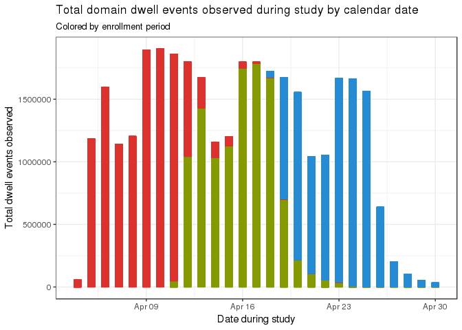
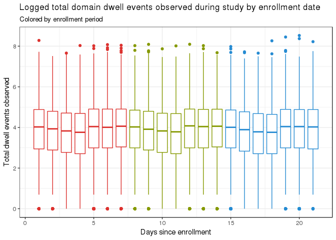
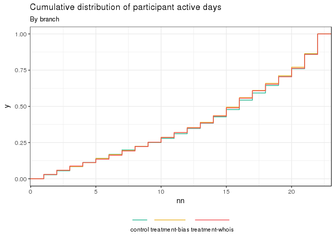

We begin with a description of the population itself.

# Data cleaning and preparation


## Distribution of activity during the study period

```r
visitdate_df = activity_tbl %>% 
  group_by(id, visit_start_date, stage) %>%
  count %>% collect

startdate_df = activity_tbl %>% 
  group_by(id, days_since_appearance, stage) %>%
  count %>% collect

ggplot(visitdate_df, aes(
  x=visit_start_date,
  y=n,
  color=stage
)) +
  geom_bar(stat='identity', width=.5) +
  guides(color=F) +
  theme_bw() + scale_color_solarized() + 
  labs(title = "Total domain dwell events observed during study by calendar date", subtitle = "Colored by enrollment period") +
  xlab('Date during study') + ylab('Total dwell events observed')
```

<!-- -->

```r
ggplot(startdate_df, aes(
  x=days_since_appearance,
  y=n,
  color=stage
)) +
  geom_bar(stat='identity', width=.5)+
  guides(color=F) +
  theme_bw() + scale_color_solarized() + 
  labs(title = "Total domain dwell events observed during study by enrollment date", subtitle = "Colored by enrollment period") +
  xlab('Days since enrollment') + ylab('Total dwell events observed')
```

<!-- -->

```r
ggplot(startdate_df, aes(
  x=days_since_appearance,
  y=log(n),
  group=days_since_appearance,
  color=stage)) +
  geom_boxplot() +
  guides(color=F) +
  theme_bw() + scale_color_solarized() +
  labs(title = "Logged total domain dwell events observed during study by enrollment date", subtitle = "Colored by enrollment period") +
  xlab('Days since enrollment') + ylab('Total dwell events observed')
```

<!-- -->

## General activity of enrollees over all study periods

```r
ecdf_activedays_df = activity_tbl %>%
  group_by(visit_start_date, branch, id) %>%
  count %>%
  filter(n>0)%>%
  group_by(id, branch)%>%
  count %>%
  collect

ggplot(ecdf_activedays_df, aes(nn)) + geom_histogram(binwidth=1,position='dodge') + 
  theme_bw()+
  labs(title = "Observed distribution of participant active days", subtitle = "Over all study periods")
```

<!-- -->

```r
ggplot(ecdf_activedays_df, aes(nn)) + stat_ecdf(geom='step') + 
  theme_bw() +
  labs(title = "Cumulative distribution of participant active days", subtitle = "Over all study periods")
```

<!-- -->

```r
ggplot(ecdf_activedays_df, aes(nn, fill=branch)) + 
  geom_histogram(binwidth=1,position='dodge') + 
  scale_fill_canva(palette='Tropical tones', 
                    guide=guide_legend(title='', label.position='bottom')) +
  labs(title = "Observed distribution of participant active days by branch", subtitle = "By branch") +
  theme_bw() + theme(legend.position="bottom")
```

<!-- -->

```r
ggplot(ecdf_activedays_df, aes(nn, color=branch)) + stat_ecdf(geom='step') + 
  scale_color_canva(palette='Tropical tones', 
                    guide=guide_legend(title='', label.position='bottom')) +
  theme_bw()+ theme(legend.position="bottom") +
  labs(title = "Cumulative distribution of participant active days", subtitle = "By branch")
```

<!-- -->

### Without weekends?

```r
pdf_activewdays_df = activity_tbl %>%
  group_by(visit_start_date, branch, id) %>%
  count %>%
  collect %>%
  mutate(wday=wday(visit_start_date)) %>%
  filter(n>0)%>%
  ungroup %>% group_by(wday) %>%
  count %>% collect

ecdf_activewdays_df = activity_tbl %>%
  group_by(visit_start_date, branch, id) %>%
  count %>%
  collect %>%
  mutate(wday=wday(visit_start_date)) %>%
  filter(n>0 & wday !=1 & wday !=7)%>%
  group_by(id, branch)%>%
  count %>% collect

ggplot(ecdf_activewdays_df, aes(nn)) +
  geom_histogram(binwidth=1,position='dodge') +
  theme_bw() +
  labs(title = "New plot title", subtitle = "A subtitle")
```

<!-- -->

```r
ggplot(ecdf_activewdays_df, aes(nn)) +
  stat_ecdf(geom='step') +
  theme_bw() +
  labs(title = "New plot title", subtitle = "A subtitle")
```

<!-- -->

```r
ggplot(ecdf_activewdays_df, aes(nn, fill=branch)) +
  geom_histogram(binwidth=1,position='dodge') +
  scale_fill_canva(palette='Tropical tones',
                    guide=guide_legend(title='', label.position='bottom')) +
  theme_bw()+ theme(legend.position="bottom") +
  labs(title = "New plot title", subtitle = "A subtitle")
```

<!-- -->

```r
ggplot(ecdf_activewdays_df, aes(nn, color=branch)) +
  stat_ecdf(geom='step') +
  theme_bw()+ theme(legend.position="bottom") +
  scale_color_canva(palette='Tropical tones',
                    guide=guide_legend(title='', label.position='bottom')) +

  labs(title = "New plot title", subtitle = "A subtitle")
```

<!-- -->

```r
pander(quantile(ecdf_activewdays_df$nn, probs=c(0, .25, .5, .75, .99, .999, .9999, 1)))
```


----------------------------------------------------
 0%   25%   50%   75%   99%   99.9%   99.99%   100% 
---- ----- ----- ----- ----- ------- -------- ------
 1     7    13    15    16     16       16      16  
----------------------------------------------------

## Distribution of time of browsing


```r
hours = activity_tbl %>% mutate(timestamp=hour(from_unixtime(visit_start_time))) %>% select(timestamp) %>% group_by(timestamp) %>% count %>% collect
hours$timestamp = hours(hours$timestamp)

ggplot(hours, aes(x=timestamp, y=n)) + 
  geom_bar(stat='identity') + 
  scale_y_continuous(labels=comma) +
  scale_x_time(labels = date_format("%H:%M")) +
  theme_bw() 
```

<!-- -->


## Average number of pageviews per day

```r
daily_pagevisits = activity_tbl %>%
  group_by(id,visit_start_date) %>%
  count %>%
  ungroup %>% group_by(id) %>%
  summarise(
    mu=mean(n, na.rm=T)
  ) %>%
  filter(mu<800) %>%
  collect

ggplot(daily_pagevisits, aes(x=mu)) + 
  geom_histogram(binwidth=1) + 
  theme_bw() +
  labs(title = "New plot title", subtitle = "A subtitle")
```

<!-- -->

```r
ggplot(daily_pagevisits, aes(x=mu)) + 
  stat_ecdf() + 
  theme_bw() +
  labs(title = "New plot title", subtitle = "A subtitle")
```

<!-- -->

```r
ggplot(daily_pagevisits, aes(x=log(mu))) + 
  geom_histogram(binwidth=.01) + 
  theme_bw() +
  labs(title = "New plot title", subtitle = "A subtitle")
```

<!-- -->

```r
ggplot(daily_pagevisits, aes(x=log(mu))) + 
  stat_ecdf() + 
  theme_bw() +
  labs(title = "New plot title", subtitle = "A subtitle")
```

<!-- -->

```r
pander(quantile(daily_pagevisits$mu, probs=c(0, .25, .5, .75, .99, .999, .9999, 1)))
```


------------------------------------------------------------
 0%   25%     50%     75%     99%    99.9%   99.99%   100%  
---- ------ ------- ------- ------- ------- -------- -------
 1    25.5   54.46   110.7   471.2   731.2   787.4    796.6 
------------------------------------------------------------

### Average total active browsing per day

```r
daily_active_browsing = activity_tbl %>%
  group_by(id,days_since_appearance) %>%
  summarise(total_s=sum(total_active_time, na.rm=T)) %>%
  filter(total_s<17290.93) %>%
  mutate(total_m=total_s/60) %>%
  mutate(total_h=total_m/24) %>%
  filter(total_m>1)%>%
  collect

ggplot(daily_active_browsing, aes(x=total_h)) + 
  stat_ecdf() + 
  theme_bw() +
  labs(title = "New plot title", subtitle = "A subtitle")
```

<!-- -->

```r
ggplot(daily_active_browsing, aes(x=log(total_h))) + 
  stat_ecdf() + 
  theme_bw() +
  labs(title = "New plot title", subtitle = "A subtitle")
```

<!-- -->

```r
ggplot(daily_active_browsing, aes(x=total_m)) + 
  stat_ecdf() + 
  theme_bw() +
  labs(title = "New plot title", subtitle = "A subtitle")
```

<!-- -->

```r
ggplot(daily_active_browsing, aes(x=log(total_m))) + 
  stat_ecdf() + 
  theme_bw() +
  labs(title = "New plot title", subtitle = "A subtitle")
```

<!-- -->

```r
ggplot(daily_active_browsing, aes(x=total_h)) + 
  geom_histogram(bins=1000, labels=comma) + 
  theme_bw() +
  labs(title = "New plot title", subtitle = "A subtitle")
```

```
## Warning: Ignoring unknown parameters: labels
```

<!-- -->

```r
ggplot(daily_active_browsing, aes(x=total_m)) + 
  geom_histogram(bins=1000, labels=comma) + 
  theme_bw() +
  labs(title = "New plot title", subtitle = "A subtitle")
```

```
## Warning: Ignoring unknown parameters: labels
```

<!-- -->

```r
ggplot(daily_active_browsing, aes(x=log(total_m))) + 
  geom_histogram(bins=1000, labels=comma) + 
  theme_bw() +
  labs(title = "New plot title", subtitle = "A subtitle")
```

```
## Warning: Ignoring unknown parameters: labels
```

<!-- -->

```r
pander(quantile(daily_active_browsing$total_m, probs=c(0, .25, .5, .75, .99, .999, .9999, 1)))
```


--------------------------------------------------------------
  0%      25%     50%    75%     99%    99.9%   99.99%   100% 
------- ------- ------- ------ ------- ------- -------- ------
 1.017   8.417   21.18   45.1   175.6   258.8    284     288  
--------------------------------------------------------------


### Length of average site visit

```r
daily_avg_activity=activity_tbl %>%
   group_by(id, days_since_appearance) %>%
   summarise(
    mean=mean(total_active_time, na.rm=T),
    n = n()) %>%
  ungroup %>% group_by(days_since_appearance) %>%
  filter(mean>1) %>%
  collect

ggplot(daily_avg_activity, aes(x=mean)) + 
  geom_histogram(binwidth=.1) +
  scale_x_continuous(labels = comma) +
  scale_y_continuous(labels = comma) +
  theme_bw()
```

<!-- -->

```r
ggplot(daily_avg_activity, aes(x=log(mean))) + 
  geom_histogram(binwidth=.01) + 
  scale_y_continuous(labels = comma) +
  theme_bw()
```

<!-- -->

```r
ggplot(daily_avg_activity, aes(x=days_since_appearance, y=mean, group=days_since_appearance)) + 
  geom_boxplot() + 
  scale_y_continuous(labels = comma) +
  theme_bw()
```

<!-- -->

```r
ggplot(daily_avg_activity, aes(x=days_since_appearance, y=log(mean), group=days_since_appearance)) + 
  geom_boxplot() + 
  scale_y_continuous(labels = comma) +
  theme_bw()
```

<!-- -->

```r
kable(quantile(daily_avg_activity$mean, probs=c(0, .25, .5, .75, .99, .999, .9999, 1)))
```

                    x
-------  ------------
0%           1.011765
25%         11.711268
50%         18.251572
75%         30.088235
99%        191.000000
99.9%      707.892800
99.99%    1929.060800
100%      4663.000000

## Self report


### Demographics: Partisan ID, Age, Gender

### Browsing patterns against self report

# Analysis

## Browsing scored domains

## Browsing scored domains by partisan group


```r
bias_json = 'https://raw.githubusercontent.com/mozilla/pioneer-study-online-news-2/master/extension/bias-domains.json'
whois_json = 'https://raw.githubusercontent.com/mozilla/pioneer-study-online-news-2/master/extension/whois-domains.json'
bias_scores = fromJSON(bias_json)
whois_scores = fromJSON(whois_json)
bias_scores$domain = str_replace(bias_scores$domain, 'www.','')

domains = dwell_tbl %>% group_by(domain) %>% count %>% collect
scored_domains = inner_join(bias_scores, domains, by='domain')
names(scored_domains) = c('domain', 'score','n')
scored_domains_tbl = sdf_copy_to(sc,scored_domains, overwrite = T)

scored_activity_tbl = activity_tbl %>%
 inner_join(scored_domains_tbl) %>%
 filter(domain != 'youtube.com' & domain != 'google.com' & domain!= 'facebook.com') %>% 
 mutate(total_active_time = total_dwell_time - total_idle_time,
        scored_active_time = score * total_active_time) %>%
 filter(total_active_time < 5000) #%>% # remove clients with active time greater than 99.999%
```

```
## Joining, by = "domain"
```

```r
pid_tbl = sdf_copy_to(sc,pid, overwrite=T)
valids_tbl = sdf_copy_to(sc,valids,overwrite=T)

daily_pid_scored_sessions = scored_activity_tbl %>% 
  inner_join(valids_tbl) %>%
  inner_join(pid_tbl) %>%
  group_by(id, pid, score, days_since_appearance) %>%
  summarise(
    total_active_time_s = sum(total_active_time, na.rm=T)) %>%
  ungroup %>% group_by(id, score, pid) %>%
  filter(pid != 'O' & pid != 'N' & pid != 'I' ) %>% #| pid == 'I') %>%
  collect
```

```
## Joining, by = "pioneer_id"
```

```
## Joining, by = "pioneer_id"
```

```r
daily_pid_scored_browsing = daily_pid_scored_sessions %>% 
  group_by(pid, score, days_since_appearance) %>%
  summarise(
   daily_sum_time = sum(total_active_time_s, na.rm=T),
   daily_avg_time = mean(total_active_time_s, na.rm=T)) %>%
  collect


ggplot(daily_pid_scored_sessions, aes(
  x=score,
  color=pid, 
  fill=pid)) + stat_density(position='dodge', geom='line', trim=T) + theme_bw()
```

```
## Warning: Width not defined. Set with `position_dodge(width = ?)`
```

<!-- -->

```r
ggplot(bias_scores, aes(x=avgAlign)) + stat_density(trim=T)
```

<!-- -->

## Effect of treatments on browsing

```r
# scored_activity_tbl = activity_tbl %>%
#  inner_join(scored_domains_tbl) %>%
#  filter(domain != 'youtube.com' & domain != 'google.com' & domain!= 'facebook.com') %>% 
#  mutate(total_active_time = total_dwell_time - total_idle_time,
#         scored_active_time = score * total_active_time) %>%
#  filter(total_active_time < 5000) #%>% # remove clients with active time greater than 99.999%

scaled_browsing = scored_activity_tbl %>%
  group_by(id, stage, branch, days_since_appearance) %>%
  summarise(
    scored_active_time_s = sum(abs(scored_active_time), na.rm=T), # XXX added abs value
    total_active_time_s = sum(total_active_time, na.rm=T)) %>%
  mutate(scaled_active_bias_s = scored_active_time_s/total_active_time_s) %>%
  compute('scored_activity_tbl')

treatment_spark = scaled_browsing %>%
  sdf_pivot(id + days_since_appearance + branch + scaled_active_bias_s ~ stage) %>%
  na.replace(0) %>%
  mutate(pretreatment = pretreatment * scaled_active_bias_s,
         treatment = treatment * scaled_active_bias_s,
         posttreatment = posttreatment * scaled_active_bias_s,
         condition = case_when(
           branch=='control'~'Control',
           branch=='treatment-bias'~'Treatment',
           branch=='treatment-whois'~'APlacebo')) 

fit_main_xcontrol = glm(data=treatment_spark, formula=posttreatment~pretreatment + branch)
fit_main_xplacebo = glm(data=treatment_spark, formula=posttreatment~pretreatment + condition)
fit_int_xplacebo = glm(data=treatment_spark, formula=posttreatment~pretreatment*condition + condition)
fit_int_xcontrol = glm(data=treatment_spark, formula=posttreatment~pretreatment*branch + branch)

sjt.lm(fit_main_xcontrol,fit_main_xplacebo,
        show.header = T,
        emph.p=T, 
        show.ci=T,
        digits.est = 3,
        digits.ci = 2,
        separate.ci.col = T,
        string.est = "Estimate",
        string.ci = "Conf. Int.",
        string.p = "p-value",
        string.dv = "Response",
        string.pred = "Coefficients",
        p.numeric = T)
```

```
## Warning in if (class(input_list[[1]]) == "list") input_list <-
## lapply(input_list[[1]], : the condition has length > 1 and only the first
## element will be used
```

```
## Fitted models have different coefficients. Grouping may not work properly. Set `group.pred = FALSE` if you encouter cluttered labelling.
```

<table style="border-collapse:collapse; border:none;border-bottom:double;">
<tr>
<td style="padding:0.2cm; border-top:double;" rowspan="2"><em>Coefficients</em></td>
<td colspan="8" style="padding:0.2cm; border-top:double; text-align:center; border-bottom:1px solid;"><em>Response</em></td>
</tr>

<td style=" padding-left:0.5em; padding-right:0.5em;">&nbsp;</td>
<td style="padding:0.2cm; text-align:center; " colspan="3">posttreatment</td>
<td style=" padding-left:0.5em; padding-right:0.5em;">&nbsp;</td>
<td style="padding:0.2cm; text-align:center; " colspan="3">posttreatment</td>
</tr>
<tr>
<td style="padding:0.2cm; font-style:italic;">&nbsp;</td>
<td style="padding-left:0.5em; padding-right:0.5em; font-style:italic;">&nbsp;</td>
<td style="padding:0.2cm; text-align:center; font-style:italic; ">Estimate</td>
<td style="padding:0.2cm; text-align:center; font-style:italic; ">Conf. Int.</td>
<td style="padding:0.2cm; text-align:center; font-style:italic; ">p&#45;value</td>
<td style="padding-left:0.5em; padding-right:0.5em; font-style:italic;">&nbsp;</td>
<td style="padding:0.2cm; text-align:center; font-style:italic; ">Estimate</td>
<td style="padding:0.2cm; text-align:center; font-style:italic; ">Conf. Int.</td>
<td style="padding:0.2cm; text-align:center; font-style:italic; ">p&#45;value</td> 
</tr>
<tr>
<td style="padding:0.2cm; border-top:1px solid; text-align:left;">(Intercept)</td>
<td style="padding-left:0.5em; padding-right:0.5em; border-top:1px solid; ">&nbsp;</td>
<td style="padding:0.2cm; text-align:center; border-top:1px solid; ">0.086</td>
<td style="padding:0.2cm; text-align:center; border-top:1px solid; ">0.08&nbsp;&ndash;&nbsp;0.09</td>
<td style="padding:0.2cm; text-align:center; border-top:1px solid; "><b>&lt;.001</b></td>
<td style="padding-left:0.5em; padding-right:0.5em; border-top:1px solid; ">&nbsp;</td>
<td style="padding:0.2cm; text-align:center; border-top:1px solid; ">0.087</td>
<td style="padding:0.2cm; text-align:center; border-top:1px solid; ">0.09&nbsp;&ndash;&nbsp;0.09</td>
<td style="padding:0.2cm; text-align:center; border-top:1px solid; "><b>&lt;.001</b></td>
</tr>
<tr>
<td style="padding:0.2cm; text-align:left;">pretreatment</td>
<td style="padding-left:0.5em; padding-right:0.5em;">&nbsp;</td>
<td style="padding:0.2cm; text-align:center; ">&#45;0.194</td>
<td style="padding:0.2cm; text-align:center; ">&#45;0.20&nbsp;&ndash;&nbsp;&#45;0.19</td>
<td style="padding:0.2cm; text-align:center; "><b>&lt;.001</b></td>
<td style="padding-left:0.5em; padding-right:0.5em;">&nbsp;</td>
<td style="padding:0.2cm; text-align:center; ">&#45;0.194</td>
<td style="padding:0.2cm; text-align:center; ">&#45;0.20&nbsp;&ndash;&nbsp;&#45;0.19</td>
<td style="padding:0.2cm; text-align:center; "><b>&lt;.001</b></td>
</tr>
<tr>
<td style="padding:0.2cm; text-align:left;">branchtreatment&#45;bias</td>
<td style="padding-left:0.5em; padding-right:0.5em;">&nbsp;</td>
<td style="padding:0.2cm; text-align:center; ">&#45;0.002</td>
<td style="padding:0.2cm; text-align:center; ">&#45;0.00&nbsp;&ndash;&nbsp;&#45;0.00</td>
<td style="padding:0.2cm; text-align:center; "><b>.041</b></td>
<td style="padding-left:0.5em; padding-right:0.5em;">&nbsp;</td>
<td style="padding:0.2cm; text-align:center; "></td>
<td style="padding:0.2cm; text-align:center; ">&nbsp;</td>
<td style="padding:0.2cm; text-align:center; "></td>
</tr>
<tr>
<td style="padding:0.2cm; text-align:left;">branchtreatment&#45;whois</td>
<td style="padding-left:0.5em; padding-right:0.5em;">&nbsp;</td>
<td style="padding:0.2cm; text-align:center; ">0.001</td>
<td style="padding:0.2cm; text-align:center; ">&#45;0.00&nbsp;&ndash;&nbsp;0.00</td>
<td style="padding:0.2cm; text-align:center; ">.122</td>
<td style="padding-left:0.5em; padding-right:0.5em;">&nbsp;</td>
<td style="padding:0.2cm; text-align:center; "></td>
<td style="padding:0.2cm; text-align:center; ">&nbsp;</td>
<td style="padding:0.2cm; text-align:center; "></td>
</tr>
<tr>
<td style="padding:0.2cm; text-align:left;">conditionControl</td>
<td style="padding-left:0.5em; padding-right:0.5em;">&nbsp;</td>
<td style="padding:0.2cm; text-align:center; "></td>
<td style="padding:0.2cm; text-align:center; ">&nbsp;</td>
<td style="padding:0.2cm; text-align:center; "></td>
<td style="padding-left:0.5em; padding-right:0.5em;">&nbsp;</td>
<td style="padding:0.2cm; text-align:center; ">&#45;0.001</td>
<td style="padding:0.2cm; text-align:center; ">&#45;0.00&nbsp;&ndash;&nbsp;0.00</td>
<td style="padding:0.2cm; text-align:center; ">.122</td>
</tr>
<tr>
<td style="padding:0.2cm; text-align:left;">conditionTreatment</td>
<td style="padding-left:0.5em; padding-right:0.5em;">&nbsp;</td>
<td style="padding:0.2cm; text-align:center; "></td>
<td style="padding:0.2cm; text-align:center; ">&nbsp;</td>
<td style="padding:0.2cm; text-align:center; "></td>
<td style="padding-left:0.5em; padding-right:0.5em;">&nbsp;</td>
<td style="padding:0.2cm; text-align:center; ">&#45;0.003</td>
<td style="padding:0.2cm; text-align:center; ">&#45;0.01&nbsp;&ndash;&nbsp;&#45;0.00</td>
<td style="padding:0.2cm; text-align:center; "><b>&lt;.001</b></td>
</tr>
<tr>
<td style="padding:0.2cm; padding-top:0.1cm; padding-bottom:0.1cm; text-align:left; border-top:1px solid;">Observations</td>
<td style="padding-left:0.5em; padding-right:0.5em; border-top:1px solid;">&nbsp;</td><td style="padding:0.2cm; padding-top:0.1cm; padding-bottom:0.1cm; text-align:center; border-top:1px solid;" colspan="3">160789</td>
<td style="padding-left:0.5em; padding-right:0.5em; border-top:1px solid;">&nbsp;</td><td style="padding:0.2cm; padding-top:0.1cm; padding-bottom:0.1cm; text-align:center; border-top:1px solid;" colspan="3">160789</td>
</tr>
<tr>
<td style="padding:0.2cm; text-align:left; padding-top:0.1cm; padding-bottom:0.1cm;">R<sup>2</sup> / adj. R<sup>2</sup></td>

<td style="padding-left:0.5em; padding-right:0.5em;">&nbsp;</td><td style="padding:0.2cm; text-align:center; padding-top:0.1cm; padding-bottom:0.1cm;" colspan="3">.001 / .044</td>

<td style="padding-left:0.5em; padding-right:0.5em;">&nbsp;</td><td style="padding:0.2cm; text-align:center; padding-top:0.1cm; padding-bottom:0.1cm;" colspan="3">.001 / .044</td>
 </tr>
</table>

```r
sjt.lm(fit_int_xplacebo, fit_int_xcontrol,
        show.header = T,
        emph.p=T, 
        show.ci=T,
        digits.est = 3,
        digits.ci = 2,
        separate.ci.col = T,
        string.est = "Estimate",
        string.ci = "Conf. Int.",
        string.p = "p-value",
        string.dv = "Response",
        string.pred = "Coefficients",
        p.numeric = T)
```

```
## Warning in if (class(input_list[[1]]) == "list") input_list <-
## lapply(input_list[[1]], : the condition has length > 1 and only the first
## element will be used
```

```
## Fitted models have different coefficients. Grouping may not work properly. Set `group.pred = FALSE` if you encouter cluttered labelling.
```

<table style="border-collapse:collapse; border:none;border-bottom:double;">
<tr>
<td style="padding:0.2cm; border-top:double;" rowspan="2"><em>Coefficients</em></td>
<td colspan="8" style="padding:0.2cm; border-top:double; text-align:center; border-bottom:1px solid;"><em>Response</em></td>
</tr>

<td style=" padding-left:0.5em; padding-right:0.5em;">&nbsp;</td>
<td style="padding:0.2cm; text-align:center; " colspan="3">posttreatment</td>
<td style=" padding-left:0.5em; padding-right:0.5em;">&nbsp;</td>
<td style="padding:0.2cm; text-align:center; " colspan="3">posttreatment</td>
</tr>
<tr>
<td style="padding:0.2cm; font-style:italic;">&nbsp;</td>
<td style="padding-left:0.5em; padding-right:0.5em; font-style:italic;">&nbsp;</td>
<td style="padding:0.2cm; text-align:center; font-style:italic; ">Estimate</td>
<td style="padding:0.2cm; text-align:center; font-style:italic; ">Conf. Int.</td>
<td style="padding:0.2cm; text-align:center; font-style:italic; ">p&#45;value</td>
<td style="padding-left:0.5em; padding-right:0.5em; font-style:italic;">&nbsp;</td>
<td style="padding:0.2cm; text-align:center; font-style:italic; ">Estimate</td>
<td style="padding:0.2cm; text-align:center; font-style:italic; ">Conf. Int.</td>
<td style="padding:0.2cm; text-align:center; font-style:italic; ">p&#45;value</td> 
</tr>
<tr>
<td style="padding:0.2cm; border-top:1px solid; text-align:left;">(Intercept)</td>
<td style="padding-left:0.5em; padding-right:0.5em; border-top:1px solid; ">&nbsp;</td>
<td style="padding:0.2cm; text-align:center; border-top:1px solid; ">0.087</td>
<td style="padding:0.2cm; text-align:center; border-top:1px solid; ">0.09&nbsp;&ndash;&nbsp;0.09</td>
<td style="padding:0.2cm; text-align:center; border-top:1px solid; "><b>&lt;.001</b></td>
<td style="padding-left:0.5em; padding-right:0.5em; border-top:1px solid; ">&nbsp;</td>
<td style="padding:0.2cm; text-align:center; border-top:1px solid; ">0.086</td>
<td style="padding:0.2cm; text-align:center; border-top:1px solid; ">0.08&nbsp;&ndash;&nbsp;0.09</td>
<td style="padding:0.2cm; text-align:center; border-top:1px solid; "><b>&lt;.001</b></td>
</tr>
<tr>
<td style="padding:0.2cm; text-align:left;">pretreatment</td>
<td style="padding-left:0.5em; padding-right:0.5em;">&nbsp;</td>
<td style="padding:0.2cm; text-align:center; ">&#45;0.196</td>
<td style="padding:0.2cm; text-align:center; ">&#45;0.20&nbsp;&ndash;&nbsp;&#45;0.19</td>
<td style="padding:0.2cm; text-align:center; "><b>&lt;.001</b></td>
<td style="padding-left:0.5em; padding-right:0.5em;">&nbsp;</td>
<td style="padding:0.2cm; text-align:center; ">&#45;0.198</td>
<td style="padding:0.2cm; text-align:center; ">&#45;0.21&nbsp;&ndash;&nbsp;&#45;0.19</td>
<td style="padding:0.2cm; text-align:center; "><b>&lt;.001</b></td>
</tr>
<tr>
<td style="padding:0.2cm; text-align:left;">conditionControl</td>
<td style="padding-left:0.5em; padding-right:0.5em;">&nbsp;</td>
<td style="padding:0.2cm; text-align:center; ">&#45;0.001</td>
<td style="padding:0.2cm; text-align:center; ">&#45;0.00&nbsp;&ndash;&nbsp;0.00</td>
<td style="padding:0.2cm; text-align:center; ">.206</td>
<td style="padding-left:0.5em; padding-right:0.5em;">&nbsp;</td>
<td style="padding:0.2cm; text-align:center; "></td>
<td style="padding:0.2cm; text-align:center; ">&nbsp;</td>
<td style="padding:0.2cm; text-align:center; "></td>
</tr>
<tr>
<td style="padding:0.2cm; text-align:left;">conditionTreatment</td>
<td style="padding-left:0.5em; padding-right:0.5em;">&nbsp;</td>
<td style="padding:0.2cm; text-align:center; ">&#45;0.004</td>
<td style="padding:0.2cm; text-align:center; ">&#45;0.01&nbsp;&ndash;&nbsp;&#45;0.00</td>
<td style="padding:0.2cm; text-align:center; "><b>&lt;.001</b></td>
<td style="padding-left:0.5em; padding-right:0.5em;">&nbsp;</td>
<td style="padding:0.2cm; text-align:center; "></td>
<td style="padding:0.2cm; text-align:center; ">&nbsp;</td>
<td style="padding:0.2cm; text-align:center; "></td>
</tr>
<tr>
<td style="padding:0.2cm; text-align:left;">pretreatment:conditionControl</td>
<td style="padding-left:0.5em; padding-right:0.5em;">&nbsp;</td>
<td style="padding:0.2cm; text-align:center; ">&#45;0.002</td>
<td style="padding:0.2cm; text-align:center; ">&#45;0.01&nbsp;&ndash;&nbsp;0.01</td>
<td style="padding:0.2cm; text-align:center; ">.750</td>
<td style="padding-left:0.5em; padding-right:0.5em;">&nbsp;</td>
<td style="padding:0.2cm; text-align:center; "></td>
<td style="padding:0.2cm; text-align:center; ">&nbsp;</td>
<td style="padding:0.2cm; text-align:center; "></td>
</tr>
<tr>
<td style="padding:0.2cm; text-align:left;">pretreatment:conditionTreatment</td>
<td style="padding-left:0.5em; padding-right:0.5em;">&nbsp;</td>
<td style="padding:0.2cm; text-align:center; ">0.007</td>
<td style="padding:0.2cm; text-align:center; ">&#45;0.00&nbsp;&ndash;&nbsp;0.02</td>
<td style="padding:0.2cm; text-align:center; ">.206</td>
<td style="padding-left:0.5em; padding-right:0.5em;">&nbsp;</td>
<td style="padding:0.2cm; text-align:center; "></td>
<td style="padding:0.2cm; text-align:center; ">&nbsp;</td>
<td style="padding:0.2cm; text-align:center; "></td>
</tr>
<tr>
<td style="padding:0.2cm; text-align:left;">branchtreatment&#45;bias</td>
<td style="padding-left:0.5em; padding-right:0.5em;">&nbsp;</td>
<td style="padding:0.2cm; text-align:center; "></td>
<td style="padding:0.2cm; text-align:center; ">&nbsp;</td>
<td style="padding:0.2cm; text-align:center; "></td>
<td style="padding-left:0.5em; padding-right:0.5em;">&nbsp;</td>
<td style="padding:0.2cm; text-align:center; ">&#45;0.003</td>
<td style="padding:0.2cm; text-align:center; ">&#45;0.00&nbsp;&ndash;&nbsp;&#45;0.00</td>
<td style="padding:0.2cm; text-align:center; "><b>.012</b></td>
</tr>
<tr>
<td style="padding:0.2cm; text-align:left;">branchtreatment&#45;whois</td>
<td style="padding-left:0.5em; padding-right:0.5em;">&nbsp;</td>
<td style="padding:0.2cm; text-align:center; "></td>
<td style="padding:0.2cm; text-align:center; ">&nbsp;</td>
<td style="padding:0.2cm; text-align:center; "></td>
<td style="padding-left:0.5em; padding-right:0.5em;">&nbsp;</td>
<td style="padding:0.2cm; text-align:center; ">0.001</td>
<td style="padding:0.2cm; text-align:center; ">&#45;0.00&nbsp;&ndash;&nbsp;0.00</td>
<td style="padding:0.2cm; text-align:center; ">.206</td>
</tr>
<tr>
<td style="padding:0.2cm; text-align:left;">pretreatment:branchtreatment&#45;bias</td>
<td style="padding-left:0.5em; padding-right:0.5em;">&nbsp;</td>
<td style="padding:0.2cm; text-align:center; "></td>
<td style="padding:0.2cm; text-align:center; ">&nbsp;</td>
<td style="padding:0.2cm; text-align:center; "></td>
<td style="padding-left:0.5em; padding-right:0.5em;">&nbsp;</td>
<td style="padding:0.2cm; text-align:center; ">0.009</td>
<td style="padding:0.2cm; text-align:center; ">&#45;0.00&nbsp;&ndash;&nbsp;0.02</td>
<td style="padding:0.2cm; text-align:center; ">.121</td>
</tr>
<tr>
<td style="padding:0.2cm; text-align:left;">pretreatment:branchtreatment&#45;whois</td>
<td style="padding-left:0.5em; padding-right:0.5em;">&nbsp;</td>
<td style="padding:0.2cm; text-align:center; "></td>
<td style="padding:0.2cm; text-align:center; ">&nbsp;</td>
<td style="padding:0.2cm; text-align:center; "></td>
<td style="padding-left:0.5em; padding-right:0.5em;">&nbsp;</td>
<td style="padding:0.2cm; text-align:center; ">0.002</td>
<td style="padding:0.2cm; text-align:center; ">&#45;0.01&nbsp;&ndash;&nbsp;0.01</td>
<td style="padding:0.2cm; text-align:center; ">.750</td>
</tr>
<tr>
<td style="padding:0.2cm; padding-top:0.1cm; padding-bottom:0.1cm; text-align:left; border-top:1px solid;">Observations</td>
<td style="padding-left:0.5em; padding-right:0.5em; border-top:1px solid;">&nbsp;</td><td style="padding:0.2cm; padding-top:0.1cm; padding-bottom:0.1cm; text-align:center; border-top:1px solid;" colspan="3">160789</td>
<td style="padding-left:0.5em; padding-right:0.5em; border-top:1px solid;">&nbsp;</td><td style="padding:0.2cm; padding-top:0.1cm; padding-bottom:0.1cm; text-align:center; border-top:1px solid;" colspan="3">160789</td>
</tr>
<tr>
<td style="padding:0.2cm; text-align:left; padding-top:0.1cm; padding-bottom:0.1cm;">R<sup>2</sup> / adj. R<sup>2</sup></td>

<td style="padding-left:0.5em; padding-right:0.5em;">&nbsp;</td><td style="padding:0.2cm; text-align:center; padding-top:0.1cm; padding-bottom:0.1cm;" colspan="3">.001 / .044</td>

<td style="padding-left:0.5em; padding-right:0.5em;">&nbsp;</td><td style="padding:0.2cm; text-align:center; padding-top:0.1cm; padding-bottom:0.1cm;" colspan="3">.001 / .044</td>
 </tr>
</table>

```r
sjPlot::plot_model(fit_main_xcontrol,
                   rm.terms=c('pretreatment'),
                   title='title',
                   vline.color='black',
                   show.values = T,
                   digits=3,
                   sort.est=T) + theme_bw()
```

<!-- -->

```r
sjPlot::plot_model(fit_main_xplacebo,
                   rm.terms=c('pretreatment'),
                   title='title',
                   vline.color='black',
                   show.values = T,
                   digits=3,
                   sort.est=T) + theme_bw()
```

<!-- -->

```r
sjPlot::plot_model(fit_int_xcontrol,
                   rm.terms=c('pretreatment'),
                   title='title',
                   vline.color='black',
                   show.values = T,
                   digits=3,
                   sort.est=T) + theme_bw()
```

<!-- -->

```r
sjPlot::plot_model(fit_int_xplacebo,
                   rm.terms=c('pretreatment'),
                   title='title',
                   vline.color='black',
                   show.values = T,
                   digits=3,
                   sort.est=T) + theme_bw()
```

<!-- -->

```r
dat = ggeffects::ggpredict(fit_int_xcontrol, terms = c('pretreatment','branch'))
```

```
## Following variables had many unique values and were prettified: pretreatment. Use `pretty = FALSE` to get smoother plots with all values, however, at the cost of increased memory usage.
```

```r
plot(dat) + theme_bw()
```

<!-- -->

```r
datb = ggeffects::ggpredict(fit_int_xplacebo, terms = c('pretreatment','condition'))
```

```
## Following variables had many unique values and were prettified: pretreatment. Use `pretty = FALSE` to get smoother plots with all values, however, at the cost of increased memory usage.
```

```r
plot(datb) + theme_bw()
```

<!-- -->

dddd


```
## Joining, by = "pioneer_id"
```

```
## Fitted models have different coefficients. Grouping may not work properly. Set `group.pred = FALSE` if you encouter cluttered labelling.
```

<table style="border-collapse:collapse; border:none;border-bottom:double;">
<tr>
<td style="padding:0.2cm; border-top:double;" rowspan="2"><em>Coefficients</em></td>
<td colspan="8" style="padding:0.2cm; border-top:double; text-align:center; border-bottom:1px solid;"><em>Response</em></td>
</tr>

<td style=" padding-left:0.5em; padding-right:0.5em;">&nbsp;</td>
<td style="padding:0.2cm; text-align:center; " colspan="3">posttreatment</td>
<td style=" padding-left:0.5em; padding-right:0.5em;">&nbsp;</td>
<td style="padding:0.2cm; text-align:center; " colspan="3">posttreatment</td>
</tr>
<tr>
<td style="padding:0.2cm; font-style:italic;">&nbsp;</td>
<td style="padding-left:0.5em; padding-right:0.5em; font-style:italic;">&nbsp;</td>
<td style="padding:0.2cm; text-align:center; font-style:italic; ">Estimate</td>
<td style="padding:0.2cm; text-align:center; font-style:italic; ">Conf. Int.</td>
<td style="padding:0.2cm; text-align:center; font-style:italic; ">p&#45;value</td>
<td style="padding-left:0.5em; padding-right:0.5em; font-style:italic;">&nbsp;</td>
<td style="padding:0.2cm; text-align:center; font-style:italic; ">Estimate</td>
<td style="padding:0.2cm; text-align:center; font-style:italic; ">Conf. Int.</td>
<td style="padding:0.2cm; text-align:center; font-style:italic; ">p&#45;value</td> 
</tr>
<tr>
<td style="padding:0.2cm; border-top:1px solid; text-align:left;">(Intercept)</td>
<td style="padding-left:0.5em; padding-right:0.5em; border-top:1px solid; ">&nbsp;</td>
<td style="padding:0.2cm; text-align:center; border-top:1px solid; ">&#45;0.070</td>
<td style="padding:0.2cm; text-align:center; border-top:1px solid; ">&#45;0.07&nbsp;&ndash;&nbsp;&#45;0.07</td>
<td style="padding:0.2cm; text-align:center; border-top:1px solid; "><b>&lt;.001</b></td>
<td style="padding-left:0.5em; padding-right:0.5em; border-top:1px solid; ">&nbsp;</td>
<td style="padding:0.2cm; text-align:center; border-top:1px solid; ">&#45;0.071</td>
<td style="padding:0.2cm; text-align:center; border-top:1px solid; ">&#45;0.07&nbsp;&ndash;&nbsp;&#45;0.07</td>
<td style="padding:0.2cm; text-align:center; border-top:1px solid; "><b>&lt;.001</b></td>
</tr>
<tr>
<td style="padding:0.2cm; text-align:left;">pretreatment</td>
<td style="padding-left:0.5em; padding-right:0.5em;">&nbsp;</td>
<td style="padding:0.2cm; text-align:center; ">&#45;0.107</td>
<td style="padding:0.2cm; text-align:center; ">&#45;0.12&nbsp;&ndash;&nbsp;&#45;0.10</td>
<td style="padding:0.2cm; text-align:center; "><b>&lt;.001</b></td>
<td style="padding-left:0.5em; padding-right:0.5em;">&nbsp;</td>
<td style="padding:0.2cm; text-align:center; ">&#45;0.107</td>
<td style="padding:0.2cm; text-align:center; ">&#45;0.12&nbsp;&ndash;&nbsp;&#45;0.10</td>
<td style="padding:0.2cm; text-align:center; "><b>&lt;.001</b></td>
</tr>
<tr>
<td style="padding:0.2cm; text-align:left;">branchtreatment&#45;bias</td>
<td style="padding-left:0.5em; padding-right:0.5em;">&nbsp;</td>
<td style="padding:0.2cm; text-align:center; ">0.005</td>
<td style="padding:0.2cm; text-align:center; ">0.00&nbsp;&ndash;&nbsp;0.01</td>
<td style="padding:0.2cm; text-align:center; "><b>.018</b></td>
<td style="padding-left:0.5em; padding-right:0.5em;">&nbsp;</td>
<td style="padding:0.2cm; text-align:center; "></td>
<td style="padding:0.2cm; text-align:center; ">&nbsp;</td>
<td style="padding:0.2cm; text-align:center; "></td>
</tr>
<tr>
<td style="padding:0.2cm; text-align:left;">branchtreatment&#45;whois</td>
<td style="padding-left:0.5em; padding-right:0.5em;">&nbsp;</td>
<td style="padding:0.2cm; text-align:center; ">&#45;0.001</td>
<td style="padding:0.2cm; text-align:center; ">&#45;0.00&nbsp;&ndash;&nbsp;0.00</td>
<td style="padding:0.2cm; text-align:center; ">.583</td>
<td style="padding-left:0.5em; padding-right:0.5em;">&nbsp;</td>
<td style="padding:0.2cm; text-align:center; "></td>
<td style="padding:0.2cm; text-align:center; ">&nbsp;</td>
<td style="padding:0.2cm; text-align:center; "></td>
</tr>
<tr>
<td style="padding:0.2cm; text-align:left;">pidR</td>
<td style="padding-left:0.5em; padding-right:0.5em;">&nbsp;</td>
<td style="padding:0.2cm; text-align:center; ">0.064</td>
<td style="padding:0.2cm; text-align:center; ">0.06&nbsp;&ndash;&nbsp;0.07</td>
<td style="padding:0.2cm; text-align:center; "><b>&lt;.001</b></td>
<td style="padding-left:0.5em; padding-right:0.5em;">&nbsp;</td>
<td style="padding:0.2cm; text-align:center; ">0.064</td>
<td style="padding:0.2cm; text-align:center; ">0.06&nbsp;&ndash;&nbsp;0.07</td>
<td style="padding:0.2cm; text-align:center; "><b>&lt;.001</b></td>
</tr>
<tr>
<td style="padding:0.2cm; text-align:left;">pidSD</td>
<td style="padding-left:0.5em; padding-right:0.5em;">&nbsp;</td>
<td style="padding:0.2cm; text-align:center; ">&#45;0.008</td>
<td style="padding:0.2cm; text-align:center; ">&#45;0.01&nbsp;&ndash;&nbsp;&#45;0.00</td>
<td style="padding:0.2cm; text-align:center; "><b>&lt;.001</b></td>
<td style="padding-left:0.5em; padding-right:0.5em;">&nbsp;</td>
<td style="padding:0.2cm; text-align:center; ">&#45;0.008</td>
<td style="padding:0.2cm; text-align:center; ">&#45;0.01&nbsp;&ndash;&nbsp;&#45;0.00</td>
<td style="padding:0.2cm; text-align:center; "><b>&lt;.001</b></td>
</tr>
<tr>
<td style="padding:0.2cm; text-align:left;">pidSR</td>
<td style="padding-left:0.5em; padding-right:0.5em;">&nbsp;</td>
<td style="padding:0.2cm; text-align:center; ">0.110</td>
<td style="padding:0.2cm; text-align:center; ">0.10&nbsp;&ndash;&nbsp;0.12</td>
<td style="padding:0.2cm; text-align:center; "><b>&lt;.001</b></td>
<td style="padding-left:0.5em; padding-right:0.5em;">&nbsp;</td>
<td style="padding:0.2cm; text-align:center; ">0.110</td>
<td style="padding:0.2cm; text-align:center; ">0.10&nbsp;&ndash;&nbsp;0.12</td>
<td style="padding:0.2cm; text-align:center; "><b>&lt;.001</b></td>
</tr>
<tr>
<td style="padding:0.2cm; text-align:left;">conditionControl</td>
<td style="padding-left:0.5em; padding-right:0.5em;">&nbsp;</td>
<td style="padding:0.2cm; text-align:center; "></td>
<td style="padding:0.2cm; text-align:center; ">&nbsp;</td>
<td style="padding:0.2cm; text-align:center; "></td>
<td style="padding-left:0.5em; padding-right:0.5em;">&nbsp;</td>
<td style="padding:0.2cm; text-align:center; ">0.001</td>
<td style="padding:0.2cm; text-align:center; ">&#45;0.00&nbsp;&ndash;&nbsp;0.00</td>
<td style="padding:0.2cm; text-align:center; ">.583</td>
</tr>
<tr>
<td style="padding:0.2cm; text-align:left;">conditionTreatment</td>
<td style="padding-left:0.5em; padding-right:0.5em;">&nbsp;</td>
<td style="padding:0.2cm; text-align:center; "></td>
<td style="padding:0.2cm; text-align:center; ">&nbsp;</td>
<td style="padding:0.2cm; text-align:center; "></td>
<td style="padding-left:0.5em; padding-right:0.5em;">&nbsp;</td>
<td style="padding:0.2cm; text-align:center; ">0.006</td>
<td style="padding:0.2cm; text-align:center; ">0.00&nbsp;&ndash;&nbsp;0.01</td>
<td style="padding:0.2cm; text-align:center; "><b>.003</b></td>
</tr>
<tr>
<td style="padding:0.2cm; padding-top:0.1cm; padding-bottom:0.1cm; text-align:left; border-top:1px solid;">Observations</td>
<td style="padding-left:0.5em; padding-right:0.5em; border-top:1px solid;">&nbsp;</td><td style="padding:0.2cm; padding-top:0.1cm; padding-bottom:0.1cm; text-align:center; border-top:1px solid;" colspan="3">44181</td>
<td style="padding-left:0.5em; padding-right:0.5em; border-top:1px solid;">&nbsp;</td><td style="padding:0.2cm; padding-top:0.1cm; padding-bottom:0.1cm; text-align:center; border-top:1px solid;" colspan="3">44181</td>
</tr>
<tr>
<td style="padding:0.2cm; text-align:left; padding-top:0.1cm; padding-bottom:0.1cm;">R<sup>2</sup> / adj. R<sup>2</sup></td>

<td style="padding-left:0.5em; padding-right:0.5em;">&nbsp;</td><td style="padding:0.2cm; text-align:center; padding-top:0.1cm; padding-bottom:0.1cm;" colspan="3">.002 / .054</td>

<td style="padding-left:0.5em; padding-right:0.5em;">&nbsp;</td><td style="padding:0.2cm; text-align:center; padding-top:0.1cm; padding-bottom:0.1cm;" colspan="3">.002 / .054</td>
 </tr>
</table>

```
## Fitted models have different coefficients. Grouping may not work properly. Set `group.pred = FALSE` if you encouter cluttered labelling.
```

<table style="border-collapse:collapse; border:none;border-bottom:double;">
<tr>
<td style="padding:0.2cm; border-top:double;" rowspan="2"><em>Coefficients</em></td>
<td colspan="8" style="padding:0.2cm; border-top:double; text-align:center; border-bottom:1px solid;"><em>Response</em></td>
</tr>

<td style=" padding-left:0.5em; padding-right:0.5em;">&nbsp;</td>
<td style="padding:0.2cm; text-align:center; " colspan="3">posttreatment</td>
<td style=" padding-left:0.5em; padding-right:0.5em;">&nbsp;</td>
<td style="padding:0.2cm; text-align:center; " colspan="3">posttreatment</td>
</tr>
<tr>
<td style="padding:0.2cm; font-style:italic;">&nbsp;</td>
<td style="padding-left:0.5em; padding-right:0.5em; font-style:italic;">&nbsp;</td>
<td style="padding:0.2cm; text-align:center; font-style:italic; ">Estimate</td>
<td style="padding:0.2cm; text-align:center; font-style:italic; ">Conf. Int.</td>
<td style="padding:0.2cm; text-align:center; font-style:italic; ">p&#45;value</td>
<td style="padding-left:0.5em; padding-right:0.5em; font-style:italic;">&nbsp;</td>
<td style="padding:0.2cm; text-align:center; font-style:italic; ">Estimate</td>
<td style="padding:0.2cm; text-align:center; font-style:italic; ">Conf. Int.</td>
<td style="padding:0.2cm; text-align:center; font-style:italic; ">p&#45;value</td> 
</tr>
<tr>
<td style="padding:0.2cm; border-top:1px solid; text-align:left;">(Intercept)</td>
<td style="padding-left:0.5em; padding-right:0.5em; border-top:1px solid; ">&nbsp;</td>
<td style="padding:0.2cm; text-align:center; border-top:1px solid; ">&#45;0.067</td>
<td style="padding:0.2cm; text-align:center; border-top:1px solid; ">&#45;0.07&nbsp;&ndash;&nbsp;&#45;0.06</td>
<td style="padding:0.2cm; text-align:center; border-top:1px solid; "><b>&lt;.001</b></td>
<td style="padding-left:0.5em; padding-right:0.5em; border-top:1px solid; ">&nbsp;</td>
<td style="padding:0.2cm; text-align:center; border-top:1px solid; ">&#45;0.072</td>
<td style="padding:0.2cm; text-align:center; border-top:1px solid; ">&#45;0.08&nbsp;&ndash;&nbsp;&#45;0.07</td>
<td style="padding:0.2cm; text-align:center; border-top:1px solid; "><b>&lt;.001</b></td>
</tr>
<tr>
<td style="padding:0.2cm; text-align:left;">pretreatment</td>
<td style="padding-left:0.5em; padding-right:0.5em;">&nbsp;</td>
<td style="padding:0.2cm; text-align:center; ">&#45;0.107</td>
<td style="padding:0.2cm; text-align:center; ">&#45;0.12&nbsp;&ndash;&nbsp;&#45;0.10</td>
<td style="padding:0.2cm; text-align:center; "><b>&lt;.001</b></td>
<td style="padding-left:0.5em; padding-right:0.5em;">&nbsp;</td>
<td style="padding:0.2cm; text-align:center; ">&#45;0.107</td>
<td style="padding:0.2cm; text-align:center; ">&#45;0.12&nbsp;&ndash;&nbsp;&#45;0.10</td>
<td style="padding:0.2cm; text-align:center; "><b>&lt;.001</b></td>
</tr>
<tr>
<td style="padding:0.2cm; text-align:left;">branchtreatment&#45;bias</td>
<td style="padding-left:0.5em; padding-right:0.5em;">&nbsp;</td>
<td style="padding:0.2cm; text-align:center; ">0.001</td>
<td style="padding:0.2cm; text-align:center; ">&#45;0.01&nbsp;&ndash;&nbsp;0.01</td>
<td style="padding:0.2cm; text-align:center; ">.843</td>
<td style="padding-left:0.5em; padding-right:0.5em;">&nbsp;</td>
<td style="padding:0.2cm; text-align:center; "></td>
<td style="padding:0.2cm; text-align:center; ">&nbsp;</td>
<td style="padding:0.2cm; text-align:center; "></td>
</tr>
<tr>
<td style="padding:0.2cm; text-align:left;">branchtreatment&#45;whois</td>
<td style="padding-left:0.5em; padding-right:0.5em;">&nbsp;</td>
<td style="padding:0.2cm; text-align:center; ">&#45;0.005</td>
<td style="padding:0.2cm; text-align:center; ">&#45;0.01&nbsp;&ndash;&nbsp;0.00</td>
<td style="padding:0.2cm; text-align:center; ">.133</td>
<td style="padding-left:0.5em; padding-right:0.5em;">&nbsp;</td>
<td style="padding:0.2cm; text-align:center; "></td>
<td style="padding:0.2cm; text-align:center; ">&nbsp;</td>
<td style="padding:0.2cm; text-align:center; "></td>
</tr>
<tr>
<td style="padding:0.2cm; text-align:left;">pidR</td>
<td style="padding-left:0.5em; padding-right:0.5em;">&nbsp;</td>
<td style="padding:0.2cm; text-align:center; ">0.059</td>
<td style="padding:0.2cm; text-align:center; ">0.05&nbsp;&ndash;&nbsp;0.07</td>
<td style="padding:0.2cm; text-align:center; "><b>&lt;.001</b></td>
<td style="padding-left:0.5em; padding-right:0.5em;">&nbsp;</td>
<td style="padding:0.2cm; text-align:center; ">0.072</td>
<td style="padding:0.2cm; text-align:center; ">0.07&nbsp;&ndash;&nbsp;0.08</td>
<td style="padding:0.2cm; text-align:center; "><b>&lt;.001</b></td>
</tr>
<tr>
<td style="padding:0.2cm; text-align:left;">pidSD</td>
<td style="padding-left:0.5em; padding-right:0.5em;">&nbsp;</td>
<td style="padding:0.2cm; text-align:center; ">&#45;0.011</td>
<td style="padding:0.2cm; text-align:center; ">&#45;0.02&nbsp;&ndash;&nbsp;&#45;0.00</td>
<td style="padding:0.2cm; text-align:center; "><b>.001</b></td>
<td style="padding-left:0.5em; padding-right:0.5em;">&nbsp;</td>
<td style="padding:0.2cm; text-align:center; ">&#45;0.011</td>
<td style="padding:0.2cm; text-align:center; ">&#45;0.02&nbsp;&ndash;&nbsp;&#45;0.00</td>
<td style="padding:0.2cm; text-align:center; "><b>.001</b></td>
</tr>
<tr>
<td style="padding:0.2cm; text-align:left;">pidSR</td>
<td style="padding-left:0.5em; padding-right:0.5em;">&nbsp;</td>
<td style="padding:0.2cm; text-align:center; ">0.101</td>
<td style="padding:0.2cm; text-align:center; ">0.09&nbsp;&ndash;&nbsp;0.11</td>
<td style="padding:0.2cm; text-align:center; "><b>&lt;.001</b></td>
<td style="padding-left:0.5em; padding-right:0.5em;">&nbsp;</td>
<td style="padding:0.2cm; text-align:center; ">0.108</td>
<td style="padding:0.2cm; text-align:center; ">0.10&nbsp;&ndash;&nbsp;0.12</td>
<td style="padding:0.2cm; text-align:center; "><b>&lt;.001</b></td>
</tr>
<tr>
<td style="padding:0.2cm; text-align:left;">branchtreatment&#45;bias:pidR</td>
<td style="padding-left:0.5em; padding-right:0.5em;">&nbsp;</td>
<td style="padding:0.2cm; text-align:center; ">0.002</td>
<td style="padding:0.2cm; text-align:center; ">&#45;0.01&nbsp;&ndash;&nbsp;0.01</td>
<td style="padding:0.2cm; text-align:center; ">.642</td>
<td style="padding-left:0.5em; padding-right:0.5em;">&nbsp;</td>
<td style="padding:0.2cm; text-align:center; "></td>
<td style="padding:0.2cm; text-align:center; ">&nbsp;</td>
<td style="padding:0.2cm; text-align:center; "></td>
</tr>
<tr>
<td style="padding:0.2cm; text-align:left;">branchtreatment&#45;whois:pidR</td>
<td style="padding-left:0.5em; padding-right:0.5em;">&nbsp;</td>
<td style="padding:0.2cm; text-align:center; ">0.013</td>
<td style="padding:0.2cm; text-align:center; ">0.00&nbsp;&ndash;&nbsp;0.02</td>
<td style="padding:0.2cm; text-align:center; "><b>.013</b></td>
<td style="padding-left:0.5em; padding-right:0.5em;">&nbsp;</td>
<td style="padding:0.2cm; text-align:center; "></td>
<td style="padding:0.2cm; text-align:center; ">&nbsp;</td>
<td style="padding:0.2cm; text-align:center; "></td>
</tr>
<tr>
<td style="padding:0.2cm; text-align:left;">branchtreatment&#45;bias:pidSD</td>
<td style="padding-left:0.5em; padding-right:0.5em;">&nbsp;</td>
<td style="padding:0.2cm; text-align:center; ">0.008</td>
<td style="padding:0.2cm; text-align:center; ">&#45;0.00&nbsp;&ndash;&nbsp;0.02</td>
<td style="padding:0.2cm; text-align:center; ">.107</td>
<td style="padding-left:0.5em; padding-right:0.5em;">&nbsp;</td>
<td style="padding:0.2cm; text-align:center; "></td>
<td style="padding:0.2cm; text-align:center; ">&nbsp;</td>
<td style="padding:0.2cm; text-align:center; "></td>
</tr>
<tr>
<td style="padding:0.2cm; text-align:left;">branchtreatment&#45;whois:pidSD</td>
<td style="padding-left:0.5em; padding-right:0.5em;">&nbsp;</td>
<td style="padding:0.2cm; text-align:center; ">0.000</td>
<td style="padding:0.2cm; text-align:center; ">&#45;0.01&nbsp;&ndash;&nbsp;0.01</td>
<td style="padding:0.2cm; text-align:center; ">.942</td>
<td style="padding-left:0.5em; padding-right:0.5em;">&nbsp;</td>
<td style="padding:0.2cm; text-align:center; "></td>
<td style="padding:0.2cm; text-align:center; ">&nbsp;</td>
<td style="padding:0.2cm; text-align:center; "></td>
</tr>
<tr>
<td style="padding:0.2cm; text-align:left;">branchtreatment&#45;bias:pidSR</td>
<td style="padding-left:0.5em; padding-right:0.5em;">&nbsp;</td>
<td style="padding:0.2cm; text-align:center; ">0.019</td>
<td style="padding:0.2cm; text-align:center; ">0.00&nbsp;&ndash;&nbsp;0.03</td>
<td style="padding:0.2cm; text-align:center; "><b>.008</b></td>
<td style="padding-left:0.5em; padding-right:0.5em;">&nbsp;</td>
<td style="padding:0.2cm; text-align:center; "></td>
<td style="padding:0.2cm; text-align:center; ">&nbsp;</td>
<td style="padding:0.2cm; text-align:center; "></td>
</tr>
<tr>
<td style="padding:0.2cm; text-align:left;">branchtreatment&#45;whois:pidSR</td>
<td style="padding-left:0.5em; padding-right:0.5em;">&nbsp;</td>
<td style="padding:0.2cm; text-align:center; ">0.008</td>
<td style="padding:0.2cm; text-align:center; ">&#45;0.01&nbsp;&ndash;&nbsp;0.02</td>
<td style="padding:0.2cm; text-align:center; ">.285</td>
<td style="padding-left:0.5em; padding-right:0.5em;">&nbsp;</td>
<td style="padding:0.2cm; text-align:center; "></td>
<td style="padding:0.2cm; text-align:center; ">&nbsp;</td>
<td style="padding:0.2cm; text-align:center; "></td>
</tr>
<tr>
<td style="padding:0.2cm; text-align:left;">conditionControl</td>
<td style="padding-left:0.5em; padding-right:0.5em;">&nbsp;</td>
<td style="padding:0.2cm; text-align:center; "></td>
<td style="padding:0.2cm; text-align:center; ">&nbsp;</td>
<td style="padding:0.2cm; text-align:center; "></td>
<td style="padding-left:0.5em; padding-right:0.5em;">&nbsp;</td>
<td style="padding:0.2cm; text-align:center; ">0.005</td>
<td style="padding:0.2cm; text-align:center; ">&#45;0.00&nbsp;&ndash;&nbsp;0.01</td>
<td style="padding:0.2cm; text-align:center; ">.133</td>
</tr>
<tr>
<td style="padding:0.2cm; text-align:left;">conditionTreatment</td>
<td style="padding-left:0.5em; padding-right:0.5em;">&nbsp;</td>
<td style="padding:0.2cm; text-align:center; "></td>
<td style="padding:0.2cm; text-align:center; ">&nbsp;</td>
<td style="padding:0.2cm; text-align:center; "></td>
<td style="padding-left:0.5em; padding-right:0.5em;">&nbsp;</td>
<td style="padding:0.2cm; text-align:center; ">0.005</td>
<td style="padding:0.2cm; text-align:center; ">&#45;0.00&nbsp;&ndash;&nbsp;0.01</td>
<td style="padding:0.2cm; text-align:center; ">.077</td>
</tr>
<tr>
<td style="padding:0.2cm; text-align:left;">conditionControl:pidR</td>
<td style="padding-left:0.5em; padding-right:0.5em;">&nbsp;</td>
<td style="padding:0.2cm; text-align:center; "></td>
<td style="padding:0.2cm; text-align:center; ">&nbsp;</td>
<td style="padding:0.2cm; text-align:center; "></td>
<td style="padding-left:0.5em; padding-right:0.5em;">&nbsp;</td>
<td style="padding:0.2cm; text-align:center; ">&#45;0.013</td>
<td style="padding:0.2cm; text-align:center; ">&#45;0.02&nbsp;&ndash;&nbsp;&#45;0.00</td>
<td style="padding:0.2cm; text-align:center; "><b>.013</b></td>
</tr>
<tr>
<td style="padding:0.2cm; text-align:left;">conditionTreatment:pidR</td>
<td style="padding-left:0.5em; padding-right:0.5em;">&nbsp;</td>
<td style="padding:0.2cm; text-align:center; "></td>
<td style="padding:0.2cm; text-align:center; ">&nbsp;</td>
<td style="padding:0.2cm; text-align:center; "></td>
<td style="padding-left:0.5em; padding-right:0.5em;">&nbsp;</td>
<td style="padding:0.2cm; text-align:center; ">&#45;0.011</td>
<td style="padding:0.2cm; text-align:center; ">&#45;0.02&nbsp;&ndash;&nbsp;&#45;0.00</td>
<td style="padding:0.2cm; text-align:center; "><b>.034</b></td>
</tr>
<tr>
<td style="padding:0.2cm; text-align:left;">conditionControl:pidSD</td>
<td style="padding-left:0.5em; padding-right:0.5em;">&nbsp;</td>
<td style="padding:0.2cm; text-align:center; "></td>
<td style="padding:0.2cm; text-align:center; ">&nbsp;</td>
<td style="padding:0.2cm; text-align:center; "></td>
<td style="padding-left:0.5em; padding-right:0.5em;">&nbsp;</td>
<td style="padding:0.2cm; text-align:center; ">&#45;0.000</td>
<td style="padding:0.2cm; text-align:center; ">&#45;0.01&nbsp;&ndash;&nbsp;0.01</td>
<td style="padding:0.2cm; text-align:center; ">.942</td>
</tr>
<tr>
<td style="padding:0.2cm; text-align:left;">conditionTreatment:pidSD</td>
<td style="padding-left:0.5em; padding-right:0.5em;">&nbsp;</td>
<td style="padding:0.2cm; text-align:center; "></td>
<td style="padding:0.2cm; text-align:center; ">&nbsp;</td>
<td style="padding:0.2cm; text-align:center; "></td>
<td style="padding-left:0.5em; padding-right:0.5em;">&nbsp;</td>
<td style="padding:0.2cm; text-align:center; ">0.007</td>
<td style="padding:0.2cm; text-align:center; ">&#45;0.00&nbsp;&ndash;&nbsp;0.02</td>
<td style="padding:0.2cm; text-align:center; ">.118</td>
</tr>
<tr>
<td style="padding:0.2cm; text-align:left;">conditionControl:pidSR</td>
<td style="padding-left:0.5em; padding-right:0.5em;">&nbsp;</td>
<td style="padding:0.2cm; text-align:center; "></td>
<td style="padding:0.2cm; text-align:center; ">&nbsp;</td>
<td style="padding:0.2cm; text-align:center; "></td>
<td style="padding-left:0.5em; padding-right:0.5em;">&nbsp;</td>
<td style="padding:0.2cm; text-align:center; ">&#45;0.008</td>
<td style="padding:0.2cm; text-align:center; ">&#45;0.02&nbsp;&ndash;&nbsp;0.01</td>
<td style="padding:0.2cm; text-align:center; ">.285</td>
</tr>
<tr>
<td style="padding:0.2cm; text-align:left;">conditionTreatment:pidSR</td>
<td style="padding-left:0.5em; padding-right:0.5em;">&nbsp;</td>
<td style="padding:0.2cm; text-align:center; "></td>
<td style="padding:0.2cm; text-align:center; ">&nbsp;</td>
<td style="padding:0.2cm; text-align:center; "></td>
<td style="padding-left:0.5em; padding-right:0.5em;">&nbsp;</td>
<td style="padding:0.2cm; text-align:center; ">0.011</td>
<td style="padding:0.2cm; text-align:center; ">&#45;0.00&nbsp;&ndash;&nbsp;0.03</td>
<td style="padding:0.2cm; text-align:center; ">.111</td>
</tr>
<tr>
<td style="padding:0.2cm; padding-top:0.1cm; padding-bottom:0.1cm; text-align:left; border-top:1px solid;">Observations</td>
<td style="padding-left:0.5em; padding-right:0.5em; border-top:1px solid;">&nbsp;</td><td style="padding:0.2cm; padding-top:0.1cm; padding-bottom:0.1cm; text-align:center; border-top:1px solid;" colspan="3">44181</td>
<td style="padding-left:0.5em; padding-right:0.5em; border-top:1px solid;">&nbsp;</td><td style="padding:0.2cm; padding-top:0.1cm; padding-bottom:0.1cm; text-align:center; border-top:1px solid;" colspan="3">44181</td>
</tr>
<tr>
<td style="padding:0.2cm; text-align:left; padding-top:0.1cm; padding-bottom:0.1cm;">R<sup>2</sup> / adj. R<sup>2</sup></td>

<td style="padding-left:0.5em; padding-right:0.5em;">&nbsp;</td><td style="padding:0.2cm; text-align:center; padding-top:0.1cm; padding-bottom:0.1cm;" colspan="3">.002 / .054</td>

<td style="padding-left:0.5em; padding-right:0.5em;">&nbsp;</td><td style="padding:0.2cm; text-align:center; padding-top:0.1cm; padding-bottom:0.1cm;" colspan="3">.002 / .054</td>
 </tr>
</table>
<!-- --><!-- --><!-- --><!-- -->

```
## Following variables had many unique values and were prettified: pretreatment. Use `pretty = FALSE` to get smoother plots with all values, however, at the cost of increased memory usage.
```

<!-- -->

```
## Following variables had many unique values and were prettified: pretreatment. Use `pretty = FALSE` to get smoother plots with all values, however, at the cost of increased memory usage.
```

<!-- -->

