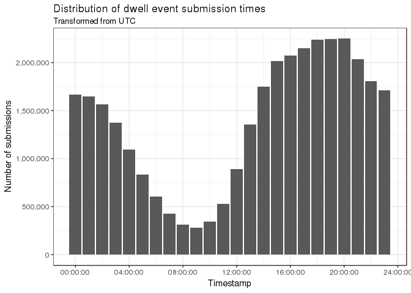

# Descriptives of general browsing against scored content browsing

```r
browsing = activity_tbl %>%
  #inner_join(pid_tbl) %>%
  group_by(id, days_since_appearance) %>%
  mutate(daily_active_time_s = sum(total_active_time, na.rm=T)) %>% 
  filter(daily_active_time_s<17290.93) %>% # added
  ungroup %>% group_by(pioneer_id, domain, stage, branch, daily_active_time_s, days_since_appearance) %>%
  summarise(
    session_active_time_s = sum(total_active_time, na.rm=T)) %>%
  ungroup
  
scored_browsing = scored_activity_tbl %>%
  #inner_join(pid_tbl) %>%
  group_by(pioneer_id, days_since_appearance) %>%
  mutate(
    daily_active_time_s = sum(total_active_time, na.rm=T)
  ) %>% 
  ungroup %>%
  filter(daily_active_time_s<17290.93) %>% # added
  group_by(pioneer_id, score, domain, stage, branch, daily_active_time_s, days_since_appearance) %>%
  summarise(
    session_active_time_s = sum(total_active_time, na.rm=T))

pretreatment_avg_score = scored_browsing %>% 
#  inner_join(pid_tbl) %>%
  filter(stage=='pretreatment') %>%
#  filter(pid7 != 'O' & pid7 != 'N' & pid7 != 'I') %>%
  group_by(pioneer_id, stage) %>%
  mutate(prestage_avg_score =  mean(score, na.rm=T)) %>%
  ungroup %>% 
  select(pioneer_id, prestage_avg_score, -stage) %>%
  distinct(pioneer_id, prestage_avg_score) %>%
  compute('pretreatment_avgscore_tbl')

prestage_daily_avg_activity = scored_browsing %>% 
#  inner_join(pid_tbl) %>%
  filter(stage=='pretreatment') %>%
#  filter(pid7 != 'O' & pid7 != 'N' & pid7 != 'I') %>%
  group_by(pioneer_id) %>%
  mutate(prestage_daily_avg_activity =  mean(daily_active_time_s, na.rm=T)) %>%
  ungroup %>% 
  select(pioneer_id, prestage_daily_avg_activity) %>%
  distinct(pioneer_id, prestage_daily_avg_activity) %>%
  compute('prestage_daily_avg_activity_tbl')
```

## Demographics


```r
#scored_browsing %>%
#  inner_join(pid_tbl) %>%
#  group_by(stage) %>%
#  summarise(n_distinct(pioneer_id))

demos = wave1 %>% select(age, pioneer_id, gender, education, pid3, pid7)

demos$age = as.numeric(recode(demos$age, 
                   "Under 18" = NA_character_,
                   "I prefer not to say" = NA_character_))

demos$gender = recode(demos$gender, 
                   "Prefer not to state" = NA_character_)


demos$pid3=recode(demos$pid3,
                  'D' = 'Democrat',
                  'R' = 'Republican',
                  'N' = 'No response',
                  'I' = 'Independent',
                  'O' = 'Other',
                  .default = NA_character_)

demos$pid7=recode(demos$pid7,
                  'SD' = 'Strong Democrat',
                  'SR' = 'Strong Republican',
                  'D' = 'Democrat',
                  'R' = 'Republican',
                  'N' = 'Other',
                  'I' = 'Independent',
                  'O' = 'Other',
                  .default = NA_character_)


demos$gender = as.factor(demos$gender)
demos$education = as.factor(demos$education)
demos$pid3 = as.factor(demos$pid3)
demos$pid7 = as.factor(demos$pid7)

sjt.frq(demos$gender, 
        show.summary=F,
        string.na='No response',
        title='Frequency table: Gender', 
        file='fig/gender_frq.html')
```

```
## Warning: `get_note()` is defunct. Please use `base::comment()` instead.
```

<table style="border-collapse:collapse; border:none;">
 <caption style="font-weight: bold; text-align:left;">Frequency table: Gender</caption>
 <tr>
 <th style="border-top:double; text-align:center; font-style:italic; font-weight:normal; padding-left:0.2cm; padding-right:0.2cm; border-bottom:1px solid; text-align:left; ">value</th>
 <th style="border-top:double; text-align:center; font-style:italic; font-weight:normal; padding-left:0.2cm; padding-right:0.2cm; border-bottom:1px solid;">N</th>
 <th style="border-top:double; text-align:center; font-style:italic; font-weight:normal; padding-left:0.2cm; padding-right:0.2cm; border-bottom:1px solid;">raw %</th>
 <th style="border-top:double; text-align:center; font-style:italic; font-weight:normal; padding-left:0.2cm; padding-right:0.2cm; border-bottom:1px solid;">valid %</th>
 <th style="border-top:double; text-align:center; font-style:italic; font-weight:normal; padding-left:0.2cm; padding-right:0.2cm; border-bottom:1px solid;">cumulative %</th>
 </tr>

 <tr>
 <td style="padding:0.2cm; text-align:left; ">Man</td>
 <td style="padding:0.2cm; text-align:center;">4380</td>
 <td style="padding:0.2cm; text-align:center;">73.28</td>
 <td style="padding:0.2cm; text-align:center;">75.19</td>
 <td style="padding:0.2cm; text-align:center;">75.19</td>
 </tr>
 
 <tr>
 <td style="padding:0.2cm; text-align:left; ">Neither</td>
 <td style="padding:0.2cm; text-align:center;">59</td>
 <td style="padding:0.2cm; text-align:center;">0.99</td>
 <td style="padding:0.2cm; text-align:center;">1.01</td>
 <td style="padding:0.2cm; text-align:center;">76.21</td>
 </tr>
 
 <tr>
 <td style="padding:0.2cm; text-align:left; ">Woman</td>
 <td style="padding:0.2cm; text-align:center;">1386</td>
 <td style="padding:0.2cm; text-align:center;">23.19</td>
 <td style="padding:0.2cm; text-align:center;">23.79</td>
 <td style="padding:0.2cm; text-align:center;">100.00</td>
 </tr>
 
 <tr>
 <td style="padding:0.2cm; text-align:left; border-top:1px solid; border-bottom:double; ">No response</td>
 <td style="padding:0.2cm; text-align:center; border-top:1px solid; border-bottom:double;">152</td>
 <td style="padding:0.2cm; text-align:center; border-top:1px solid; border-bottom:double;">2.54</td>
 <td style="padding:0.2cm; border-top:1px solid; border-bottom:double;"></td>
 <td style="padding:0.2cm; border-top:1px solid; border-bottom:double;"></td>
 </tr>
 </table>

```r
sjt.frq(demos$age,
        auto.group = 7,
        show.summary=F,
        string.na='No response',
        title='Frequency table: Age',
        file='fig/age_frq.html')
```

```
## Warning: `get_note()` is defunct. Please use `base::comment()` instead.
```

```
## Variable data with 76 unique values was grouped...
```

<table style="border-collapse:collapse; border:none;">
 <caption style="font-weight: bold; text-align:left;">Frequency table: Age</caption>
 <tr>
 <th style="border-top:double; text-align:center; font-style:italic; font-weight:normal; padding-left:0.2cm; padding-right:0.2cm; border-bottom:1px solid; text-align:left; ">value</th>
 <th style="border-top:double; text-align:center; font-style:italic; font-weight:normal; padding-left:0.2cm; padding-right:0.2cm; border-bottom:1px solid;">N</th>
 <th style="border-top:double; text-align:center; font-style:italic; font-weight:normal; padding-left:0.2cm; padding-right:0.2cm; border-bottom:1px solid;">raw %</th>
 <th style="border-top:double; text-align:center; font-style:italic; font-weight:normal; padding-left:0.2cm; padding-right:0.2cm; border-bottom:1px solid;">valid %</th>
 <th style="border-top:double; text-align:center; font-style:italic; font-weight:normal; padding-left:0.2cm; padding-right:0.2cm; border-bottom:1px solid;">cumulative %</th>
 </tr>

 <tr>
 <td style="padding:0.2cm; text-align:left; ">18-29</td>
 <td style="padding:0.2cm; text-align:center;">1246</td>
 <td style="padding:0.2cm; text-align:center;">20.85</td>
 <td style="padding:0.2cm; text-align:center;">21.52</td>
 <td style="padding:0.2cm; text-align:center;">21.52</td>
 </tr>
 
 <tr>
 <td style="padding:0.2cm; text-align:left; ">30-41</td>
 <td style="padding:0.2cm; text-align:center;">1201</td>
 <td style="padding:0.2cm; text-align:center;">20.09</td>
 <td style="padding:0.2cm; text-align:center;">20.75</td>
 <td style="padding:0.2cm; text-align:center;">42.27</td>
 </tr>
 
 <tr>
 <td style="padding:0.2cm; text-align:left; ">42-53</td>
 <td style="padding:0.2cm; text-align:center;">1155</td>
 <td style="padding:0.2cm; text-align:center;">19.32</td>
 <td style="padding:0.2cm; text-align:center;">19.95</td>
 <td style="padding:0.2cm; text-align:center;">62.22</td>
 </tr>
 
 <tr>
 <td style="padding:0.2cm; text-align:left; ">54-65</td>
 <td style="padding:0.2cm; text-align:center;">1241</td>
 <td style="padding:0.2cm; text-align:center;">20.76</td>
 <td style="padding:0.2cm; text-align:center;">21.44</td>
 <td style="padding:0.2cm; text-align:center;">83.66</td>
 </tr>
 
 <tr>
 <td style="padding:0.2cm; text-align:left; ">66-77</td>
 <td style="padding:0.2cm; text-align:center;">805</td>
 <td style="padding:0.2cm; text-align:center;">13.47</td>
 <td style="padding:0.2cm; text-align:center;">13.91</td>
 <td style="padding:0.2cm; text-align:center;">97.56</td>
 </tr>
 
 <tr>
 <td style="padding:0.2cm; text-align:left; ">78-89</td>
 <td style="padding:0.2cm; text-align:center;">134</td>
 <td style="padding:0.2cm; text-align:center;">2.24</td>
 <td style="padding:0.2cm; text-align:center;">2.31</td>
 <td style="padding:0.2cm; text-align:center;">99.88</td>
 </tr>
 
 <tr>
 <td style="padding:0.2cm; text-align:left; ">90-101</td>
 <td style="padding:0.2cm; text-align:center;">7</td>
 <td style="padding:0.2cm; text-align:center;">0.12</td>
 <td style="padding:0.2cm; text-align:center;">0.12</td>
 <td style="padding:0.2cm; text-align:center;">100.00</td>
 </tr>
 
 <tr>
 <td style="padding:0.2cm; text-align:left; border-top:1px solid; border-bottom:double; ">No response</td>
 <td style="padding:0.2cm; text-align:center; border-top:1px solid; border-bottom:double;">188</td>
 <td style="padding:0.2cm; text-align:center; border-top:1px solid; border-bottom:double;">3.15</td>
 <td style="padding:0.2cm; border-top:1px solid; border-bottom:double;"></td>
 <td style="padding:0.2cm; border-top:1px solid; border-bottom:double;"></td>
 </tr>
 </table>

```r
sjt.frq(demos$education,
        show.summary=F,
        string.na='No response',
        title='Frequency table: Education',
        file='fig/ed_frq.html')
```

```
## Warning: `get_note()` is defunct. Please use `base::comment()` instead.
```

<table style="border-collapse:collapse; border:none;">
 <caption style="font-weight: bold; text-align:left;">Frequency table: Education</caption>
 <tr>
 <th style="border-top:double; text-align:center; font-style:italic; font-weight:normal; padding-left:0.2cm; padding-right:0.2cm; border-bottom:1px solid; text-align:left; ">value</th>
 <th style="border-top:double; text-align:center; font-style:italic; font-weight:normal; padding-left:0.2cm; padding-right:0.2cm; border-bottom:1px solid;">N</th>
 <th style="border-top:double; text-align:center; font-style:italic; font-weight:normal; padding-left:0.2cm; padding-right:0.2cm; border-bottom:1px solid;">raw %</th>
 <th style="border-top:double; text-align:center; font-style:italic; font-weight:normal; padding-left:0.2cm; padding-right:0.2cm; border-bottom:1px solid;">valid %</th>
 <th style="border-top:double; text-align:center; font-style:italic; font-weight:normal; padding-left:0.2cm; padding-right:0.2cm; border-bottom:1px solid;">cumulative %</th>
 </tr>

 <tr>
 <td style="padding:0.2cm; text-align:left; ">Completed graduate</td>
 <td style="padding:0.2cm; text-align:center;">1402</td>
 <td style="padding:0.2cm; text-align:center;">23.46</td>
 <td style="padding:0.2cm; text-align:center;">30.67</td>
 <td style="padding:0.2cm; text-align:center;">30.67</td>
 </tr>
 
 <tr>
 <td style="padding:0.2cm; text-align:left; ">High school</td>
 <td style="padding:0.2cm; text-align:center;">486</td>
 <td style="padding:0.2cm; text-align:center;">8.13</td>
 <td style="padding:0.2cm; text-align:center;">10.63</td>
 <td style="padding:0.2cm; text-align:center;">41.30</td>
 </tr>
 
 <tr>
 <td style="padding:0.2cm; text-align:left; ">Less than high school</td>
 <td style="padding:0.2cm; text-align:center;">226</td>
 <td style="padding:0.2cm; text-align:center;">3.78</td>
 <td style="padding:0.2cm; text-align:center;">4.94</td>
 <td style="padding:0.2cm; text-align:center;">46.25</td>
 </tr>
 
 <tr>
 <td style="padding:0.2cm; text-align:left; ">Some graduate</td>
 <td style="padding:0.2cm; text-align:center;">601</td>
 <td style="padding:0.2cm; text-align:center;">10.06</td>
 <td style="padding:0.2cm; text-align:center;">13.15</td>
 <td style="padding:0.2cm; text-align:center;">59.40</td>
 </tr>
 
 <tr>
 <td style="padding:0.2cm; text-align:left; ">Some undergraduate</td>
 <td style="padding:0.2cm; text-align:center;">1856</td>
 <td style="padding:0.2cm; text-align:center;">31.05</td>
 <td style="padding:0.2cm; text-align:center;">40.60</td>
 <td style="padding:0.2cm; text-align:center;">100.00</td>
 </tr>
 
 <tr>
 <td style="padding:0.2cm; text-align:left; border-top:1px solid; border-bottom:double; ">No response</td>
 <td style="padding:0.2cm; text-align:center; border-top:1px solid; border-bottom:double;">1406</td>
 <td style="padding:0.2cm; text-align:center; border-top:1px solid; border-bottom:double;">23.52</td>
 <td style="padding:0.2cm; border-top:1px solid; border-bottom:double;"></td>
 <td style="padding:0.2cm; border-top:1px solid; border-bottom:double;"></td>
 </tr>
 </table>

```r
sjt.frq(demos$pid3,
        show.summary=F,
        string.na='No response',
        title='Frequency table: Party ID (including leaners)',
        file='fig/pid3_frq.html')
```

```
## Warning: `get_note()` is defunct. Please use `base::comment()` instead.
```

<table style="border-collapse:collapse; border:none;">
 <caption style="font-weight: bold; text-align:left;">Frequency table: Party ID (including leaners)</caption>
 <tr>
 <th style="border-top:double; text-align:center; font-style:italic; font-weight:normal; padding-left:0.2cm; padding-right:0.2cm; border-bottom:1px solid; text-align:left; ">value</th>
 <th style="border-top:double; text-align:center; font-style:italic; font-weight:normal; padding-left:0.2cm; padding-right:0.2cm; border-bottom:1px solid;">N</th>
 <th style="border-top:double; text-align:center; font-style:italic; font-weight:normal; padding-left:0.2cm; padding-right:0.2cm; border-bottom:1px solid;">raw %</th>
 <th style="border-top:double; text-align:center; font-style:italic; font-weight:normal; padding-left:0.2cm; padding-right:0.2cm; border-bottom:1px solid;">valid %</th>
 <th style="border-top:double; text-align:center; font-style:italic; font-weight:normal; padding-left:0.2cm; padding-right:0.2cm; border-bottom:1px solid;">cumulative %</th>
 </tr>

 <tr>
 <td style="padding:0.2cm; text-align:left; ">Democrat</td>
 <td style="padding:0.2cm; text-align:center;">3466</td>
 <td style="padding:0.2cm; text-align:center;">57.99</td>
 <td style="padding:0.2cm; text-align:center;">57.99</td>
 <td style="padding:0.2cm; text-align:center;">57.99</td>
 </tr>
 
 <tr>
 <td style="padding:0.2cm; text-align:left; ">Independent</td>
 <td style="padding:0.2cm; text-align:center;">54</td>
 <td style="padding:0.2cm; text-align:center;">0.90</td>
 <td style="padding:0.2cm; text-align:center;">0.90</td>
 <td style="padding:0.2cm; text-align:center;">58.89</td>
 </tr>
 
 <tr>
 <td style="padding:0.2cm; text-align:left; ">No response</td>
 <td style="padding:0.2cm; text-align:center;">705</td>
 <td style="padding:0.2cm; text-align:center;">11.80</td>
 <td style="padding:0.2cm; text-align:center;">11.80</td>
 <td style="padding:0.2cm; text-align:center;">70.69</td>
 </tr>
 
 <tr>
 <td style="padding:0.2cm; text-align:left; ">Other</td>
 <td style="padding:0.2cm; text-align:center;">22</td>
 <td style="padding:0.2cm; text-align:center;">0.37</td>
 <td style="padding:0.2cm; text-align:center;">0.37</td>
 <td style="padding:0.2cm; text-align:center;">71.06</td>
 </tr>
 
 <tr>
 <td style="padding:0.2cm; text-align:left; ">Republican</td>
 <td style="padding:0.2cm; text-align:center;">1730</td>
 <td style="padding:0.2cm; text-align:center;">28.94</td>
 <td style="padding:0.2cm; text-align:center;">28.94</td>
 <td style="padding:0.2cm; text-align:center;">100.00</td>
 </tr>
 
 <tr>
 <td style="padding:0.2cm; text-align:left; border-top:1px solid; border-bottom:double; ">No response</td>
 <td style="padding:0.2cm; text-align:center; border-top:1px solid; border-bottom:double;">0</td>
 <td style="padding:0.2cm; text-align:center; border-top:1px solid; border-bottom:double;">0.00</td>
 <td style="padding:0.2cm; border-top:1px solid; border-bottom:double;"></td>
 <td style="padding:0.2cm; border-top:1px solid; border-bottom:double;"></td>
 </tr>
 </table>

```r
sjt.frq(demos$pid7,
        show.summary=F,
        string.na='No response',
        title='Frequency table: Party ID (including leaners)',
        file='fig/pid7_frq.html')
```

```
## `sjt.frq()` will become deprecated in the future. Please use `sjmisc::frq(out = "v")` instead.
```

```
## Warning: `get_note()` is defunct. Please use `base::comment()` instead.
```

<table style="border-collapse:collapse; border:none;">
 <caption style="font-weight: bold; text-align:left;">Frequency table: Party ID (including leaners)</caption>
 <tr>
 <th style="border-top:double; text-align:center; font-style:italic; font-weight:normal; padding-left:0.2cm; padding-right:0.2cm; border-bottom:1px solid; text-align:left; ">value</th>
 <th style="border-top:double; text-align:center; font-style:italic; font-weight:normal; padding-left:0.2cm; padding-right:0.2cm; border-bottom:1px solid;">N</th>
 <th style="border-top:double; text-align:center; font-style:italic; font-weight:normal; padding-left:0.2cm; padding-right:0.2cm; border-bottom:1px solid;">raw %</th>
 <th style="border-top:double; text-align:center; font-style:italic; font-weight:normal; padding-left:0.2cm; padding-right:0.2cm; border-bottom:1px solid;">valid %</th>
 <th style="border-top:double; text-align:center; font-style:italic; font-weight:normal; padding-left:0.2cm; padding-right:0.2cm; border-bottom:1px solid;">cumulative %</th>
 </tr>

 <tr>
 <td style="padding:0.2cm; text-align:left; ">Democrat</td>
 <td style="padding:0.2cm; text-align:center;">2195</td>
 <td style="padding:0.2cm; text-align:center;">36.72</td>
 <td style="padding:0.2cm; text-align:center;">36.72</td>
 <td style="padding:0.2cm; text-align:center;">36.72</td>
 </tr>
 
 <tr>
 <td style="padding:0.2cm; text-align:left; ">Independent</td>
 <td style="padding:0.2cm; text-align:center;">54</td>
 <td style="padding:0.2cm; text-align:center;">0.90</td>
 <td style="padding:0.2cm; text-align:center;">0.90</td>
 <td style="padding:0.2cm; text-align:center;">37.63</td>
 </tr>
 
 <tr>
 <td style="padding:0.2cm; text-align:left; ">Other</td>
 <td style="padding:0.2cm; text-align:center;">727</td>
 <td style="padding:0.2cm; text-align:center;">12.16</td>
 <td style="padding:0.2cm; text-align:center;">12.16</td>
 <td style="padding:0.2cm; text-align:center;">49.79</td>
 </tr>
 
 <tr>
 <td style="padding:0.2cm; text-align:left; ">Republican</td>
 <td style="padding:0.2cm; text-align:center;">1215</td>
 <td style="padding:0.2cm; text-align:center;">20.33</td>
 <td style="padding:0.2cm; text-align:center;">20.33</td>
 <td style="padding:0.2cm; text-align:center;">70.12</td>
 </tr>
 
 <tr>
 <td style="padding:0.2cm; text-align:left; ">Strong Democrat</td>
 <td style="padding:0.2cm; text-align:center;">1271</td>
 <td style="padding:0.2cm; text-align:center;">21.26</td>
 <td style="padding:0.2cm; text-align:center;">21.26</td>
 <td style="padding:0.2cm; text-align:center;">91.38</td>
 </tr>
 
 <tr>
 <td style="padding:0.2cm; text-align:left; ">Strong Republican</td>
 <td style="padding:0.2cm; text-align:center;">515</td>
 <td style="padding:0.2cm; text-align:center;">8.62</td>
 <td style="padding:0.2cm; text-align:center;">8.62</td>
 <td style="padding:0.2cm; text-align:center;">100.00</td>
 </tr>
 
 <tr>
 <td style="padding:0.2cm; text-align:left; border-top:1px solid; border-bottom:double; ">No response</td>
 <td style="padding:0.2cm; text-align:center; border-top:1px solid; border-bottom:double;">0</td>
 <td style="padding:0.2cm; text-align:center; border-top:1px solid; border-bottom:double;">0.00</td>
 <td style="padding:0.2cm; border-top:1px solid; border-bottom:double;"></td>
 <td style="padding:0.2cm; border-top:1px solid; border-bottom:double;"></td>
 </tr>
 </table>

```r
library(forcats)
demos$gender = as.factor(replace_na(as.character(demos$gender), 'No response')) %>% fct_relevel('Neither','Man','Woman', 'No response')
demos$education = as.factor(replace_na(as.character(demos$education), 'No response')) %>%
  fct_relevel('Less than high school','High school','Some undergraduate','Some graduate','Completed graduate')
demos$pid3 = demos$pid3 %>% fct_relevel('Democrat','Republican','Independent','Other')
demos$pid7 = demos$pid7 %>% fct_relevel('Strong Democrat','Strong Republican','Democrat','Republican','Independent','Other')


library(ggridges)
ggplot(demos, aes(
  x=age,y=education,fill=gender)) +
    geom_density_ridges(alpha=0.25) +
  guides(fill=guide_legend(title="Gender")) +
  theme_bw() + scale_fill_ptol() +
  labs(title='Densities of demographics', subtitle='Gender and education against age') +
  xlab('Age in years') + ylab('') +
  theme(legend.position = 'bottom') +
  ggsave('fig/news_demographic_densities_ed.pdf', height=6)
```

```
## Saving 7 x 6 in image
```

```
## Picking joint bandwidth of 5.78
```

```
## Warning: Removed 188 rows containing non-finite values
## (stat_density_ridges).
```

```
## Picking joint bandwidth of 5.78
```

```
## Warning: Removed 188 rows containing non-finite values
## (stat_density_ridges).
```

<!-- -->

```r
ggplot(na.omit(demos), aes(
  x=age,y=pid3,fill=gender)) +
    geom_density_ridges(alpha=0.25) +
  guides(fill=guide_legend(title="Gender")) +
  theme_bw() + scale_fill_ptol() +
  labs(title='Densities of demographics', subtitle='Gender and party ID (including leaners) against age') +
  xlab('Age in years') + ylab('') +
  theme(legend.position = 'bottom') +
  ggsave('fig/news_demographic_densities_pid3.pdf', height=8)
```

```
## Saving 7 x 8 in image
```

```
## Picking joint bandwidth of 5
## Picking joint bandwidth of 5
```

<!-- -->

```r
ggplot(na.omit(demos), aes(
  x=age,y=pid7,fill=gender)) +
    geom_density_ridges(alpha=0.25) +
  guides(fill=guide_legend(title="Gender")) +
  theme_bw() + scale_fill_ptol() +
  labs(title='Densities of demographics', subtitle='Gender and party ID (including leaners) against age') +
  xlab('Age in years') + ylab('') +
  theme(legend.position = 'bottom') +
  ggsave('fig/news_demographic_densities_pid7.pdf', height=8)
```

```
## Saving 7 x 8 in image
```

```
## Picking joint bandwidth of 5.02
## Picking joint bandwidth of 5.02
```

<!-- -->

```r
ggplot(demos,aes(
  x=education,
  fill=gender)) +
  geom_histogram(stat='count', position='fill') +
  theme_bw() + coord_flip() +
  labs(title='Proportions of gender and education') +
  xlab('') + ylab('Percent respondents') +
  scale_y_continuous(label=percent_format()) +
  scale_fill_colorblind(name='Gender') +
  theme(legend.position = 'bottom') +
  ggsave('fig/news_demographic_proportions.pdf')
```

```
## Warning: Ignoring unknown parameters: binwidth, bins, pad
```

```
## Saving 7 x 5 in image
```

<!-- -->

```r
ggplot(demos,aes(
  x=pid3,
  fill=gender)) +
  geom_histogram(stat='count', position='fill') +
  theme_bw() + coord_flip() +
  labs(title='Proportions of gender and party ID (including leaners)') +
  xlab('') + ylab('Percent respondents') +
  scale_y_continuous(label=percent_format()) +
  scale_fill_colorblind(name='Gender') +
  theme(legend.position = 'bottom') +
  ggsave('fig/news_demographic_proportions_pid3.pdf')
```

```
## Warning: Ignoring unknown parameters: binwidth, bins, pad
```

```
## Saving 7 x 5 in image
```

<!-- -->

```r
ggplot(demos,aes(
  x=pid7,
  fill=gender)) +
  geom_histogram(stat='count', position='fill') +
  theme_bw() + coord_flip() +
  labs(title='Proportions of gender and party ID (including leaners)') +
  xlab('') + ylab('Percent respondents') +
  scale_y_continuous(label=percent_format()) +
  scale_fill_colorblind(name='Gender') +
  theme(legend.position = 'bottom') +
  ggsave('fig/news_demographic_proportions_pid7.pdf')
```

```
## Warning: Ignoring unknown parameters: binwidth, bins, pad
```

```
## Saving 7 x 5 in image
```

<!-- -->
```

## Distribution of browsing events by study period


```r
visitdate_df = activity_tbl %>% 
  #inner_join(pid_tbl) %>%
  group_by(id, visit_start_date, stage) %>%
  count %>% collect

startdate_df = activity_tbl %>% 
  #inner_join(pid_tbl) %>%
  group_by(id, days_since_appearance, stage) %>%
  count %>% collect

ggplot(visitdate_df, aes(
  x=visit_start_date,
  y=n,
  color=stage
)) +
  geom_bar(stat='identity', width=.5) +
  guides(color=F) +
  scale_y_continuous(labels=comma) +
  theme_bw() + scale_color_solarized() + 
  labs(title = "Total domain dwell events observed during study by calendar date", subtitle = "Colored by enrollment period") +
  xlab('Date during study') + ylab('Total dwell events observed') +
  ggsave('fig/dwell_enrollment.pdf')
```

```
## Saving 7 x 5 in image
```

<!-- -->

```r
ggplot(startdate_df, aes(
  x=days_since_appearance,
  y=n,
  color=stage
)) +
  geom_bar(stat='identity', width=.5)+
  guides(color=F) +
  theme_bw() + scale_color_solarized() + 
  scale_y_continuous(labels=comma) +
  labs(title = "Total domain dwell events observed during study by enrollment date", subtitle = "Colored by enrollment period") +
  xlab('Days since enrollment') + ylab('Total dwell events observed') +
  ggsave('fig/dwell_enrollment_stage.pdf')
```

```
## Saving 7 x 5 in image
```

<!-- -->

```r
ggplot(startdate_df, aes(
  x=days_since_appearance,
  y=log(n),
  group=days_since_appearance,
  color=stage)) +
  geom_boxplot() +
  guides(color=F) +
  theme_bw() + scale_color_solarized() +
  labs(title = "Log-total domain dwell events observed during study by enrollment date", subtitle = "Colored by enrollment period") +
  xlab('Days since enrollment') + ylab('(log) Total dwell events observed') +
  ggsave('fig/dwell_events_log_stage.pdf')
```

```
## Saving 7 x 5 in image
```

<!-- -->

## General activity of enrollees over all study periods

```r
ecdf_activedays_df = activity_tbl %>%
  #inner_join(pid_tbl) %>%
  group_by(visit_start_date, branch, id) %>%
  count %>%
  filter(n>0)%>%
  group_by(id, branch)%>%
  count %>%
  collect

ggplot(ecdf_activedays_df, aes(nn)) + geom_histogram(binwidth=1,position='dodge') + 
  theme_bw() +
  scale_y_continuous(labels=comma) +
  ylab('') + xlab('Total days in study') +
  labs(title = "Observed distribution of participant active days", subtitle = "Over all study periods") +
  ggsave('fig/hist_activedays.pdf')
```

```
## Saving 7 x 5 in image
```

<!-- -->

```r
ggplot(ecdf_activedays_df, aes(nn)) + stat_ecdf(geom='step') + 
  theme_bw() +
  scale_y_continuous(labels=percent_format()) +
  ylab('') + xlab('Cumulative days in study') +
  labs(title = "Cumulative distribution of participant active days", subtitle = "Over all study periods") +
  ggsave('fig/ecdf_active_days.pdf')
```

```
## Saving 7 x 5 in image
```

<!-- -->

## Distribution of time of browsing


```r
hours = activity_tbl %>% 
  inner_join(pid_tbl) %>%
  mutate(timestamp=hour(from_unixtime(visit_start_time))) %>% 
  select(timestamp) %>% group_by(timestamp) %>% 
  count %>% collect
```

```
## Joining, by = "pioneer_id"
```

```r
hours$timestamp = hours(hours$timestamp)

ggplot(hours, aes(x=timestamp, y=n)) + 
  geom_bar(stat='identity') + 
  scale_y_continuous(labels=comma) +
  scale_x_time(labels = date_format("%H:%M")) +
  labs(title = "Distribution of dwell event submission times", 
       subtitle = "Transformed from UTC") + 
  xlab('Timestamp') + 
  ylab('Number of submissions') +
  theme_bw() +
  ggsave('fig/dist_times.pdf')
```

```
## Saving 7 x 5 in image
```

<!-- -->
## Tables 


### Daily averages

```r
daily_pagevisits = activity_tbl %>%
  #inner_join(pid_tbl) %>%
  group_by(id,visit_start_date) %>%
  count %>%
  ungroup %>% group_by(id) %>%
  summarise(
    mu=mean(n, na.rm=T)
  ) %>%
  filter(mu<800) %>% # greater than 99.999%
  collect

scored_daily_pagevisits = scored_activity_tbl %>%
  #inner_join(pid_tbl) %>%
  group_by(id,visit_start_date) %>%
  count %>%
  ungroup %>% group_by(id) %>%
  summarise(
    mu=mean(n, na.rm=T)
  ) %>%
  filter(mu<800) %>% # greater than 99.999%
  collect
  
daily_visits_df= data.frame(
General = quantile(daily_pagevisits$mu, probs=c(.25, .5, .75, .99, .999, .9999, 1)),
Scored = quantile(scored_daily_pagevisits$mu, probs=c(.25, .5, .75, .99, .999, .9999, 1)))

daily_visits_tab=xtable(t(daily_visits_df),
                           caption='nth-tiles of daily average page visits',
                           label='tab:daily_visits_mu')
                           
digits(daily_visits_tab) = 0

print(daily_visits_tab,file="tables.tex",append=T,table.placement = "h",booktabs=T,
 caption.placement="bottom", hline.after=seq(from=-1,to=nrow(daily_visits_tab),by=1))


###
daily_active_browsing = activity_tbl %>%
  #inner_join(pid_tbl) %>%
  group_by(id,days_since_appearance) %>%
  summarise(total_s=sum(total_active_time, na.rm=T)) %>%
  filter(total_s<17290.93) %>%
  mutate(total_m=total_s/60) %>%
  mutate(total_h=total_m/60) %>%
  filter(total_m>1)%>% # greater than one minute of activity
  collect

scored_daily_active_browsing = scored_activity_tbl %>%
  #inner_join(pid_tbl) %>%
  group_by(id,days_since_appearance) %>%
  summarise(total_s=sum(total_active_time, na.rm=T)) %>%
  filter(total_s<17290.93) %>%
  mutate(total_m=total_s/60) %>%
  mutate(total_h=total_m/24) %>%
  filter(total_m>1)%>%
  collect

daily_activity_df= data.frame(
  General=quantile(daily_active_browsing$total_m, probs=c(.25, .5, .75, .99, .999, .9999, 1)),
  Scored=quantile(scored_daily_active_browsing$total_m, probs=c(.25, .5, .75, .99, .999, .9999, 1)))

daily_activity_tab=xtable(t(daily_activity_df),
                           caption='nth-tiles of average total daily active browsing (in minutes)',
                           label='tab:daily_total_activity_minutes')

digits(daily_activity_tab) = 1

print(daily_activity_tab,file="tables.tex",append=T,table.placement = "h", booktabs=T,
 caption.placement="bottom", hline.after=seq(from=-1,to=nrow(daily_activity_tab),by=1))

###

daily_avg_activity=activity_tbl %>%
  #inner_join(pid_tbl) %>%
   group_by(id, domain) %>% #, days_since_appearance) %>%
   summarise(
    mean=mean(total_active_time, na.rm=T),
    n = n()) %>%
  #ungroup %>% group_by(days_since_appearance) %>%
  filter(mean>1) %>% # make sure every site visit has at least 1 second of activity
  ungroup %>% group_by(id) %>%
  summarise(mu=mean(mean, na.rm=T)) %>%
  collect

scored_daily_avg_activity=scored_activity_tbl %>%
  #inner_join(pid_tbl) %>%
   group_by(id, domain) %>% #, days_since_appearance) %>%
   summarise(
    mean=mean(total_active_time, na.rm=T),
    n = n()) %>%
  #ungroup %>% group_by(days_since_appearance) %>%
  filter(mean>1) %>% # make sure every site visit has at least 1 second of activity
  ungroup %>% group_by(id) %>%
  summarise(mu=mean(mean, na.rm=T)) %>%
  collect
  
daily_active_session_df= data.frame(
  General=quantile(daily_avg_activity$mu, probs=c(.25, .5, .75, .99, .999, .9999, 1)),
  Scored=quantile(scored_daily_avg_activity$mu, probs=c(.25, .5, .75, .99, .999, .9999, 1)))

daily_active_session_tab=xtable(t(daily_active_session_df),
                           caption='nth-tiles of average active site session length (in seconds)',
                           label='tab:daily_active_session')
digits(daily_active_session_tab) = 0

#print(daily_active_session_tab,file="tables.tex",append=T,table.placement = "h",booktabs=T,add.to.row=list(list(1),"\\rowcolor{1}{}[lightgray] "),caption.placement="bottom", hline.after=seq(from=-1,to=nrow(daily_active_session_tab),by=1))

print(daily_active_session_tab,file="tables.tex",append=T,table.placement = "h",booktabs=T,
 caption.placement="bottom", hline.after=seq(from=-1,to=nrow(daily_active_session_tab),by=1))
```

### Just pretreatment


```r
pretreatment_pagevisits = activity_tbl %>%
  #inner_join(pid_tbl) %>%
  filter(stage=='pretreatment') %>%
  #group_by(id,stage) %>%
  group_by(id) %>%
  count %>%
  collect

pretreatment_scored_pagevisits = scored_activity_tbl %>%
  #inner_join(pid_tbl) %>%
  filter(stage=='pretreatment') %>%
  #group_by(id,stage) %>%
  group_by(id) %>%
  count %>%
  #ungroup %>% group_by(id) %>%
  #summarise(
  #  mu=mean(n, na.rm=T)
  #) %>%
  #filter(mu<800) %>% # greater than 99.999%
  collect
  
pretreatment_daily_visits_df= data.frame(
  General = quantile(pretreatment_pagevisits$n, probs=c(.25, .5, .75, .99, .999, .9999, 1)),
  Scored = quantile(pretreatment_scored_pagevisits$n, probs=c(.25, .5, .75, .99, .999, .9999, 1)))

pretreatment_daily_visits_tab=xtable(t(pretreatment_daily_visits_df),
                           caption='nth-tiles of total page visits during pretreatment',
                           label='tab:pretreatment_mu')
                           
digits(pretreatment_daily_visits_tab) = 0

print(pretreatment_daily_visits_tab,file="tables.tex",append=T,table.placement = "h",booktabs=T,
 caption.placement="bottom", hline.after=seq(from=-1,to=nrow(pretreatment_daily_visits_tab),by=1))


###
pretreatment_active_browsing = activity_tbl %>%
  #inner_join(pid_tbl) %>%
  filter(stage=='pretreatment') %>%
  group_by(id) %>%
  summarise(total_s=sum(total_active_time, na.rm=T)) %>%
  filter(total_s<17290.93) %>%
  mutate(total_m=total_s/60) %>%
  mutate(total_h=total_m/60) %>%
  filter(total_m>1)%>% # greater than one minute of activity
  collect

scored_pretreatment_active_browsing = scored_activity_tbl %>%
  #inner_join(pid_tbl) %>%
  filter(stage=='pretreatment') %>%
  group_by(id) %>%
  summarise(total_s=sum(total_active_time, na.rm=T)) %>%
  filter(total_s<17290.93) %>%
  mutate(total_m=total_s/60) %>%
  mutate(total_h=total_m/24) %>%
  filter(total_m>1)%>%
  collect

pretreatment_activity_df= data.frame(
  General=quantile(pretreatment_active_browsing$total_m, probs=c(.25, .5, .75, .99, .999, .9999, 1)),
  Scored=quantile(scored_pretreatment_active_browsing$total_m, probs=c(.25, .5, .75, .99, .999, .9999, 1)))

pretreatment_activity_tab=xtable(t(pretreatment_activity_df),
                           caption='nth-tiles of total pretreatment active browsing (in minutes)',
                           label='tab:daily_total_activity_minutes')

digits(pretreatment_activity_tab) = 1

print(pretreatment_activity_tab,file="tables.tex",append=T,table.placement = "h", booktabs=T,
 caption.placement="bottom", hline.after=seq(from=-1,to=nrow(pretreatment_activity_tab),by=1))
```


```r
#browsing_daily = sdf_quantile(browsing, 'daily_active_time_s', probabilities=seq(0,1,by=0.0001))

#prbs = c(.25,.5,.75,.99,.999,.9999)
#rnames = paste0(prbs*100, '%')

#browsing_deciles = data.frame(
#  `Daily browsing over all` = sdf_quantile(browsing, 'daily_active_time_s', probabilities=prbs),
#  `Daily browsing over scored` = sdf_quantile(scored_browsing, 'daily_active_time_s', probabilities=prbs),
#  `Session browsing over all` = sdf_quantile(browsing, 'session_active_time_s', probabilities=prbs),
#  `Session browsing over scored` = sdf_quantile(scored_browsing, 'session_active_time_s', probabilities=prbs),
#  #row.names = c('10%','20%','30%','40%','50%','60%','70%','80%','90%','99%','99.9%','99.99%', '100%'))
#  row.names=rnames)


#browsing_deciles_tab=xtable(t(browsing_deciles),
#                           caption='Deciles of browsing active time in seconds, daily- and session-level',
#                           label='tab:browsing_deciles')
#digits(browsing_deciles_tab) = 0

#print(browsing_deciles_tab,file="tables.tex",
#      booktabs = T,
#      format.args = list(big.mark = ","),
#      append=T,
#      table.placement = "h", 
#      caption.placement="bottom", 
#      hline.after=seq(from=-1,
#                      to=nrow(browsing_deciles_tab),
#                      by=1))

prbs = seq(0,1,0.001)
rnames = paste0(prbs*100, '%')

#TODO: convert to other method, make tables as well?

log_browsing_deciles = data.frame(
  browsing_daily=browsing %>% mutate(daily_active_time_logs = log(daily_active_time_s)) %>% 
    sdf_quantile('daily_active_time_logs', probabilities=prbs),
  sbrowsing_daily=scored_browsing %>% mutate(daily_active_time_logs = log(daily_active_time_s)) %>% 
    sdf_quantile('daily_active_time_logs', probabilities=prbs),
  browsing_session = scored_browsing %>% mutate(session_active_time_logs = log(session_active_time_s)) %>% 
    sdf_quantile('session_active_time_logs', probabilities=prbs),
  sbrowsing_session = scored_browsing %>% mutate(session_active_time_logs = log(session_active_time_s)) %>% 
    sdf_quantile('session_active_time_logs', probabilities=prbs),
  row.names=rnames)
log_browsing_deciles$rnames = prbs
```


```r
library(plyr)
library(reshape2)
plot = melt(log_browsing_deciles, id.vars=c('rnames'))
plot$variable = revalue(plot$variable, c(
  'browsing_session'='General browsing (session-level)', 
  'sbrowsing_session'='Scored browsing only (session-level)',
  'browsing_daily'='General browsing (daily-level)',
  'sbrowsing_daily'='Scored browsing (daily-level)'))

daily = plot %>% filter(variable=='General browsing (daily-level)' | variable=='Scored browsing (daily-level)')
session = plot %>% filter(variable=='General browsing (session-level)' | variable=='Scored browsing only (session-level)')

ggplot(daily, aes(
  x=rnames,
  y=value,
  color=variable)) + 
  geom_line(stat='identity', position='dodge') +
  theme_bw() + theme(legend.position='bottom') + 
  scale_x_continuous(label=percent_format()) +
  scale_color_fivethirtyeight(name='') +
  xlab('Percentile') + ylab('Log-seconds') +
  labs(title='ECDF of log-seconds of total daily browsing') +
ggsave('fig/ecdf_daily.pdf')
```

```
## Saving 7 x 5 in image
```

```
## Warning: Width not defined. Set with `position_dodge(width = ?)`

## Warning: Width not defined. Set with `position_dodge(width = ?)`
```

<!-- -->

```r
ggplot(session, aes(
  x=rnames,
  y=value,
  fill=variable)) + 
  geom_histogram(stat='identity',binwidth=1) +
  facet_wrap(~variable) + 
  theme_bw() + theme(legend.position='none') + 
  scale_x_continuous(label=percent_format()) +
  scale_fill_fivethirtyeight(name='') +
  labs(title='ECDFs of log-seconds of session-level browsing') +
  xlab('Percentile') +
  ylab('Log-seconds') +
  ggsave('fig/ecdf_session.pdf')
```

```
## Warning: Ignoring unknown parameters: binwidth, bins, pad
```

```
## Saving 7 x 5 in image
```

<!-- -->

```r
#browsing_s = browsing %>% ungroup %>% select(id, daily_active_time_s, session_active_time_s) %>% mutate(cond='browsing')
#sbrowsing_s = scored_browsing %>% ungroup %>% select(id, daily_active_time_s, session_active_time_s) %>% mutate(cond='sbrowsing')
#plot = rbind(browsing_s, sbrowsing_s) %>% melt


# ggplot(plot, aes(
#   x=session_active_time_s,
#   y=cond
# ))+ geom_density_ridges()
```


```r
#daily_pid_scored_sessions = scored_activity_tbl %>%
daily_pid_scored_sessions = scored_browsing %>% ungroup %>%
  inner_join(pid_tbl) %>%
  filter(stage=='pretreatment') %>%
  filter(pid7 != 'O' & pid7 != 'N' & pid7 != 'I') %>% 
  group_by(pioneer_id, score, pid7) %>%
  collect
```

```
## Joining, by = "pioneer_id"
```

```r
ggplot(daily_pid_scored_sessions, aes(
 x=score,
 color=pid7)) + stat_density(position='dodge', geom='line', trim=T) +
labs(title='Density of site visits along alignment scores',
     subtitle='By self-reported party identification per site visit per day',
      color='') +
 xlab('Alignment score') + ylab('Density of dwell events') +
theme_bw() + theme(legend.position = 'bottom') +
guides(
   color=guide_legend(label.position='bottom',title.position='top')) +
    scale_color_few(name='') +
ggsave('fig/alignment_visit_density_pid7.pdf')
```

```
## Saving 7 x 5 in image
```

```
## Warning: Width not defined. Set with `position_dodge(width = ?)`

## Warning: Width not defined. Set with `position_dodge(width = ?)`
```

<!-- -->

```r
ggplot(daily_pid_scored_sessions, aes(
 x=score,
 color=pid3)) + 
  stat_density(position='dodge', geom='line', trim=T) +
  labs(
    title='Density of site visits along alignment scores',
    subtitle='By self-reported party identification') +
  xlab('Alignment score') + ylab('Density of dwell events') +
  guides(color=guide_legend(label.position='bottom',title.position='top')) +
  scale_color_fivethirtyeight(name='') +
  theme_bw() + 
  theme(legend.position=c(1,1),
        legend.direction="horizontal",
        legend.justification=c(1, 0), 
        legend.key.width=unit(1, "lines"), 
        legend.key.height=unit(1, "lines"), 
        plot.margin = unit(c(5, 1, 0.5, 0.5), "lines"))
```

```
## Warning: Width not defined. Set with `position_dodge(width = ?)`
```

<!-- -->

```r
  ggsave('fig/alignment_visit_density_pid2.pdf')
```

```
## Saving 7 x 5 in image
```

```
## Warning: Width not defined. Set with `position_dodge(width = ?)`
```
# Top websites, scored and unscored

```r
topsites_byvisits = browsing %>%
  filter(stage=='pretreatment') %>%
  #inner_join(pid_tbl) %>%
  group_by(domain) %>%
  tally %>%
  arrange(desc(n)) %>%
  collect

topsites_bytime = browsing %>%
  filter(stage=='pretreatment') %>%
  #inner_join(pid_tbl) %>%
  group_by(domain) %>%
  summarise(seconds = sum(session_active_time_s, na.rm=T)) %>%
  arrange(desc(seconds)) %>%
  collect

scored_topsites_byvisits = scored_browsing %>% 
  filter(stage=='pretreatment') %>%
  #inner_join(pid_tbl) %>%
  group_by(domain) %>%
  tally %>%
  arrange(desc(n)) %>%
  collect

scored_topsites_bytime = scored_browsing %>%
  filter(stage=='pretreatment') %>%
  #inner_join(pid_tbl) %>%
  group_by(domain) %>%
  summarise(seconds = sum(session_active_time_s, na.rm=T)) %>%
  arrange(desc(seconds)) %>%
  collect

#convert to table
# ggplot(topsites_byvisits[1:25,], aes(
#   x=reorder(domain, n),
#   y=n)) + geom_bar(stat='identity') + coord_flip()
# 
# ggplot(topsites_bytime[1:25,], aes(
#   x=reorder(domain, seconds),
#   y=seconds)) + geom_bar(stat='identity') + coord_flip()
# 
# ggplot(scored_topsites_byvisits[1:25,], aes(
#   x=reorder(domain, n),
#   y=n)) + geom_bar(stat='identity') + coord_flip()
# 
# ggplot(scored_topsites_bytime[1:25,], aes(
#   x=reorder(domain, seconds),
#   y=seconds)) + geom_bar(stat='identity') + coord_flip() +
#   scale_y_continuous(label=comma)
# library(plyr)
# library(reshape2)

topsites_byvisits_melt = melt(topsites_byvisits, id.vars='domain')
topsites_bytime_melt = melt(topsites_bytime, id.vars='domain')

topsites_byvisits_melt$type = 'By visit count'
topsites_bytime_melt$type = 'By active seconds'

topsites = rbind(topsites_byvisits_melt[1:25,], topsites_bytime_melt[1:25,])

ggplot(topsites, aes(
  x=type,
  y=value,
  fill=domain)) + 
  geom_bar(position='fill',stat='identity') +
  theme(legend.position='bottom') +
  labs(title='Proportion of visits counts and active time in seconds spent',
     subtitle='Top 25 overall domains',
      color='') +
   xlab('') + ylab('') +
    theme_bw() + theme(legend.position = 'right') +
   scale_fill_viridis(discrete=T, option='plasma', name='') +
  scale_y_continuous(label=percent_format()) +
  ggsave('fig/props.pdf', height=6)
```

```
## Saving 7 x 6 in image
```

<!-- -->

```r
scored_topsites_byvisits_melt = melt(scored_topsites_byvisits, id.vars='domain')
scored_topsites_bytime_melt = melt(scored_topsites_bytime, id.vars='domain')

scored_topsites_byvisits_melt$type = 'By visit count'
scored_topsites_bytime_melt$type = 'By active seconds'

scored_topsites = rbind(scored_topsites_byvisits_melt[1:25,], scored_topsites_bytime_melt[1:25,])
scored_topsites$domain = factor(scored_topsites$domain)

library(viridis)
ggplot(scored_topsites, aes(
  x=type,
  y=value,
  fill=domain)) + geom_bar(position='fill',stat='identity') +
  theme(legend.position='bottom') +
  labs(title='Proportion of visits counts and active time in seconds spent',
     subtitle='Top 25 scored domains') +
   xlab('') + ylab('') +
    theme_bw() +
    scale_fill_viridis(discrete=T, option='cividis', name='') +
  scale_y_continuous(label=percent_format()) +
  ggsave('fig/scored_props.pdf', height=6)
```

```
## Saving 7 x 6 in image
```

<!-- -->
So clearly there are differences in looking at counts of visits to a place and the amount of time you spend
are there differences by PID?

```r
top25_visits_tbl = sdf_copy_to(sc, data.frame(domain=topsites_byvisits[1:25,]$domain), 'top25_visits_tbl')
top25_time_tbl = sdf_copy_to(sc, data.frame(domain=topsites_bytime[1:25,]$domain), 'top25_time_tbl')
scored_top25_visits_tbl = sdf_copy_to(sc, data.frame(domain=scored_topsites_byvisits[1:25,]$domain), 'scored_top25_visits_tbl')
scored_top25_time_tbl = sdf_copy_to(sc, data.frame(domain=scored_topsites_bytime[1:25,]$domain), 'scored_top25_time_tbl')

pid_topsites_byvisits = browsing %>% 
  inner_join(top25_visits_tbl) %>%
  filter(stage=='pretreatment') %>%
  inner_join(pid_tbl) %>%
  filter(pid7 != 'O' & pid7 != 'N' & pid7 != 'I') %>% 
  group_by(domain, pid7) %>%
  tally %>%
  arrange(desc(n)) %>%
  collect
```

```
## Joining, by = "domain"
```

```
## Joining, by = "pioneer_id"
```

```r
pid_topsites_bytime = browsing %>%
  inner_join(top25_time_tbl) %>%
  filter(stage=='pretreatment') %>%
  inner_join(pid_tbl) %>%
  filter(pid7 != 'O' & pid7 != 'N' & pid7 != 'I') %>% 
  group_by(domain, pid7) %>%
  summarise(seconds = sum(session_active_time_s, na.rm=T)) %>%
  arrange(desc(seconds)) %>%
  collect
```

```
## Joining, by = "domain"
## Joining, by = "pioneer_id"
```

```r
pid_scored_topsites_byvisits = scored_browsing %>% 
  inner_join(scored_top25_visits_tbl) %>%
  filter(stage=='pretreatment') %>%
  inner_join(pid_tbl) %>%
  filter(pid7 != 'O' & pid7 != 'N' & pid7 != 'I') %>% 
  group_by(domain, pid7) %>%
  tally %>%
  arrange(desc(n)) %>%
  collect
```

```
## Joining, by = "domain"
## Joining, by = "pioneer_id"
```

```r
pid_scored_topsites_bytime = scored_browsing %>%
  inner_join(scored_top25_time_tbl) %>%
  filter(stage=='pretreatment') %>%
  inner_join(pid_tbl) %>%
  filter(pid7 != 'O' & pid7 != 'N' & pid7 != 'I') %>% 
  group_by(domain, pid7) %>%
  summarise(seconds = sum(session_active_time_s, na.rm=T)) %>%
  arrange(desc(seconds)) %>%
  collect
```

```
## Joining, by = "domain"
## Joining, by = "pioneer_id"
```

```r
# TODO: Convert to table
# ggplot(topsites_byvisits, aes(
#   x=domain,
#   y=n)) + geom_bar(stat='identity') + coord_flip() + facet_grid(~pid7)
# 
# ggplot(topsites_bytime, aes(
#   x=reorder(domain, seconds),
#   y=seconds)) + geom_bar(stat='identity') + coord_flip() + facet_grid(~pid7)
# 
# ggplot(scored_topsites_byvisits, aes(
#   x=reorder(domain, n),
#   y=n)) + geom_bar(stat='identity') + coord_flip() + facet_grid(~pid7)
# 
# ggplot(scored_topsites_bytime, aes(
#   x=reorder(domain, seconds),
#   y=seconds)) + geom_bar(stat='identity') + coord_flip() +
#   scale_y_continuous(label=comma) + facet_grid(~pid7)

pid_topsites_byvisits_melt = melt(pid_topsites_byvisits, id.vars=c('domain','pid7'))
pid_topsites_bytime_melt = melt(pid_topsites_bytime, id.vars=c('domain','pid7'))

pid_topsites_byvisits_melt$type = 'By count'
pid_topsites_bytime_melt$type = 'By seconds'

pid_topsites = rbind(pid_topsites_byvisits_melt, pid_topsites_bytime_melt)

ggplot(pid_topsites, aes(
  x=type,
  y=value,
  fill=domain
)) + geom_bar(position='fill',stat='identity')+
  facet_grid(~pid7) +
  theme(legend.position='bottom') +
  labs(title='Proportion of visits and active time spent on top 25 overall domains',
     subtitle='By self-reported party identification',
      color='') +
   xlab('') + ylab('') +
    theme_bw() + theme(legend.position = 'bottom') +
  scale_fill_viridis(discrete=T, option='plasma', name='') +
  ggsave('fig/props_pid7.pdf', height=6)
```

```
## Saving 7 x 6 in image
```

<!-- -->

```r
pid_scored_topsites_byvisits_melt = melt(pid_scored_topsites_byvisits, id.vars=c('domain','pid7'))
pid_scored_topsites_bytime_melt = melt(pid_scored_topsites_bytime, id.vars=c('domain','pid7'))

pid_scored_topsites_byvisits_melt$type = 'By count'
pid_scored_topsites_bytime_melt$type = 'By seconds'

pid_scored_topsites = rbind(pid_scored_topsites_byvisits_melt, pid_scored_topsites_bytime_melt)

ggplot(pid_scored_topsites, aes(
  x=type,
  y=value,
  fill=domain
)) + geom_bar(position='fill',stat='identity')+
  facet_grid(~pid7) +
  theme(legend.position='bottom') +
  labs(title='Proportion of visits and active time spent on top 25 scored domains',
     subtitle='By self-reported party identification',
      color='') +
   xlab('') + ylab('') +
    theme_bw() + theme(legend.position = 'bottom') +
  scale_fill_viridis(discrete=T,  option='cividis', name='') +
  ggsave('fig/props_scored_pid7.pdf', height=6)
```

```
## Saving 7 x 6 in image
```

<!-- -->

# What about score instead of domain


```r
pid_scored_topsites_byvisits = scored_browsing %>% 
  #inner_join(scored_top25_visits_tbl) %>%
  filter(stage=='pretreatment') %>%
  inner_join(pid_tbl) %>%
  filter(pid7 != 'O' & pid7 != 'N' & pid7 != 'I') %>% 
  group_by(score, pid7) %>%
  tally %>%
  arrange(desc(score)) %>%
  collect
```

```
## Joining, by = "pioneer_id"
```

```r
pid_scored_topsites_bytime = scored_browsing %>%
  #inner_join(scored_top25_time_tbl) %>%
  filter(stage=='pretreatment') %>%
  inner_join(pid_tbl) %>%
  filter(pid7 != 'O' & pid7 != 'N' & pid7 != 'I') %>% 
  group_by(score, pid7) %>%
  summarise(seconds = sum(session_active_time_s, na.rm=T)) %>%
  arrange(desc(score)) %>%
  collect
```

```
## Joining, by = "pioneer_id"
```

```r
pid_scored_topsites_byvisits_melt = melt(pid_scored_topsites_byvisits, id.vars=c('score','pid7'))
pid_scored_topsites_bytime_melt = melt(pid_scored_topsites_bytime, id.vars=c('score','pid7'))

pid_scored_topsites_byvisits_melt$type = 'By count'
pid_scored_topsites_bytime_melt$type = 'By seconds'

pid_scored_topsites = rbind(pid_scored_topsites_byvisits_melt, pid_scored_topsites_bytime_melt)

ggplot(pid_scored_topsites, aes(
  x=type,
  y=value,
  fill=score)) + 
  geom_bar(position='fill',stat='identity')+
  facet_grid(~pid7) +
  theme(legend.position='bottom') +
  labs(title='Proportion of visit counts and active time in seconds') +
  xlab('') + ylab('') +
  theme_bw() + theme(
      legend.position = 'bottom',
      legend.direction="horizontal") +
  scale_fill_viridis(name='') +
  ggsave('fig/props_scored_pid7_continuous.pdf', height=6)
```

```
## Saving 7 x 6 in image
```

<!-- -->


# Daily average score of scored content visits by party ID

```r
daily_avg_score3 = scored_browsing %>% 
  inner_join(pid_tbl) %>%
  filter(pid7 != 'O' & pid7 != 'N' & pid7 != 'I') %>% 
  group_by(pioneer_id, days_since_appearance, pid3) %>%
  mutate(daily_avg_score =  mean(score, na.rm=T)) %>%
  collect
```

```
## Joining, by = "pioneer_id"
```

```r
ggplot(daily_avg_score3, aes(
  x=daily_avg_score,
  color=pid3)) + 
  stat_density(position='dodge', geom='line', trim=T) +
labs(title='Density of daily average alignment score',
     subtitle='By self-reported party identification',
    color='') +
 xlab('Daily average alignment score') + ylab('') +
theme_bw() + theme(legend.position = 'bottom') +
guides(color=guide_legend(label.position='bottom',title.position='top')) +
  scale_color_fivethirtyeight(name='') +
ggsave('fig/alignment_avgscore_density_pid3.pdf')
```

```
## Saving 7 x 5 in image
```

```
## Warning: Width not defined. Set with `position_dodge(width = ?)`

## Warning: Width not defined. Set with `position_dodge(width = ?)`
```

<!-- -->

```r
daily_avg_score7 = scored_browsing %>% 
  inner_join(pid_tbl) %>%
  filter(pid7 != 'O' & pid7 != 'N' & pid7 != 'I') %>% 
  group_by(pioneer_id, days_since_appearance, pid7, stage) %>%
  mutate(daily_avg_score =  mean(score, na.rm=T)) %>%
  collect
```

```
## Joining, by = "pioneer_id"
```

```r
ggplot(daily_avg_score7, aes(
  x=daily_avg_score,
  color=pid7)) + 
  stat_density(position='dodge', geom='line', trim=T) +
labs(title='Density of daily average alignment score',
     subtitle='By self-reported party identification',
    color='') +
 xlab('Average respondent alignment score over all days') + ylab('') +
theme_bw() + theme(legend.position = 'bottom') +
guides(color=guide_legend(label.position='bottom',title.position='top')) +
  scale_color_few(name='') +
  ggsave('fig/alignment_avgscore_density_pid7.pdf')
```

```
## Saving 7 x 5 in image
```

```
## Warning: Width not defined. Set with `position_dodge(width = ?)`

## Warning: Width not defined. Set with `position_dodge(width = ?)`
```

<!-- -->

# Do we see an impact of treatment on likelihood to visit scored content?
# TODO: Need to show distribution of pre and post treatment visits

```r
visits = scored_browsing %>% 
#  inner_join(pid_tbl) %>%
  filter(stage!='treatment') %>%
#  filter(pid7 != 'O' & pid7 != 'N' & pid7 != 'I') %>%
  group_by(pioneer_id, stage, branch) %>%
  mutate(n=n()) %>%
  ungroup %>%
  inner_join(pretreatment_avg_score) %>%
  sdf_pivot(pioneer_id + branch + prestage_avg_score + n ~ stage) %>%
  group_by(pioneer_id) %>%
  mutate(pretreatment = sum(pretreatment,na.rm=T),
         posttreatment = sum(posttreatment,na.rm=T)) %>%
  collect %>%
  distinct(pioneer_id, branch, prestage_avg_score, posttreatment, pretreatment)  %>%
  na.omit
```

```
## Joining, by = "pioneer_id"
```

```r
visits$branch = as.factor(visits$branch)
visits_fit_main = glm(posttreatment ~ pretreatment + branch, data=visits)
visits_fit_int = glm(posttreatment ~ pretreatment + branch*prestage_avg_score, data=visits)

plot_model(visits_fit_main,rm.terms='pretreatment')
```

<!-- -->

```r
sjp.int(visits_fit_int, show.ci=T)
```

```
## `sjp.int()` will become deprecated in the future. Please use `plot_model()` instead.
```

<!-- -->

```r
out = stargazer(visits_fit_main, visits_fit_int,
          title='Regression predicting total scored site visits.',
          no.space=T,
          dep.var.labels=c('Post-treatment visit count'),
          apply.coef=exp#,
          #intercept.top=T,
          #covariate.labels=c(
          #  'Pre-treatment visit count',
          #  'Stage average alignment',
          #  'Treatment (Alignment)',
          #  'Placebo (WHOIS)',
          #  'Pretreatment * Stage average alignment',
          #  'Intercept'
          )#)
```

```
## 
## % Table created by stargazer v.5.2 by Marek Hlavac, Harvard University. E-mail: hlavac at fas.harvard.edu
## % Date and time: Sun, May 20, 2018 - 08:12:43 PM
## \begin{table}[!htbp] \centering 
##   \caption{Regression predicting total scored site visits.} 
##   \label{} 
## \begin{tabular}{@{\extracolsep{5pt}}lcc} 
## \\[-1.8ex]\hline 
## \hline \\[-1.8ex] 
##  & \multicolumn{2}{c}{\textit{Dependent variable:}} \\ 
## \cline{2-3} 
## \\[-1.8ex] & \multicolumn{2}{c}{Post-treatment visit count} \\ 
## \\[-1.8ex] & (1) & (2)\\ 
## \hline \\[-1.8ex] 
##  pretreatment & 2.161$^{***}$ & 2.161$^{***}$ \\ 
##   & (0.006) & (0.006) \\ 
##   branchtreatment-bias & 0.815$^{***}$ & 0.779$^{***}$ \\ 
##   & (0.160) & (0.201) \\ 
##   branchtreatment-whois & 0.958$^{***}$ & 1.008$^{***}$ \\ 
##   & (0.159) & (0.199) \\ 
##   prestage\_avg\_score &  & 1.418$^{***}$ \\ 
##   &  & (0.377) \\ 
##   branchtreatment-bias:prestage\_avg\_score &  & 0.818 \\ 
##   &  & (0.535) \\ 
##   branchtreatment-whois:prestage\_avg\_score &  & 1.227$^{**}$ \\ 
##   &  & (0.521) \\ 
##   Constant & 5.117$^{***}$ & 5.544$^{***}$ \\ 
##   & (0.124) & (0.151) \\ 
##  \hline \\[-1.8ex] 
## Observations & 8,801 & 8,801 \\ 
## Log Likelihood & $-$28,406.460 & $-$28,404.760 \\ 
## Akaike Inf. Crit. & 56,820.910 & 56,823.530 \\ 
## \hline 
## \hline \\[-1.8ex] 
## \textit{Note:}  & \multicolumn{2}{r}{$^{*}$p$<$0.1; $^{**}$p$<$0.05; $^{***}$p$<$0.01} \\ 
## \end{tabular} 
## \end{table}
```

```r
cat(out,sep='\n',file="tables.tex", append=T)
```

# Do we see an impact of treatment on time spent on scored content
# TODO: Need plots showing pre and post distribution


```r
active_time = scored_browsing %>% 
  filter(stage!='treatment') %>%
  #inner_join(pid_tbl) %>%
  #filter(pid7 != 'O' & pid7 != 'N' & pid7 != 'I') %>%
  inner_join(pretreatment_avg_score) %>%
  sdf_pivot(pioneer_id + branch + prestage_avg_score + daily_active_time_s ~ stage) %>%
  group_by(pioneer_id) %>%
  mutate(pretreatment = sum((pretreatment/pretreatment) * daily_active_time_s, na.rm=T),
         posttreatment = sum((posttreatment/pretreatment) * daily_active_time_s, na.rm=T)) %>%
  collect %>%
  distinct(pioneer_id, branch, prestage_avg_score, posttreatment, pretreatment) %>%
  na.omit
```

```
## Joining, by = "pioneer_id"
```

```r
active_time$branch = as.factor(active_time$branch)
active_time_fit_main = glm(posttreatment ~ pretreatment + branch, data=active_time)
active_time_fit_int = glm(posttreatment ~ pretreatment + branch*prestage_avg_score, data=active_time)
plot_model(active_time_fit_main, rm.terms='pretreatment')
```

<!-- -->

```r
sjp.int(active_time_fit_int, show.ci=T)
```

```
## `sjp.int()` will become deprecated in the future. Please use `plot_model()` instead.
```

<!-- -->

```r
out = stargazer(active_time_fit_main, active_time_fit_int,
                intercept.bottom=F,
                title='Effect of doorhanger intervention on average post-treatment scored active time (in seconds)',
                no.space=T,
                dep.var.labels=c('Post-treatment daily scored active time'),
                apply.coef=exp,
                omit=c('Constant')#,
                # covariate.labels=c(
                #   'Pre-treatment daily scored active time',
                #   'Stage average alignment',
                #   'Treatment (Alignment)',
                #   'Placebo (WHOIS)',
                #   'Pretreatment * log daily scored active time',
                #   'Pretreatment * daily average score',
                #   'Intercept')
          )
```

```
## 
## % Table created by stargazer v.5.2 by Marek Hlavac, Harvard University. E-mail: hlavac at fas.harvard.edu
## % Date and time: Sun, May 20, 2018 - 08:13:16 PM
## \begin{table}[!htbp] \centering 
##   \caption{Effect of doorhanger intervention on average post-treatment scored active time (in seconds)} 
##   \label{} 
## \begin{tabular}{@{\extracolsep{5pt}}lcc} 
## \\[-1.8ex]\hline 
## \hline \\[-1.8ex] 
##  & \multicolumn{2}{c}{\textit{Dependent variable:}} \\ 
## \cline{2-3} 
## \\[-1.8ex] & \multicolumn{2}{c}{Post-treatment daily scored active time} \\ 
## \\[-1.8ex] & (1) & (2)\\ 
## \hline \\[-1.8ex] 
##  pretreatment & 0.999$^{***}$ & 0.999$^{***}$ \\ 
##   & (0.0003) & (0.0003) \\ 
##   branchtreatment-bias & 0.008 & 0.061 \\ 
##   & (1.944) & (2.450) \\ 
##   branchtreatment-whois & 0.006 & 0.047 \\ 
##   & (1.927) & (2.427) \\ 
##   prestage\_avg\_score &  & 0.00002 \\ 
##   &  & (4.582) \\ 
##   branchtreatment-bias:prestage\_avg\_score &  & 6,134.767$^{***}$ \\ 
##   &  & (6.539) \\ 
##   branchtreatment-whois:prestage\_avg\_score &  & 6,755.831$^{***}$ \\ 
##   &  & (6.354) \\ 
##  \hline \\[-1.8ex] 
## Observations & 8,527 & 8,527 \\ 
## Log Likelihood & $-$48,664.510 & $-$48,661.650 \\ 
## Akaike Inf. Crit. & 97,337.020 & 97,337.310 \\ 
## \hline 
## \hline \\[-1.8ex] 
## \textit{Note:}  & \multicolumn{2}{r}{$^{*}$p$<$0.1; $^{**}$p$<$0.05; $^{***}$p$<$0.01} \\ 
## \end{tabular} 
## \end{table}
```

```r
cat(out,sep='\n',file="tables.tex", append=T)
```
Generally suggests that the treatment was somewhat successful at reducing consumption of content over all scored content (negative \beta^2 on treatment)


# Is there an effect on the ideological alignment of news consumption measured by average daily alignment score changes?

```r
avg_score = scored_browsing %>% 
  filter(stage != 'treatment') %>%
  #inner_join(pid_tbl) %>%
  #filter(pid7 != 'O' & pid7 != 'N' & pid7 != 'I') %>% 
  
  group_by(pioneer_id, stage) %>%
  #group_by(pioneer_id, stage, days_since_appearance) %>%
  mutate(stage_avg_score =  mean(score, na.rm=T),
         daily_avg_active_time = mean(daily_active_time_s, na.rm=T)) %>%
  ungroup %>%
  sdf_pivot(pioneer_id + branch + stage_avg_score ~ stage) %>%
  group_by(pioneer_id) %>%
  mutate(pretreatment = sum((pretreatment/pretreatment) * stage_avg_score, na.rm=T),
         posttreatment = sum((posttreatment/posttreatment) * stage_avg_score,na.rm=T)) %>%
  inner_join(pretreatment_avg_score) %>%
  collect %>%
  distinct(pioneer_id, branch, prestage_avg_score, posttreatment, pretreatment) %>%
  na.omit
```

```
## Joining, by = "pioneer_id"
```

```r
avg_score$branch = as.factor(avg_score$branch)
avg_score_main = glm(posttreatment ~ pretreatment + branch, data=avg_score)
avg_score_int = glm(posttreatment ~ pretreatment + branch*prestage_avg_score, data=avg_score)

plot_model(avg_score_main, rm.terms='pretreatment')
```

<!-- -->

```r
sjp.int(avg_score_int, show.ci=T)
```

```
## `sjp.int()` will become deprecated in the future. Please use `plot_model()` instead.
```

<!-- -->

```r
out = stargazer(avg_score_main, avg_score_int,
                intercept.bottom=F,
                title='Effect of doorhanger intervention on daily average post-treatment score',
                no.space=T,
                dep.var.labels=c('Post-treatment daily average score'),
                #apply.coef=exp,
                omit=c('Constant')#,
                # covariate.labels=c(
                #   'Pre-treatment daily scored active time',
                #   'Stage average alignment',
                #   'Treatment (Alignment)',
                #   'Placebo (WHOIS)',
                #   'Pretreatment * log daily scored active time',
                #   'Pretreatment * daily average score',
                #   'Intercept')
          )
```

```
## 
## % Table created by stargazer v.5.2 by Marek Hlavac, Harvard University. E-mail: hlavac at fas.harvard.edu
## % Date and time: Sun, May 20, 2018 - 08:13:40 PM
## \begin{table}[!htbp] \centering 
##   \caption{Effect of doorhanger intervention on daily average post-treatment score} 
##   \label{} 
## \begin{tabular}{@{\extracolsep{5pt}}lcc} 
## \\[-1.8ex]\hline 
## \hline \\[-1.8ex] 
##  & \multicolumn{2}{c}{\textit{Dependent variable:}} \\ 
## \cline{2-3} 
## \\[-1.8ex] & \multicolumn{2}{c}{Post-treatment daily average score} \\ 
## \\[-1.8ex] & (1) & (2)\\ 
## \hline \\[-1.8ex] 
##  pretreatment & 0.662$^{***}$ & $-$1.419$^{**}$ \\ 
##   & (0.008) & (0.585) \\ 
##   branchtreatment-bias & 0.003 & 0.0004 \\ 
##   & (0.006) & (0.007) \\ 
##   branchtreatment-whois & 0.007 & 0.015$^{**}$ \\ 
##   & (0.006) & (0.007) \\ 
##   prestage\_avg\_score &  & 2.074$^{***}$ \\ 
##   &  & (0.586) \\ 
##   branchtreatment-bias:prestage\_avg\_score &  & $-$0.009 \\ 
##   &  & (0.020) \\ 
##   branchtreatment-whois:prestage\_avg\_score &  & 0.033$^{*}$ \\ 
##   &  & (0.019) \\ 
##  \hline \\[-1.8ex] 
## Observations & 8,801 & 8,801 \\ 
## Log Likelihood & 611.067 & 620.171 \\ 
## Akaike Inf. Crit. & $-$1,214.133 & $-$1,226.341 \\ 
## \hline 
## \hline \\[-1.8ex] 
## \textit{Note:}  & \multicolumn{2}{r}{$^{*}$p$<$0.1; $^{**}$p$<$0.05; $^{***}$p$<$0.01} \\ 
## \end{tabular} 
## \end{table}
```

```r
cat(out,sep='\n',file="tables.tex", append=T)
```
#  ideology * branch * abs(score), ideology is defined as mean(abs(score)*time) over the pretreatment period -->
